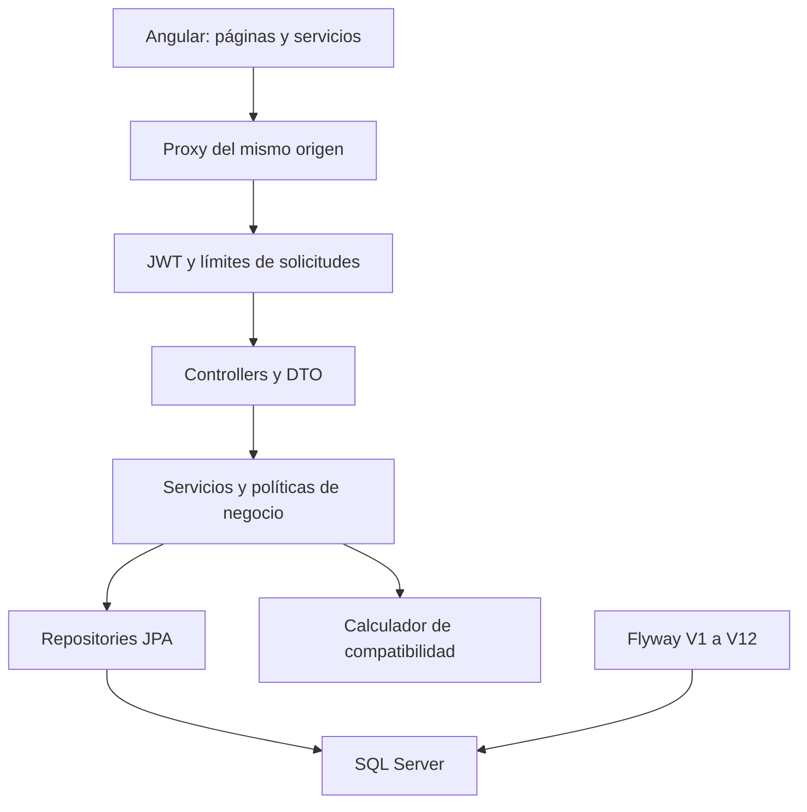
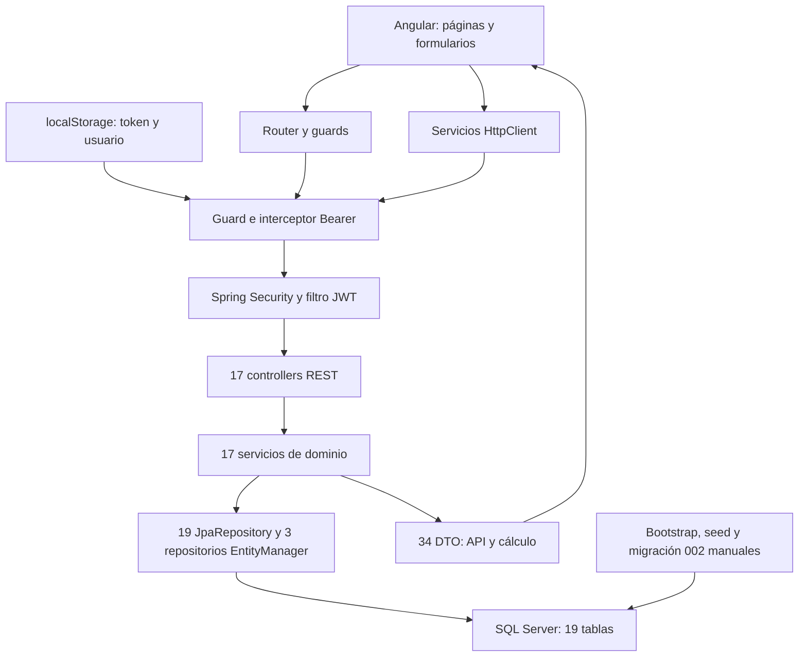

# ROOMMATCH — Arquitectura e inventario confirmado

## Arquitectura de la rama de correcciones

Se conserva el monolito Java 17/Spring Boot 3.5/SQL Server y Angular 21 standalone.
Angular carga las pantallas de forma diferida y llama a `/api` en el mismo origen.
El proxy local conserva el backend en el puerto 8081.

Las nuevas migraciones incorporan historial de solicitudes, invariantes de
suscripciones/galerías, versiones optimistas, correo consentido en leads e
historial administrativo. La compatibilidad actual se calcula al leer; la tabla
`match_resultado` permanece como historial, sin alimentar resultados actuales.

Los contratos y decisiones actualizados están en [reglas de negocio](docs/BUSINESS_RULES.md),
[matching](docs/MATCHING.md), [contactos](docs/CONTACTS.md) y [admin](docs/ADMIN.md).
**El inventario y la matriz campo por campo que siguen corresponden al baseline.**
La consolidación de esa matriz con todas las migraciones posteriores sigue
pendiente; el arranque de integración sí verifica el esquema con Hibernate
sobre SQL Server real en CI.

---

## Documento de auditoría original (baseline)

Baseline: 12 de septiembre de 2026. Informe emitido: 13 de septiembre de 2026. Código fijado al commit indicado y revalidado antes de entregar. Repositorio: [1621-nicolas/roommatch](https://github.com/1621-nicolas/roommatch). Rama auditada: `main`. Commit fijado: [8308ed4cde23](https://github.com/1621-nicolas/roommatch/commit/8308ed4cde239bbc03752df985269134d6de52bf).

Fase ejecutada: auditoría, sin correcciones del producto, cambios de dependencias, commits, merges ni ajustes de configuración del repositorio. Las propuestas y casos de prueba de estos documentos **no están implementados**. Evidencia estática y resultados de comandos se distinguen de pruebas dinámicas pendientes. No se certifica preparación para producción.

## Sistema y límites

SPA Angular standalone y API REST Spring Boot en monorepositorio, base SQL Server creada manualmente. No hay SSR, microservicios, websocket/chat, almacenamiento administrado de imágenes, pasarela de pago, deploy automatizado ni refresh tokens en el código auditado. Se mantiene Java 17 y Angular 21 según el código actual, no según documentación histórica.

El diagrama describe el flujo lógico; un guard no sustituye la seguridad del servidor. El filtro verifica firma y expiración y consulta Usuario/rol/estado actuales en BD. Los controllers extraen identidad de Authentication y las escrituras de recursos propios suelen usar ID+propietario/autor. Los servicios contienen transacciones y mapean entidades a DTO. `open-in-view=false`; la mayoría de lecturas usan readOnly, pero no todas (p.ej. consultas de PerfilConvivenciaService). Asociaciones EAGER por defecto pueden añadir consultas; PublicacionRoomie declara LAZY en usuario/habitación. No se ha confirmado una LazyInitializationException reproducible.

No existe una capa central de policy para cupos, moderación, visibilidad y transiciones. MatchService une cálculo, consultas y persistencia. Los controllers mezclan manejo local de IllegalArgumentException con GlobalExceptionHandler. La arquitectura de monolito por capas es suficiente para el alcance; conviene separar responsabilidades dentro del mismo stack antes de añadir infraestructura.

## Inventario cuantitativo

| Elemento | Cantidad / contenido |
| --- | --- |
| Archivos versionados | 278 |
| Controllers / endpoints | 17 / 69 |
| Servicios backend | 17 |
| Repositories | 19 interfaces JPA + 3 EntityManager |
| Entidades / campos persistentes | 19 / 168 |
| Tablas / columnas SQL después de 002 | 19 / 167; falta principal de imagen_publicacion |
| DTO Java | 34 |
| Servicios Angular | 16 |
| Rutas Angular | 22 de componente + wildcard |
| Guards / interceptors | 3 / 1 |
| Pruebas declaradas | Backend 1 contextLoads; frontend 2 app.spec |
| CI/CD | 1 workflow CI; sin deployment |
| SQL | Bootstrap destructivo, 1 seed, 1 migración manual |

## Mapa funcional extremo a extremo

Se omite prefijo `/api/` en la columna Endpoint y sufijos Controller/Service/Repository cuando hay clase homónima. Los nombres completos aparecen en inventarios posteriores. COMPLETA significa recorrido implementado por inspección, no certificado en ejecución; PARCIAL tiene camino principal con defectos o integración faltante; INCOMPLETA carece de un tramo importante; ROTA contradice su contrato o esquema; NO UTILIZADA existe sin consumidor actual. Ninguna fila tiene pruebas automatizadas de negocio actuales; las familias al final son propuestas.

| Funcionalidad | Frontend | Endpoint | Controller | Service | Repository | Entidad → tabla SQL | Estado | Pruebas |
| --- | --- | --- | --- | --- | --- | --- | --- | --- |
| Registro/login/logout | auth/login, auth/register; AuthService | POST auth/register, auth/login; logout solo local | Auth | Auth | Usuario, Rol | Usuario→usuario; Rol→rol | PARCIAL | Sin casos de auth; SEC |
| Cuenta propia | mi-cuenta; UsuarioService | GET/PUT usuarios/me | Usuario | Usuario | Usuario | Usuario→usuario | COMPLETA | Implementación estática; sin pruebas; HTTP/PERFIL |
| Perfil de convivencia | perfil, mi-cuenta; PerfilService | POST perfil; GET/PUT perfil/me | PerfilConvivencia | PerfilConvivencia | PerfilConvivencia | PerfilConvivencia→perfil_convivencia | PARCIAL | Sin pruebas; MAT/PERFIL |
| Búsqueda básica de perfiles | Sin consumidor TS | GET perfil/buscar/distrito, compatibles-basico | PerfilConvivencia | PerfilConvivencia | PerfilConvivenciaNamed | PerfilConvivencia, Usuario→perfil_convivencia, usuario | NO UTILIZADA | Sin pruebas; DB/PERF |
| Matches | matches, home, publicaciones | POST matches/calcular; GET matches | Match | Match | MatchResultado, PerfilConvivencia, Usuario | MatchResultado→match_resultado; perfiles/usuario | PARCIAL | Sin pruebas; MAT/SEC/PRIV |
| Favoritos | favoritos, matches; FavoritoService | POST/DELETE favoritos/{idUsuarioFavorito}; GET favoritos | Favorito | Favorito | FavoritoUsuario, Usuario | FavoritoUsuario→favorito_usuario | PARCIAL | Email expuesto; sin pruebas; PRIV/CON |
| Enviar/aceptar/rechazar solicitud | solicitudes, matches, favoritos, publicación detalle | POST solicitudes/{idUsuarioReceptor}; PUT aceptar/rechazar; GET enviadas/recibidas | SolicitudContacto | SolicitudContacto | SolicitudContacto, ContactoRoomie, Notificacion, Usuario | solicitud_contacto, contacto_roomie, notificacion | PARCIAL | Sin pruebas; SOL |
| Cancelar/reenviar solicitud | Ausente | Cancelar ausente; reenviar bloqueado | — | SolicitudContacto parcial | SolicitudContacto | Estado cancelada definido en SQL | INCOMPLETA | Sin pruebas; SOL |
| Contacto propio y desbloqueado | mi-cuenta, contactos; ContactoService | POST/PUT/GET contactos/me; GET contactos/desbloqueado/{idUsuario} | ContactoUsuario | ContactoUsuario | ContactoUsuario, ContactoRoomie, Usuario | contacto_usuario, contacto_roomie | PARCIAL | Filtro privado presente; fugas laterales; PRIV |
| Notificaciones | notificaciones; NotificacionService | GET notificaciones, no-leidas/count; PUT leer/leer-todas | Notificacion | Notificacion | Notificacion | Notificacion→notificacion | PARCIAL | Sin pruebas; WEB/OWN |
| Catálogo/detalle habitaciones | habitaciones, habitacion-detalle, home | GET habitaciones; GET habitaciones/{id} | Habitacion | Habitacion | HabitacionBusqueda, Habitacion | Habitacion, Propietario→habitacion, propietario | PARCIAL | Sin galería; sin pruebas; PUB/WEB |
| Alta/edición/pausa/activación habitaciones | propietario/habitaciones | POST habitaciones; GET mis; PUT {id}, pausar, activar | Habitacion | Habitacion | Habitacion, Propietario, SuscripcionPropietario | habitacion, propietario, suscripcion_propietario, plan_propietario | PARCIAL | Sin pruebas; PLAN/OWN/MOD |
| Estado alquilada/eliminada de habitación | Sin acción pública implementada | No hay endpoint para esos estados | — | Sin transición dedicada | Habitacion | CHECK SQL permite alquilada/eliminada | INCOMPLETA | No asumir que DELETE habitación exista |
| Imágenes de habitación | gestor real solo propietario | POST/GET imagenes-habitacion/habitacion/{id}; PUT/DELETE imagenes-habitacion/{idImagen} | ImagenHabitacion | ImagenHabitacion | ImagenHabitacion, Habitacion, Propietario | imagen_habitacion, habitacion | PARCIAL | Sin pruebas; IMG/OWN |
| Leads/intereses | habitacion-detalle; solicitudes; propietario/leads | POST leads/habitacion/{id}; GET mis, propietario; PUT {idLead}/estado | LeadHabitacion | LeadHabitacion | LeadHabitacion, Habitacion, Propietario, Notificacion | lead_habitacion, habitacion, notificacion | PARCIAL | Sin pruebas; PRIV/OWN/CON |
| Alta/perfil de propietario | propietario/registro, contexto | POST/GET propietarios/me | Propietario | Propietario | Propietario, Usuario, Rol, PlanPropietario, SuscripcionPropietario | propietario, usuario, rol, suscripcion_propietario | PARCIAL | Sin pruebas; ROLE |
| Planes/suscripción | propietario/planes, panel | GET planes, mi-plan; PUT planes/cambiar/{idPlan} | PlanPropietario | PlanPropietario | PlanPropietario, SuscripcionPropietario, Propietario | plan_propietario, suscripcion_propietario | PARCIAL | Sin facturación; sin pruebas; PLAN |
| Publicaciones roomie catálogo | publicaciones-roomie, home | GET publicaciones-roomie | PublicacionRoomie | PublicacionRoomie, Match | PublicacionRoomie, MatchResultado, PerfilConvivencia | publicacion_roomie, match_resultado, perfil_convivencia | PARCIAL | Sin pruebas; PUB/PERF |
| Detalle público publicación | publicaciones-roomie/:id | GET publicaciones-roomie/{idPublicacion} | PublicacionRoomie | PublicacionRoomie | PublicacionRoomie | publicacion_roomie | ROTA | Anónimo rechazado; PUB-01 |
| Gestión/vínculo/borrado publicación | mis-publicaciones | POST; GET mis; PUT editar/pausar/activar/cerrar; DELETE publicaciones-roomie/{id} | PublicacionRoomie | PublicacionRoomie | PublicacionRoomie, ImagenPublicacion, Habitacion | publicacion_roomie, imagen_publicacion, habitacion | PARCIAL | Sin pruebas; PUB/OWN/D-01/D-03 |
| Imágenes de publicación | Sin servicio/template integrado | POST/GET publicaciones-roomie/{id}/imagenes; PUT/DELETE imagenes/{idImagen} | ImagenPublicacion | ImagenPublicacion | ImagenPublicacion, PublicacionRoomie | imagen_publicacion (falta principal) | ROTA | SQL entregado incompatible; IMG/DB |
| Reportar usuario/habitación | report-modal vacío sin uso | POST reportes/usuarios/{id}; habitaciones/{id} | Reporte | Reporte | ReporteUsuario, ReporteHabitacion, Usuario, Habitacion | reporte_usuario, reporte_habitacion | INCOMPLETA | Backend disponible; UI ausente; MOD/ADMIN |
| Dashboard admin | admin/dashboard placeholder | GET admin/dashboard | DashboardAdmin | DashboardAdmin | DashboardAdmin, Usuario | agregados de tablas principales | INCOMPLETA | No consumo frontend; ADMIN |
| Revisar/rechazar/sancionar reportes | admin/reportes ficticio | GET reportes/admin/usuarios, habitaciones; PUT revisar/sancionar | Reporte | Reporte | ReporteUsuario, ReporteHabitacion, Usuario, Habitacion, Notificacion | reporte_usuario, reporte_habitacion, usuario, habitacion | INCOMPLETA | API parcial; ADMIN/MOD |
| Recuperación de contraseña | Enlace vuelve a login | Ausente | — | — | — | Sin token de recuperación | INCOMPLETA | Alcance de producto por decidir |
| Componentes compartidos de tarjetas/estado | 7 placeholders; Navbar y gestor sí usados | No corresponde | — | — | — | — | NO UTILIZADA | Sin pruebas; WEB/A11Y |

## Endpoints y autorización, uno por operación

Los 69 endpoints de negocio se enumeran sin inferir rutas por README. Swagger/OpenAPI, OPTIONS y /error son rutas de infraestructura adicionales permitidas en SecurityConfig. No hay cancelar solicitud, eliminar/alquilar habitación ni recuperación de contraseña.

| Verbo y ruta | Controller.método / línea | Llamada a servicio | Regla comprobada / limitación |
| --- | --- | --- | --- |
| POST /api/auth/register | [AuthController.registrar](https://github.com/1621-nicolas/roommatch/blob/8308ed4cde239bbc03752df985269134d6de52bf/roommatch-api/roommatch-api/src/main/java/com/roommatch/controller/AuthController.java#L26) | authService.registrarUsuario | Público; DTO validado; sin limitación de abuso (RM-06) |
| POST /api/auth/login | [AuthController.login](https://github.com/1621-nicolas/roommatch/blob/8308ed4cde239bbc03752df985269134d6de52bf/roommatch-api/roommatch-api/src/main/java/com/roommatch/controller/AuthController.java#L37) | authService.login | Público; DTO validado; sin limitación de abuso (RM-06) |
| POST /api/contactos/me | [ContactoUsuarioController.guardarMiContacto](https://github.com/1621-nicolas/roommatch/blob/8308ed4cde239bbc03752df985269134d6de52bf/roommatch-api/roommatch-api/src/main/java/com/roommatch/controller/ContactoUsuarioController.java#L37) | contactoService.guardarOModificarMiContacto | Propio desde principal |
| PUT /api/contactos/me | [ContactoUsuarioController.actualizarMiContacto](https://github.com/1621-nicolas/roommatch/blob/8308ed4cde239bbc03752df985269134d6de52bf/roommatch-api/roommatch-api/src/main/java/com/roommatch/controller/ContactoUsuarioController.java#L103) | contactoService.guardarOModificarMiContacto | Propio desde principal |
| GET /api/contactos/me | [ContactoUsuarioController.obtenerMiContacto](https://github.com/1621-nicolas/roommatch/blob/8308ed4cde239bbc03752df985269134d6de52bf/roommatch-api/roommatch-api/src/main/java/com/roommatch/controller/ContactoUsuarioController.java#L169) | contactoService.obtenerMiContactoOpcional | Propio desde principal |
| GET /api/contactos/desbloqueado/{idUsuario} | [ContactoUsuarioController.verContactoDesbloqueado](https://github.com/1621-nicolas/roommatch/blob/8308ed4cde239bbc03752df985269134d6de52bf/roommatch-api/roommatch-api/src/main/java/com/roommatch/controller/ContactoUsuarioController.java#L235) | contactoService.verContactoDesbloqueado | ContactoRoomie simétrico requerido; preferencias en DTO; RM-02 fuga por otros DTO |
| GET /api/admin/dashboard | [DashboardAdminController.obtenerDashboard](https://github.com/1621-nicolas/roommatch/blob/8308ed4cde239bbc03752df985269134d6de52bf/roommatch-api/roommatch-api/src/main/java/com/roommatch/controller/DashboardAdminController.java#L21) | dashboardService.obtenerDashboard | ADMIN en SecurityConfig y validarAdmin en servicio; estados/rastreo RM-17/37 |
| POST /api/favoritos/{idUsuarioFavorito} | [FavoritoController.agregarFavorito](https://github.com/1621-nicolas/roommatch/blob/8308ed4cde239bbc03752df985269134d6de52bf/roommatch-api/roommatch-api/src/main/java/com/roommatch/controller/FavoritoController.java#L23) | favoritoService.agregarFavorito | Principal delimita dueño; alta a usuario activo; DELETE por par propio. RM-02 email |
| GET /api/favoritos | [FavoritoController.listarFavoritos](https://github.com/1621-nicolas/roommatch/blob/8308ed4cde239bbc03752df985269134d6de52bf/roommatch-api/roommatch-api/src/main/java/com/roommatch/controller/FavoritoController.java#L47) | favoritoService.listarMisFavoritos | Principal delimita dueño; alta a usuario activo; DELETE por par propio. RM-02 email |
| DELETE /api/favoritos/{idUsuarioFavorito} | [FavoritoController.eliminarFavorito](https://github.com/1621-nicolas/roommatch/blob/8308ed4cde239bbc03752df985269134d6de52bf/roommatch-api/roommatch-api/src/main/java/com/roommatch/controller/FavoritoController.java#L62) | favoritoService.eliminarFavorito | Principal delimita dueño; alta a usuario activo; DELETE por par propio. RM-02 email |
| POST /api/habitaciones | [HabitacionController.crearHabitacion](https://github.com/1621-nicolas/roommatch/blob/8308ed4cde239bbc03752df985269134d6de52bf/roommatch-api/roommatch-api/src/main/java/com/roommatch/controller/HabitacionController.java#L39) | habitacionService.crearHabitacion | Perfil propietario del principal; ID+propietario en edición/estado; RM-16/17 policy insuficiente |
| GET /api/habitaciones | [HabitacionController.listarHabitaciones](https://github.com/1621-nicolas/roommatch/blob/8308ed4cde239bbc03752df985269134d6de52bf/roommatch-api/roommatch-api/src/main/java/com/roommatch/controller/HabitacionController.java#L55) | habitacionService.listarHabitacionesPublicas | Público; habitación activa; falta estado efectivo del autor/moderación (RM-22) |
| GET /api/habitaciones/mis | [HabitacionController.listarMisHabitaciones](https://github.com/1621-nicolas/roommatch/blob/8308ed4cde239bbc03752df985269134d6de52bf/roommatch-api/roommatch-api/src/main/java/com/roommatch/controller/HabitacionController.java#L88) | habitacionService.listarMisHabitaciones | Perfil propietario del principal; ID+propietario en edición/estado; RM-16/17 policy insuficiente |
| GET /api/habitaciones/{idHabitacion} | [HabitacionController.obtenerHabitacion](https://github.com/1621-nicolas/roommatch/blob/8308ed4cde239bbc03752df985269134d6de52bf/roommatch-api/roommatch-api/src/main/java/com/roommatch/controller/HabitacionController.java#L107) | habitacionService.obtenerHabitacionPorId | Público; habitación activa; falta estado efectivo del autor/moderación (RM-22) |
| PUT /api/habitaciones/{idHabitacion} | [HabitacionController.actualizarHabitacion](https://github.com/1621-nicolas/roommatch/blob/8308ed4cde239bbc03752df985269134d6de52bf/roommatch-api/roommatch-api/src/main/java/com/roommatch/controller/HabitacionController.java#L118) | habitacionService.actualizarHabitacion | Perfil propietario del principal; ID+propietario en edición/estado; RM-16/17 policy insuficiente |
| PUT /api/habitaciones/{idHabitacion}/pausar | [HabitacionController.pausarHabitacion](https://github.com/1621-nicolas/roommatch/blob/8308ed4cde239bbc03752df985269134d6de52bf/roommatch-api/roommatch-api/src/main/java/com/roommatch/controller/HabitacionController.java#L136) | habitacionService.pausarHabitacion | Perfil propietario del principal; ID+propietario en edición/estado; RM-16/17 policy insuficiente |
| PUT /api/habitaciones/{idHabitacion}/activar | [HabitacionController.activarHabitacion](https://github.com/1621-nicolas/roommatch/blob/8308ed4cde239bbc03752df985269134d6de52bf/roommatch-api/roommatch-api/src/main/java/com/roommatch/controller/HabitacionController.java#L152) | habitacionService.activarHabitacion | Perfil propietario del principal; ID+propietario en edición/estado; RM-16/17 policy insuficiente |
| POST /api/imagenes-habitacion/habitacion/{idHabitacion} | [ImagenHabitacionController.agregarImagen](https://github.com/1621-nicolas/roommatch/blob/8308ed4cde239bbc03752df985269134d6de52bf/roommatch-api/roommatch-api/src/main/java/com/roommatch/controller/ImagenHabitacionController.java#L45) | imagenService.agregarImagen | Cadena imagen→padre→propietario/autor comparada con principal; RM-20 concurrencia |
| GET /api/imagenes-habitacion/habitacion/{idHabitacion} | [ImagenHabitacionController.listarImagenes](https://github.com/1621-nicolas/roommatch/blob/8308ed4cde239bbc03752df985269134d6de52bf/roommatch-api/roommatch-api/src/main/java/com/roommatch/controller/ImagenHabitacionController.java#L118) | imagenService.listarImagenesPorHabitacion | Público; estado/visibilidad del padre incompleto (RM-22) |
| PUT /api/imagenes-habitacion/{idImagen}/principal | [ImagenHabitacionController.marcarPrincipal](https://github.com/1621-nicolas/roommatch/blob/8308ed4cde239bbc03752df985269134d6de52bf/roommatch-api/roommatch-api/src/main/java/com/roommatch/controller/ImagenHabitacionController.java#L175) | imagenService.marcarComoPrincipal | Cadena imagen→padre→propietario/autor comparada con principal; RM-20 concurrencia |
| DELETE /api/imagenes-habitacion/{idImagen} | [ImagenHabitacionController.eliminarImagen](https://github.com/1621-nicolas/roommatch/blob/8308ed4cde239bbc03752df985269134d6de52bf/roommatch-api/roommatch-api/src/main/java/com/roommatch/controller/ImagenHabitacionController.java#L243) | imagenService.eliminarImagen | Cadena imagen→padre→propietario/autor comparada con principal; RM-20 concurrencia |
| POST /api/publicaciones-roomie/{idPublicacion}/imagenes | [ImagenPublicacionController.agregarImagen](https://github.com/1621-nicolas/roommatch/blob/8308ed4cde239bbc03752df985269134d6de52bf/roommatch-api/roommatch-api/src/main/java/com/roommatch/controller/ImagenPublicacionController.java#L25) | imagenService.agregarImagen | Cadena imagen→padre→propietario/autor comparada con principal; RM-20 concurrencia |
| GET /api/publicaciones-roomie/{idPublicacion}/imagenes | [ImagenPublicacionController.listarImagenes](https://github.com/1621-nicolas/roommatch/blob/8308ed4cde239bbc03752df985269134d6de52bf/roommatch-api/roommatch-api/src/main/java/com/roommatch/controller/ImagenPublicacionController.java#L44) | imagenService.listarImagenesPorPublicacion | Público; estado/visibilidad del padre incompleto (RM-22) |
| PUT /api/publicaciones-roomie/imagenes/{idImagen}/principal | [ImagenPublicacionController.marcarPrincipal](https://github.com/1621-nicolas/roommatch/blob/8308ed4cde239bbc03752df985269134d6de52bf/roommatch-api/roommatch-api/src/main/java/com/roommatch/controller/ImagenPublicacionController.java#L56) | imagenService.marcarComoPrincipal | Cadena imagen→padre→propietario/autor comparada con principal; RM-20 concurrencia |
| DELETE /api/publicaciones-roomie/imagenes/{idImagen} | [ImagenPublicacionController.eliminarImagen](https://github.com/1621-nicolas/roommatch/blob/8308ed4cde239bbc03752df985269134d6de52bf/roommatch-api/roommatch-api/src/main/java/com/roommatch/controller/ImagenPublicacionController.java#L73) | imagenService.eliminarImagen | Cadena imagen→padre→propietario/autor comparada con principal; RM-20 concurrencia |
| POST /api/leads/habitacion/{idHabitacion} | [LeadHabitacionController.crearLead](https://github.com/1621-nicolas/roommatch/blob/8308ed4cde239bbc03752df985269134d6de52bf/roommatch-api/roommatch-api/src/main/java/com/roommatch/controller/LeadHabitacionController.java#L28) | leadService.crearLead | Mis=principal; alta a habitación activa no propia; cambios/lista propietario por ID+dueño; RM-02 privacidad |
| GET /api/leads/mis | [LeadHabitacionController.listarMisIntereses](https://github.com/1621-nicolas/roommatch/blob/8308ed4cde239bbc03752df985269134d6de52bf/roommatch-api/roommatch-api/src/main/java/com/roommatch/controller/LeadHabitacionController.java#L54) | leadService.listarMisIntereses | Mis=principal; alta a habitación activa no propia; cambios/lista propietario por ID+dueño; RM-02 privacidad |
| GET /api/leads/propietario | [LeadHabitacionController.listarLeadsPropietario](https://github.com/1621-nicolas/roommatch/blob/8308ed4cde239bbc03752df985269134d6de52bf/roommatch-api/roommatch-api/src/main/java/com/roommatch/controller/LeadHabitacionController.java#L69) | leadService.listarLeadsPropietario | Mis=principal; alta a habitación activa no propia; cambios/lista propietario por ID+dueño; RM-02 privacidad |
| PUT /api/leads/{idLead}/estado | [LeadHabitacionController.cambiarEstadoLead](https://github.com/1621-nicolas/roommatch/blob/8308ed4cde239bbc03752df985269134d6de52bf/roommatch-api/roommatch-api/src/main/java/com/roommatch/controller/LeadHabitacionController.java#L98) | leadService.cambiarEstadoLead | Mis=principal; alta a habitación activa no propia; cambios/lista propietario por ID+dueño; RM-02 privacidad |
| POST /api/matches/calcular | [MatchController.calcularMatches](https://github.com/1621-nicolas/roommatch/blob/8308ed4cde239bbc03752df985269134d6de52bf/roommatch-api/roommatch-api/src/main/java/com/roommatch/controller/MatchController.java#L27) | matchService.calcularMatches | Usuario del principal; resultados propios dirigidos; RM-02/10/11 |
| GET /api/matches | [MatchController.listarMisMatches](https://github.com/1621-nicolas/roommatch/blob/8308ed4cde239bbc03752df985269134d6de52bf/roommatch-api/roommatch-api/src/main/java/com/roommatch/controller/MatchController.java#L49) | matchService.listarMisMatches | Usuario del principal; resultados propios dirigidos; RM-02/10/11 |
| GET /api/notificaciones | [NotificacionController.listarMisNotificaciones](https://github.com/1621-nicolas/roommatch/blob/8308ed4cde239bbc03752df985269134d6de52bf/roommatch-api/roommatch-api/src/main/java/com/roommatch/controller/NotificacionController.java#L24) | notificacionService.listarMisNotificaciones | Principal delimita lista/conteo; ID+usuario para leer; leer-todas solo propio |
| GET /api/notificaciones/no-leidas/count | [NotificacionController.contarNoLeidas](https://github.com/1621-nicolas/roommatch/blob/8308ed4cde239bbc03752df985269134d6de52bf/roommatch-api/roommatch-api/src/main/java/com/roommatch/controller/NotificacionController.java#L47) | notificacionService.contarNoLeidas | Principal delimita lista/conteo; ID+usuario para leer; leer-todas solo propio |
| PUT /api/notificaciones/{idNotificacion}/leer | [NotificacionController.marcarComoLeida](https://github.com/1621-nicolas/roommatch/blob/8308ed4cde239bbc03752df985269134d6de52bf/roommatch-api/roommatch-api/src/main/java/com/roommatch/controller/NotificacionController.java#L60) | notificacionService.marcarComoLeida | Principal delimita lista/conteo; ID+usuario para leer; leer-todas solo propio |
| PUT /api/notificaciones/leer-todas | [NotificacionController.marcarTodasComoLeidas](https://github.com/1621-nicolas/roommatch/blob/8308ed4cde239bbc03752df985269134d6de52bf/roommatch-api/roommatch-api/src/main/java/com/roommatch/controller/NotificacionController.java#L84) | notificacionService.marcarTodasComoLeidas | Principal delimita lista/conteo; ID+usuario para leer; leer-todas solo propio |
| POST /api/perfil | [PerfilConvivenciaController.crearPerfil](https://github.com/1621-nicolas/roommatch/blob/8308ed4cde239bbc03752df985269134d6de52bf/roommatch-api/roommatch-api/src/main/java/com/roommatch/controller/PerfilConvivenciaController.java#L23) | perfilService.crearPerfil | Autenticado; propio para me/alta; búsqueda solo perfiles activos sin UI; listas sin límite |
| GET /api/perfil/me | [PerfilConvivenciaController.obtenerMiPerfil](https://github.com/1621-nicolas/roommatch/blob/8308ed4cde239bbc03752df985269134d6de52bf/roommatch-api/roommatch-api/src/main/java/com/roommatch/controller/PerfilConvivenciaController.java#L47) | perfilService.obtenerMiPerfil | Autenticado; propio para me/alta; búsqueda solo perfiles activos sin UI; listas sin límite |
| PUT /api/perfil/me | [PerfilConvivenciaController.actualizarMiPerfil](https://github.com/1621-nicolas/roommatch/blob/8308ed4cde239bbc03752df985269134d6de52bf/roommatch-api/roommatch-api/src/main/java/com/roommatch/controller/PerfilConvivenciaController.java#L69) | perfilService.actualizarMiPerfil | Autenticado; propio para me/alta; búsqueda solo perfiles activos sin UI; listas sin límite |
| GET /api/perfil/buscar/distrito | [PerfilConvivenciaController.buscarPorDistrito](https://github.com/1621-nicolas/roommatch/blob/8308ed4cde239bbc03752df985269134d6de52bf/roommatch-api/roommatch-api/src/main/java/com/roommatch/controller/PerfilConvivenciaController.java#L92) | perfilService.buscarPerfilesPorDistrito | Autenticado; propio para me/alta; búsqueda solo perfiles activos sin UI; listas sin límite |
| GET /api/perfil/compatibles-basico | [PerfilConvivenciaController.buscarCompatiblesBasico](https://github.com/1621-nicolas/roommatch/blob/8308ed4cde239bbc03752df985269134d6de52bf/roommatch-api/roommatch-api/src/main/java/com/roommatch/controller/PerfilConvivenciaController.java#L104) | perfilService.buscarCompatiblesBasico | Autenticado; propio para me/alta; búsqueda solo perfiles activos sin UI; listas sin límite |
| GET /api/planes | [PlanPropietarioController.listarPlanes](https://github.com/1621-nicolas/roommatch/blob/8308ed4cde239bbc03752df985269134d6de52bf/roommatch-api/roommatch-api/src/main/java/com/roommatch/controller/PlanPropietarioController.java#L43) | planService.listarPlanesActivos | Público: solo planes activos |
| GET /api/planes/mi-plan | [PlanPropietarioController.obtenerMiPlan](https://github.com/1621-nicolas/roommatch/blob/8308ed4cde239bbc03752df985269134d6de52bf/roommatch-api/roommatch-api/src/main/java/com/roommatch/controller/PlanPropietarioController.java#L73) | planService.obtenerMiPlan | Perfil propietario del principal; plan objetivo activo, política incompleta RM-16 |
| PUT /api/planes/cambiar/{idPlan} | [PlanPropietarioController.cambiarPlan](https://github.com/1621-nicolas/roommatch/blob/8308ed4cde239bbc03752df985269134d6de52bf/roommatch-api/roommatch-api/src/main/java/com/roommatch/controller/PlanPropietarioController.java#L133) | planService.cambiarPlan | Perfil propietario del principal; plan objetivo activo, política incompleta RM-16 |
| POST /api/propietarios/me | [PropietarioController.convertirmeEnPropietario](https://github.com/1621-nicolas/roommatch/blob/8308ed4cde239bbc03752df985269134d6de52bf/roommatch-api/roommatch-api/src/main/java/com/roommatch/controller/PropietarioController.java#L42) | propietarioService.convertirmeEnPropietario | Usuario actual; no idUsuario de request; rol ADMIN puede sobrescribirse (RM-18) |
| GET /api/propietarios/me | [PropietarioController.obtenerMiPerfilPropietario](https://github.com/1621-nicolas/roommatch/blob/8308ed4cde239bbc03752df985269134d6de52bf/roommatch-api/roommatch-api/src/main/java/com/roommatch/controller/PropietarioController.java#L108) | propietarioService.obtenerMiPerfilPropietarioOpcional | Usuario actual; no idUsuario de request; rol ADMIN puede sobrescribirse (RM-18) |
| POST /api/publicaciones-roomie | [PublicacionRoomieController.crearPublicacion](https://github.com/1621-nicolas/roommatch/blob/8308ed4cde239bbc03752df985269134d6de52bf/roommatch-api/roommatch-api/src/main/java/com/roommatch/controller/PublicacionRoomieController.java#L51) | publicacionService.crearPublicacion | Autor del principal; ID+autor en escrituras; vínculo habitación sin regla acordada (RM-08) |
| GET /api/publicaciones-roomie | [PublicacionRoomieController.listarPublicaciones](https://github.com/1621-nicolas/roommatch/blob/8308ed4cde239bbc03752df985269134d6de52bf/roommatch-api/roommatch-api/src/main/java/com/roommatch/controller/PublicacionRoomieController.java#L110) | publicacionService.listarPublicaciones | Público; activa; compatibilidad opcional. RM-12/22 |
| GET /api/publicaciones-roomie/{idPublicacion} | [PublicacionRoomieController.obtenerPublicacion](https://github.com/1621-nicolas/roommatch/blob/8308ed4cde239bbc03752df985269134d6de52bf/roommatch-api/roommatch-api/src/main/java/com/roommatch/controller/PublicacionRoomieController.java#L227) | publicacionService.obtenerPublicacion | PermitAll pero helper exige usuario: detalle anónimo roto (RM-25) |
| GET /api/publicaciones-roomie/mis | [PublicacionRoomieController.listarMisPublicaciones](https://github.com/1621-nicolas/roommatch/blob/8308ed4cde239bbc03752df985269134d6de52bf/roommatch-api/roommatch-api/src/main/java/com/roommatch/controller/PublicacionRoomieController.java#L280) | publicacionService.listarMisPublicaciones | Autor del principal; ID+autor en escrituras; vínculo habitación sin regla acordada (RM-08) |
| PUT /api/publicaciones-roomie/{idPublicacion} | [PublicacionRoomieController.actualizarPublicacion](https://github.com/1621-nicolas/roommatch/blob/8308ed4cde239bbc03752df985269134d6de52bf/roommatch-api/roommatch-api/src/main/java/com/roommatch/controller/PublicacionRoomieController.java#L347) | publicacionService.actualizarPublicacion | Autor del principal; ID+autor en escrituras; vínculo habitación sin regla acordada (RM-08) |
| PUT /api/publicaciones-roomie/{idPublicacion}/pausar | [PublicacionRoomieController.pausarPublicacion](https://github.com/1621-nicolas/roommatch/blob/8308ed4cde239bbc03752df985269134d6de52bf/roommatch-api/roommatch-api/src/main/java/com/roommatch/controller/PublicacionRoomieController.java#L406) | publicacionService.pausarPublicacion | Autor del principal; ID+autor en escrituras; vínculo habitación sin regla acordada (RM-08) |
| PUT /api/publicaciones-roomie/{idPublicacion}/activar | [PublicacionRoomieController.activarPublicacion](https://github.com/1621-nicolas/roommatch/blob/8308ed4cde239bbc03752df985269134d6de52bf/roommatch-api/roommatch-api/src/main/java/com/roommatch/controller/PublicacionRoomieController.java#L459) | publicacionService.activarPublicacion | Autor del principal; ID+autor en escrituras; vínculo habitación sin regla acordada (RM-08) |
| PUT /api/publicaciones-roomie/{idPublicacion}/cerrar | [PublicacionRoomieController.cerrarPublicacion](https://github.com/1621-nicolas/roommatch/blob/8308ed4cde239bbc03752df985269134d6de52bf/roommatch-api/roommatch-api/src/main/java/com/roommatch/controller/PublicacionRoomieController.java#L512) | publicacionService.cerrarPublicacion | Autor del principal; ID+autor en escrituras; vínculo habitación sin regla acordada (RM-08) |
| DELETE /api/publicaciones-roomie/{idPublicacion} | [PublicacionRoomieController.eliminarPublicacion](https://github.com/1621-nicolas/roommatch/blob/8308ed4cde239bbc03752df985269134d6de52bf/roommatch-api/roommatch-api/src/main/java/com/roommatch/controller/PublicacionRoomieController.java#L565) | publicacionService.eliminarPublicacion | Autor del principal; ID+autor en escrituras; vínculo habitación sin regla acordada (RM-08) |
| POST /api/reportes/usuarios/{idUsuarioReportado} | [ReporteController.reportarUsuario](https://github.com/1621-nicolas/roommatch/blob/8308ed4cde239bbc03752df985269134d6de52bf/roommatch-api/roommatch-api/src/main/java/com/roommatch/controller/ReporteController.java#L27) | reporteService.reportarUsuario | Revisar |
| POST /api/reportes/habitaciones/{idHabitacion} | [ReporteController.reportarHabitacion](https://github.com/1621-nicolas/roommatch/blob/8308ed4cde239bbc03752df985269134d6de52bf/roommatch-api/roommatch-api/src/main/java/com/roommatch/controller/ReporteController.java#L53) | reporteService.reportarHabitacion | Revisar |
| GET /api/reportes/admin/usuarios | [ReporteController.listarReportesUsuarios](https://github.com/1621-nicolas/roommatch/blob/8308ed4cde239bbc03752df985269134d6de52bf/roommatch-api/roommatch-api/src/main/java/com/roommatch/controller/ReporteController.java#L79) | reporteService.listarReportesUsuarios | ADMIN en SecurityConfig y validarAdmin en servicio; estados/rastreo RM-17/37 |
| GET /api/reportes/admin/habitaciones | [ReporteController.listarReportesHabitaciones](https://github.com/1621-nicolas/roommatch/blob/8308ed4cde239bbc03752df985269134d6de52bf/roommatch-api/roommatch-api/src/main/java/com/roommatch/controller/ReporteController.java#L107) | reporteService.listarReportesHabitaciones | ADMIN en SecurityConfig y validarAdmin en servicio; estados/rastreo RM-17/37 |
| PUT /api/reportes/admin/usuarios/{idReporte}/revisar | [ReporteController.revisarReporteUsuario](https://github.com/1621-nicolas/roommatch/blob/8308ed4cde239bbc03752df985269134d6de52bf/roommatch-api/roommatch-api/src/main/java/com/roommatch/controller/ReporteController.java#L135) | reporteService.revisarReporteUsuario | ADMIN en SecurityConfig y validarAdmin en servicio; estados/rastreo RM-17/37 |
| PUT /api/reportes/admin/habitaciones/{idReporte}/revisar | [ReporteController.revisarReporteHabitacion](https://github.com/1621-nicolas/roommatch/blob/8308ed4cde239bbc03752df985269134d6de52bf/roommatch-api/roommatch-api/src/main/java/com/roommatch/controller/ReporteController.java#L161) | reporteService.revisarReporteHabitacion | ADMIN en SecurityConfig y validarAdmin en servicio; estados/rastreo RM-17/37 |
| PUT /api/reportes/admin/usuarios/{idReporte}/sancionar | [ReporteController.sancionarUsuario](https://github.com/1621-nicolas/roommatch/blob/8308ed4cde239bbc03752df985269134d6de52bf/roommatch-api/roommatch-api/src/main/java/com/roommatch/controller/ReporteController.java#L187) | reporteService.sancionarUsuario | ADMIN en SecurityConfig y validarAdmin en servicio; estados/rastreo RM-17/37 |
| PUT /api/reportes/admin/habitaciones/{idReporte}/sancionar | [ReporteController.sancionarHabitacion](https://github.com/1621-nicolas/roommatch/blob/8308ed4cde239bbc03752df985269134d6de52bf/roommatch-api/roommatch-api/src/main/java/com/roommatch/controller/ReporteController.java#L211) | reporteService.sancionarHabitacion | ADMIN en SecurityConfig y validarAdmin en servicio; estados/rastreo RM-17/37 |
| POST /api/solicitudes/{idUsuarioReceptor} | [SolicitudContactoController.enviarSolicitud](https://github.com/1621-nicolas/roommatch/blob/8308ed4cde239bbc03752df985269134d6de52bf/roommatch-api/roommatch-api/src/main/java/com/roommatch/controller/SolicitudContactoController.java#L25) | solicitudService.enviarSolicitud | Emisor/receptor actual; aceptar/rechazar solo receptor y pendiente; carreras y reenvío RM-13/14 |
| GET /api/solicitudes/recibidas | [SolicitudContactoController.listarRecibidas](https://github.com/1621-nicolas/roommatch/blob/8308ed4cde239bbc03752df985269134d6de52bf/roommatch-api/roommatch-api/src/main/java/com/roommatch/controller/SolicitudContactoController.java#L51) | solicitudService.listarRecibidas | Emisor/receptor actual; aceptar/rechazar solo receptor y pendiente; carreras y reenvío RM-13/14 |
| GET /api/solicitudes/enviadas | [SolicitudContactoController.listarEnviadas](https://github.com/1621-nicolas/roommatch/blob/8308ed4cde239bbc03752df985269134d6de52bf/roommatch-api/roommatch-api/src/main/java/com/roommatch/controller/SolicitudContactoController.java#L66) | solicitudService.listarEnviadas | Emisor/receptor actual; aceptar/rechazar solo receptor y pendiente; carreras y reenvío RM-13/14 |
| PUT /api/solicitudes/{idSolicitud}/aceptar | [SolicitudContactoController.aceptarSolicitud](https://github.com/1621-nicolas/roommatch/blob/8308ed4cde239bbc03752df985269134d6de52bf/roommatch-api/roommatch-api/src/main/java/com/roommatch/controller/SolicitudContactoController.java#L81) | solicitudService.aceptarSolicitud | Emisor/receptor actual; aceptar/rechazar solo receptor y pendiente; carreras y reenvío RM-13/14 |
| PUT /api/solicitudes/{idSolicitud}/rechazar | [SolicitudContactoController.rechazarSolicitud](https://github.com/1621-nicolas/roommatch/blob/8308ed4cde239bbc03752df985269134d6de52bf/roommatch-api/roommatch-api/src/main/java/com/roommatch/controller/SolicitudContactoController.java#L105) | solicitudService.rechazarSolicitud | Emisor/receptor actual; aceptar/rechazar solo receptor y pendiente; carreras y reenvío RM-13/14 |
| GET /api/usuarios/me | [UsuarioController.obtenerMiUsuario](https://github.com/1621-nicolas/roommatch/blob/8308ed4cde239bbc03752df985269134d6de52bf/roommatch-api/roommatch-api/src/main/java/com/roommatch/controller/UsuarioController.java#L27) | usuarioService.obtenerMiUsuario | Solo usuario del principal; DTO no permite rol, estado ni passwordHash |
| PUT /api/usuarios/me | [UsuarioController.actualizarMiUsuario](https://github.com/1621-nicolas/roommatch/blob/8308ed4cde239bbc03752df985269134d6de52bf/roommatch-api/roommatch-api/src/main/java/com/roommatch/controller/UsuarioController.java#L48) | usuarioService.actualizarMiUsuario | Solo usuario del principal; DTO no permite rol, estado ni passwordHash |

## Rutas Angular, guards e interceptor

| Ruta | Componente | Guard |
| --- | --- | --- |
| / | Home | pública |
| /login | Login | pública |
| /register | Register | pública |
| /habitaciones | Habitaciones | pública |
| /habitaciones/:idHabitacion | HabitacionDetalle | pública |
| /publicaciones-roomie | PublicacionesList | pública |
| /publicaciones-roomie/:id | PublicacionesDetail | pública |
| /mi-cuenta | MiCuenta | authGuard |
| /perfil | Perfil | authGuard |
| /matches | Matches | authGuard |
| /favoritos | Favoritos | authGuard |
| /solicitudes | Solicitudes | authGuard |
| /contactos | Contactos | authGuard |
| /notificaciones | Notificaciones | authGuard |
| /mis-publicaciones | MisPublicaciones | authGuard |
| /propietario/registro | PropietarioRegistro | authGuard |
| /propietario | PropietarioPanel | propietarioGuard |
| /propietario/planes | Planes | propietarioGuard |
| /propietario/habitaciones | MisHabitaciones | propietarioGuard |
| /propietario/leads | Interesados | propietarioGuard |
| /admin/dashboard | Dashboard | adminGuard |
| /admin/reportes | Reportes | adminGuard |
| ** → / | '' | pública |

AuthGuard verifica presencia de token; AdminGuard compara rol local ADMIN; PropietarioGuard admite PROPIETARIO o ADMIN. El backend vuelve a validar el rol y requiere perfil propietario para sus operaciones, de modo que un ADMIN sin perfil puede entrar en una ruta de propietario pero recibir error de negocio. Todas las rutas se importan eager. AuthInterceptor añade token solo a URLs bajo el API_BASE_URL configurado y excluye autenticación; dos servicios duplican una URL fija que debe unificarse. `PropietarioContextService` mantiene estado compartido y Navbar cancela subscriptions al destruirse; no se detectó una fuga de suscripción permanente demostrada. Peticiones de búsqueda pueden competir sin cancelación y producir respuestas obsoletas en UI.

## Modelo relacional, cardinalidad e invariantes

| FK hija | Tabla padre | Cardinalidad | Nullable JPA | Fetch JPA |
| --- | --- | --- | --- | --- |
| contacto_roomie.id_solicitud | solicitud_contacto | 1:1 en SQL | Obligatoria | EAGER por defecto |
| contacto_roomie.id_usuario_a | usuario | N: 1 | Obligatoria | EAGER por defecto |
| contacto_roomie.id_usuario_b | usuario | N: 1 | Obligatoria | EAGER por defecto |
| contacto_usuario.id_usuario | usuario | 1:1 en SQL | Obligatoria | EAGER por defecto |
| favorito_usuario.id_usuario | usuario | N: 1 | Obligatoria | EAGER por defecto |
| favorito_usuario.id_usuario_favorito | usuario | N: 1 | Obligatoria | EAGER por defecto |
| habitacion.id_propietario | propietario | N: 1 | Obligatoria | EAGER por defecto |
| imagen_habitacion.id_habitacion | habitacion | N: 1 | Obligatoria | EAGER por defecto |
| imagen_publicacion.id_publicacion | publicacion_roomie | N: 1 | Obligatoria | EAGER por defecto |
| lead_habitacion.id_habitacion | habitacion | N: 1 | Obligatoria | EAGER por defecto |
| lead_habitacion.id_usuario_interesado | usuario | N: 1 | Obligatoria | EAGER por defecto |
| match_resultado.id_usuario_origen | usuario | N: 1 | Obligatoria | EAGER por defecto |
| match_resultado.id_usuario_destino | usuario | N: 1 | Obligatoria | EAGER por defecto |
| notificacion.id_usuario | usuario | N: 1 | Obligatoria | EAGER por defecto |
| perfil_convivencia.id_usuario | usuario | 1:1 en SQL | Obligatoria | EAGER por defecto |
| propietario.id_usuario | usuario | 1:1 en SQL | Obligatoria | EAGER por defecto |
| publicacion_roomie.id_usuario | usuario | N: 1 | Obligatoria | LAZY |
| publicacion_roomie.id_habitacion | habitacion | N: 1 | Opcional | LAZY |
| reporte_habitacion.id_usuario_reportante | usuario | N: 1 | Obligatoria | EAGER por defecto |
| reporte_habitacion.id_habitacion | habitacion | N: 1 | Obligatoria | EAGER por defecto |
| reporte_usuario.id_usuario_reportante | usuario | N: 1 | Obligatoria | EAGER por defecto |
| reporte_usuario.id_usuario_reportado | usuario | N: 1 | Obligatoria | EAGER por defecto |
| solicitud_contacto.id_usuario_emisor | usuario | N: 1 | Obligatoria | EAGER por defecto |
| solicitud_contacto.id_usuario_receptor | usuario | N: 1 | Obligatoria | EAGER por defecto |
| suscripcion_propietario.id_propietario | propietario | N: 1 | Obligatoria | EAGER por defecto |
| suscripcion_propietario.id_plan | plan_propietario | N: 1 | Obligatoria | EAGER por defecto |
| usuario.id_rol | rol | N: 1 | Obligatoria | EAGER por defecto |

No hay ON DELETE CASCADE en los SQL ni cascades JPA declarados. Borrado físico de publicaciones elimina primero sus imágenes; no hay reporte_publicacion. Usuarios/habitaciones referenciados por leads/reportes no deben borrarse sin estudiar todas sus FK. UNIQUE existente: email/nombreRol/nombrePlan, usuario de perfil/contacto/propietario, par de favorito, par dirigido de match/solicitud, par habitación+interesado y solicitud en contacto_roomie. CHECK protege edades, escalas, importes y estados, pero no hay catálogo CHECK para todos los hábitos ni consistencia completa de vínculos vivienda (por ejemplo tipo roommatch con habitación nula vía SQL directo).

No hay @Version en entidades, índice filtrado de principal, una suscripción activa por propietario ni un pendiente por par canónico. Los defaults de fechas/estados/booleans se reparten entre SQL y callbacks; Hibernate envía sus valores y no debe suponerse que siempre ejecuta el default SQL. El campo fechaActualizacion no detecta por sí mismo carreras. El seed solo garantiza USUARIO/PROPIETARIO/ADMIN y plan Gratis; no hay cuentas admin de prueba ni fixture de plan 10 entregados.

## Matriz de consistencia campo por campo

Base de comparación: `Base de datos_Roommatch.sql` más `database/migrations/002_publicacion_roomie_vivienda.sql`. Esto describe los scripts, **no el esquema de una BD desplegada desconocida**. Las relaciones se muestran como IDs proyectados; los DTO no serializan entidades completas. “Servidor” significa que ese campo no se permite en request de su agregado. Nombres/fechas derivados adicionales constan en catálogo DTO. Validación de entrada abreviada omite mensajes, preserva anotaciones y límites; validaciones cruzadas (presupuesto, tipo, ownership) se describen en hallazgos y servicios.

### [ContactoRoomie](https://github.com/1621-nicolas/roommatch/blob/8308ed4cde239bbc03752df985269134d6de52bf/roommatch-api/roommatch-api/src/main/java/com/roommatch/model/ContactoRoomie.java) ↔ contacto_roomie

| Campo JPA y definición | DTO entrada / validación | DTO salida | SQL efectivo / default | Resultado |
| --- | --- | --- | --- | --- |
| [idContactoRoomie: 14](https://github.com/1621-nicolas/roommatch/blob/8308ed4cde239bbc03752df985269134d6de52bf/roommatch-api/roommatch-api/src/main/java/com/roommatch/model/ContactoRoomie.java#L14) / Integer; PK | Servidor / ID de ruta o principal | No expuesto directamente | [id_contacto_roomie](https://github.com/1621-nicolas/roommatch/blob/8308ed4cde239bbc03752df985269134d6de52bf/Base%20de%20datos_Roommatch.sql#L455) INT IDENTITY(1,1) PRIMARY KEY | Sin diferencia de tipo/longitud/null detectada; ver constraints |
| [solicitud: 18](https://github.com/1621-nicolas/roommatch/blob/8308ed4cde239bbc03752df985269134d6de52bf/roommatch-api/roommatch-api/src/main/java/com/roommatch/model/ContactoRoomie.java#L18) / SolicitudContacto; NN | Servidor / ID de ruta o principal | No expuesto directamente | [id_solicitud](https://github.com/1621-nicolas/roommatch/blob/8308ed4cde239bbc03752df985269134d6de52bf/Base%20de%20datos_Roommatch.sql#L457) INT NOT NULL UNIQUE | Sin diferencia de tipo/longitud/null detectada; ver constraints |
| [usuarioA: 22](https://github.com/1621-nicolas/roommatch/blob/8308ed4cde239bbc03752df985269134d6de52bf/roommatch-api/roommatch-api/src/main/java/com/roommatch/model/ContactoRoomie.java#L22) / Usuario; NN | Servidor / ID de ruta o principal | No expuesto directamente | [id_usuario_a](https://github.com/1621-nicolas/roommatch/blob/8308ed4cde239bbc03752df985269134d6de52bf/Base%20de%20datos_Roommatch.sql#L458) INT NOT NULL | Sin diferencia de tipo/longitud/null detectada; ver constraints |
| [usuarioB: 26](https://github.com/1621-nicolas/roommatch/blob/8308ed4cde239bbc03752df985269134d6de52bf/roommatch-api/roommatch-api/src/main/java/com/roommatch/model/ContactoRoomie.java#L26) / Usuario; NN | Servidor / ID de ruta o principal | No expuesto directamente | [id_usuario_b](https://github.com/1621-nicolas/roommatch/blob/8308ed4cde239bbc03752df985269134d6de52bf/Base%20de%20datos_Roommatch.sql#L459) INT NOT NULL | Sin diferencia de tipo/longitud/null detectada; ver constraints |
| [fechaDesbloqueo: 29](https://github.com/1621-nicolas/roommatch/blob/8308ed4cde239bbc03752df985269134d6de52bf/roommatch-api/roommatch-api/src/main/java/com/roommatch/model/ContactoRoomie.java#L29) / LocalDateTime; NN | Servidor / ID de ruta o principal | No expuesto directamente | [fecha_desbloqueo](https://github.com/1621-nicolas/roommatch/blob/8308ed4cde239bbc03752df985269134d6de52bf/Base%20de%20datos_Roommatch.sql#L461) DATETIME2 NOT NULL DEFAULT SYSDATETIME() | Sin diferencia de tipo/longitud/null detectada; ver constraints |

### [ContactoUsuario](https://github.com/1621-nicolas/roommatch/blob/8308ed4cde239bbc03752df985269134d6de52bf/roommatch-api/roommatch-api/src/main/java/com/roommatch/model/ContactoUsuario.java) ↔ contacto_usuario

| Campo JPA y definición | DTO entrada / validación | DTO salida | SQL efectivo / default | Resultado |
| --- | --- | --- | --- | --- |
| [idContacto: 14](https://github.com/1621-nicolas/roommatch/blob/8308ed4cde239bbc03752df985269134d6de52bf/roommatch-api/roommatch-api/src/main/java/com/roommatch/model/ContactoUsuario.java#L14) / Integer; PK | Servidor / ID de ruta o principal | ContactoUsuarioResponse.idContacto | [id_contacto](https://github.com/1621-nicolas/roommatch/blob/8308ed4cde239bbc03752df985269134d6de52bf/Base%20de%20datos_Roommatch.sql#L62) INT IDENTITY(1,1) PRIMARY KEY | Sin diferencia de tipo/longitud/null detectada; ver constraints |
| [usuario: 18](https://github.com/1621-nicolas/roommatch/blob/8308ed4cde239bbc03752df985269134d6de52bf/roommatch-api/roommatch-api/src/main/java/com/roommatch/model/ContactoUsuario.java#L18) / Usuario; NN | Servidor / ID de ruta o principal | ContactoUsuarioResponse.idUsuario | [id_usuario](https://github.com/1621-nicolas/roommatch/blob/8308ed4cde239bbc03752df985269134d6de52bf/Base%20de%20datos_Roommatch.sql#L63) INT NOT NULL UNIQUE | Sin diferencia de tipo/longitud/null detectada; ver constraints |
| [telefono: 21](https://github.com/1621-nicolas/roommatch/blob/8308ed4cde239bbc03752df985269134d6de52bf/roommatch-api/roommatch-api/src/main/java/com/roommatch/model/ContactoUsuario.java#L21) / String; NULL permitido; len=20 | ContactoUsuarioRequest.telefono @Size(max = 20) | ContactoUsuarioResponse.telefono | [telefono](https://github.com/1621-nicolas/roommatch/blob/8308ed4cde239bbc03752df985269134d6de52bf/Base%20de%20datos_Roommatch.sql#L65) VARCHAR(20) NULL | Sin diferencia de tipo/longitud/null detectada; ver constraints |
| [whatsapp: 24](https://github.com/1621-nicolas/roommatch/blob/8308ed4cde239bbc03752df985269134d6de52bf/roommatch-api/roommatch-api/src/main/java/com/roommatch/model/ContactoUsuario.java#L24) / String; NULL permitido; len=20 | ContactoUsuarioRequest.whatsapp @Size(max = 20) | ContactoUsuarioResponse.whatsapp | [whatsapp](https://github.com/1621-nicolas/roommatch/blob/8308ed4cde239bbc03752df985269134d6de52bf/Base%20de%20datos_Roommatch.sql#L66) VARCHAR(20) NULL | Sin diferencia de tipo/longitud/null detectada; ver constraints |
| [instagram: 27](https://github.com/1621-nicolas/roommatch/blob/8308ed4cde239bbc03752df985269134d6de52bf/roommatch-api/roommatch-api/src/main/java/com/roommatch/model/ContactoUsuario.java#L27) / String; NULL permitido; len=100 | ContactoUsuarioRequest.instagram @Size(max = 100) | ContactoUsuarioResponse.instagram | [instagram](https://github.com/1621-nicolas/roommatch/blob/8308ed4cde239bbc03752df985269134d6de52bf/Base%20de%20datos_Roommatch.sql#L67) VARCHAR(100) NULL | Sin diferencia de tipo/longitud/null detectada; ver constraints |
| [facebook: 30](https://github.com/1621-nicolas/roommatch/blob/8308ed4cde239bbc03752df985269134d6de52bf/roommatch-api/roommatch-api/src/main/java/com/roommatch/model/ContactoUsuario.java#L30) / String; NULL permitido; len=150 | ContactoUsuarioRequest.facebook @Size(max = 150) | ContactoUsuarioResponse.facebook | [facebook](https://github.com/1621-nicolas/roommatch/blob/8308ed4cde239bbc03752df985269134d6de52bf/Base%20de%20datos_Roommatch.sql#L68) VARCHAR(150) NULL | Sin diferencia de tipo/longitud/null detectada; ver constraints |
| [emailContacto: 33](https://github.com/1621-nicolas/roommatch/blob/8308ed4cde239bbc03752df985269134d6de52bf/roommatch-api/roommatch-api/src/main/java/com/roommatch/model/ContactoUsuario.java#L33) / String; NULL permitido; len=150 | ContactoUsuarioRequest.emailContacto @Email | ContactoUsuarioResponse.emailContacto | [email_contacto](https://github.com/1621-nicolas/roommatch/blob/8308ed4cde239bbc03752df985269134d6de52bf/Base%20de%20datos_Roommatch.sql#L69) VARCHAR(150) NULL | request sin @Size(150) |
| [mostrarTelefono: 36](https://github.com/1621-nicolas/roommatch/blob/8308ed4cde239bbc03752df985269134d6de52bf/roommatch-api/roommatch-api/src/main/java/com/roommatch/model/ContactoUsuario.java#L36) / Boolean; NN | ContactoUsuarioRequest.mostrarTelefono  | ContactoUsuarioResponse.mostrarTelefono | [mostrar_telefono](https://github.com/1621-nicolas/roommatch/blob/8308ed4cde239bbc03752df985269134d6de52bf/Base%20de%20datos_Roommatch.sql#L71) BIT NOT NULL DEFAULT 0 | Sin diferencia de tipo/longitud/null detectada; ver constraints |
| [mostrarWhatsapp: 39](https://github.com/1621-nicolas/roommatch/blob/8308ed4cde239bbc03752df985269134d6de52bf/roommatch-api/roommatch-api/src/main/java/com/roommatch/model/ContactoUsuario.java#L39) / Boolean; NN | ContactoUsuarioRequest.mostrarWhatsapp  | ContactoUsuarioResponse.mostrarWhatsapp | [mostrar_whatsapp](https://github.com/1621-nicolas/roommatch/blob/8308ed4cde239bbc03752df985269134d6de52bf/Base%20de%20datos_Roommatch.sql#L72) BIT NOT NULL DEFAULT 0 | Sin diferencia de tipo/longitud/null detectada; ver constraints |
| [mostrarInstagram: 42](https://github.com/1621-nicolas/roommatch/blob/8308ed4cde239bbc03752df985269134d6de52bf/roommatch-api/roommatch-api/src/main/java/com/roommatch/model/ContactoUsuario.java#L42) / Boolean; NN | ContactoUsuarioRequest.mostrarInstagram  | ContactoUsuarioResponse.mostrarInstagram | [mostrar_instagram](https://github.com/1621-nicolas/roommatch/blob/8308ed4cde239bbc03752df985269134d6de52bf/Base%20de%20datos_Roommatch.sql#L73) BIT NOT NULL DEFAULT 0 | Sin diferencia de tipo/longitud/null detectada; ver constraints |
| [mostrarFacebook: 45](https://github.com/1621-nicolas/roommatch/blob/8308ed4cde239bbc03752df985269134d6de52bf/roommatch-api/roommatch-api/src/main/java/com/roommatch/model/ContactoUsuario.java#L45) / Boolean; NN | ContactoUsuarioRequest.mostrarFacebook  | ContactoUsuarioResponse.mostrarFacebook | [mostrar_facebook](https://github.com/1621-nicolas/roommatch/blob/8308ed4cde239bbc03752df985269134d6de52bf/Base%20de%20datos_Roommatch.sql#L74) BIT NOT NULL DEFAULT 0 | Sin diferencia de tipo/longitud/null detectada; ver constraints |
| [mostrarEmail: 48](https://github.com/1621-nicolas/roommatch/blob/8308ed4cde239bbc03752df985269134d6de52bf/roommatch-api/roommatch-api/src/main/java/com/roommatch/model/ContactoUsuario.java#L48) / Boolean; NN | ContactoUsuarioRequest.mostrarEmail  | ContactoUsuarioResponse.mostrarEmail | [mostrar_email](https://github.com/1621-nicolas/roommatch/blob/8308ed4cde239bbc03752df985269134d6de52bf/Base%20de%20datos_Roommatch.sql#L75) BIT NOT NULL DEFAULT 1 | Sin diferencia de tipo/longitud/null detectada; ver constraints |
| [fechaActualizacion: 51](https://github.com/1621-nicolas/roommatch/blob/8308ed4cde239bbc03752df985269134d6de52bf/roommatch-api/roommatch-api/src/main/java/com/roommatch/model/ContactoUsuario.java#L51) / LocalDateTime; NN | Servidor / ID de ruta o principal | ContactoUsuarioResponse.fechaActualizacion | [fecha_actualizacion](https://github.com/1621-nicolas/roommatch/blob/8308ed4cde239bbc03752df985269134d6de52bf/Base%20de%20datos_Roommatch.sql#L77) DATETIME2 NOT NULL DEFAULT SYSDATETIME() | Sin diferencia de tipo/longitud/null detectada; ver constraints |

### [FavoritoUsuario](https://github.com/1621-nicolas/roommatch/blob/8308ed4cde239bbc03752df985269134d6de52bf/roommatch-api/roommatch-api/src/main/java/com/roommatch/model/FavoritoUsuario.java) ↔ favorito_usuario

| Campo JPA y definición | DTO entrada / validación | DTO salida | SQL efectivo / default | Resultado |
| --- | --- | --- | --- | --- |
| [idFavorito: 14](https://github.com/1621-nicolas/roommatch/blob/8308ed4cde239bbc03752df985269134d6de52bf/roommatch-api/roommatch-api/src/main/java/com/roommatch/model/FavoritoUsuario.java#L14) / Integer; PK | Servidor / ID de ruta o principal | FavoritoResponse.idFavorito | [id_favorito](https://github.com/1621-nicolas/roommatch/blob/8308ed4cde239bbc03752df985269134d6de52bf/Base%20de%20datos_Roommatch.sql#L396) INT IDENTITY(1,1) PRIMARY KEY | Sin diferencia de tipo/longitud/null detectada; ver constraints |
| [usuario: 18](https://github.com/1621-nicolas/roommatch/blob/8308ed4cde239bbc03752df985269134d6de52bf/roommatch-api/roommatch-api/src/main/java/com/roommatch/model/FavoritoUsuario.java#L18) / Usuario; NN | Servidor / ID de ruta o principal | No expuesto directamente | [id_usuario](https://github.com/1621-nicolas/roommatch/blob/8308ed4cde239bbc03752df985269134d6de52bf/Base%20de%20datos_Roommatch.sql#L398) INT NOT NULL | Sin diferencia de tipo/longitud/null detectada; ver constraints |
| [usuarioFavorito: 22](https://github.com/1621-nicolas/roommatch/blob/8308ed4cde239bbc03752df985269134d6de52bf/roommatch-api/roommatch-api/src/main/java/com/roommatch/model/FavoritoUsuario.java#L22) / Usuario; NN | Servidor / ID de ruta o principal | FavoritoResponse.idUsuarioFavorito | [id_usuario_favorito](https://github.com/1621-nicolas/roommatch/blob/8308ed4cde239bbc03752df985269134d6de52bf/Base%20de%20datos_Roommatch.sql#L399) INT NOT NULL | Sin diferencia de tipo/longitud/null detectada; ver constraints |
| [fechaFavorito: 25](https://github.com/1621-nicolas/roommatch/blob/8308ed4cde239bbc03752df985269134d6de52bf/roommatch-api/roommatch-api/src/main/java/com/roommatch/model/FavoritoUsuario.java#L25) / LocalDateTime; NN | Servidor / ID de ruta o principal | FavoritoResponse.fechaFavorito | [fecha_favorito](https://github.com/1621-nicolas/roommatch/blob/8308ed4cde239bbc03752df985269134d6de52bf/Base%20de%20datos_Roommatch.sql#L401) DATETIME2 NOT NULL DEFAULT SYSDATETIME() | Sin diferencia de tipo/longitud/null detectada; ver constraints |

### [Habitacion](https://github.com/1621-nicolas/roommatch/blob/8308ed4cde239bbc03752df985269134d6de52bf/roommatch-api/roommatch-api/src/main/java/com/roommatch/model/Habitacion.java) ↔ habitacion

| Campo JPA y definición | DTO entrada / validación | DTO salida | SQL efectivo / default | Resultado |
| --- | --- | --- | --- | --- |
| [idHabitacion: 16](https://github.com/1621-nicolas/roommatch/blob/8308ed4cde239bbc03752df985269134d6de52bf/roommatch-api/roommatch-api/src/main/java/com/roommatch/model/Habitacion.java#L16) / Integer; PK | Servidor / ID de ruta o principal | HabitacionResponse.idHabitacion | [id_habitacion](https://github.com/1621-nicolas/roommatch/blob/8308ed4cde239bbc03752df985269134d6de52bf/Base%20de%20datos_Roommatch.sql#L214) INT IDENTITY(1,1) PRIMARY KEY | Sin diferencia de tipo/longitud/null detectada; ver constraints |
| [propietario: 20](https://github.com/1621-nicolas/roommatch/blob/8308ed4cde239bbc03752df985269134d6de52bf/roommatch-api/roommatch-api/src/main/java/com/roommatch/model/Habitacion.java#L20) / Propietario; NN | Servidor / ID de ruta o principal | HabitacionResponse.idPropietario | [id_propietario](https://github.com/1621-nicolas/roommatch/blob/8308ed4cde239bbc03752df985269134d6de52bf/Base%20de%20datos_Roommatch.sql#L215) INT NOT NULL | Sin diferencia de tipo/longitud/null detectada; ver constraints |
| [titulo: 23](https://github.com/1621-nicolas/roommatch/blob/8308ed4cde239bbc03752df985269134d6de52bf/roommatch-api/roommatch-api/src/main/java/com/roommatch/model/Habitacion.java#L23) / String; NN; len=150 | HabitacionRequest.titulo @NotBlank @Size(max = 150) | HabitacionResponse.titulo | [titulo](https://github.com/1621-nicolas/roommatch/blob/8308ed4cde239bbc03752df985269134d6de52bf/Base%20de%20datos_Roommatch.sql#L217) VARCHAR(150) NOT NULL | Sin diferencia de tipo/longitud/null detectada; ver constraints |
| [descripcion: 26](https://github.com/1621-nicolas/roommatch/blob/8308ed4cde239bbc03752df985269134d6de52bf/roommatch-api/roommatch-api/src/main/java/com/roommatch/model/Habitacion.java#L26) / String; NN; len=800 | HabitacionRequest.descripcion @NotBlank @Size(max = 800) | HabitacionResponse.descripcion | [descripcion](https://github.com/1621-nicolas/roommatch/blob/8308ed4cde239bbc03752df985269134d6de52bf/Base%20de%20datos_Roommatch.sql#L218) VARCHAR(800) NOT NULL | Sin diferencia de tipo/longitud/null detectada; ver constraints |
| [distrito: 29](https://github.com/1621-nicolas/roommatch/blob/8308ed4cde239bbc03752df985269134d6de52bf/roommatch-api/roommatch-api/src/main/java/com/roommatch/model/Habitacion.java#L29) / String; NN; len=100 | HabitacionRequest.distrito @NotBlank @Size(max = 100) | HabitacionResponse.distrito | [distrito](https://github.com/1621-nicolas/roommatch/blob/8308ed4cde239bbc03752df985269134d6de52bf/Base%20de%20datos_Roommatch.sql#L220) VARCHAR(100) NOT NULL | Sin diferencia de tipo/longitud/null detectada; ver constraints |
| [direccionReferencial: 32](https://github.com/1621-nicolas/roommatch/blob/8308ed4cde239bbc03752df985269134d6de52bf/roommatch-api/roommatch-api/src/main/java/com/roommatch/model/Habitacion.java#L32) / String; NULL permitido; len=250 | HabitacionRequest.direccionReferencial @Size(max = 250) | HabitacionResponse.direccionReferencial | [direccion_referencial](https://github.com/1621-nicolas/roommatch/blob/8308ed4cde239bbc03752df985269134d6de52bf/Base%20de%20datos_Roommatch.sql#L221) VARCHAR(250) NULL | Sin diferencia de tipo/longitud/null detectada; ver constraints |
| [precio: 35](https://github.com/1621-nicolas/roommatch/blob/8308ed4cde239bbc03752df985269134d6de52bf/roommatch-api/roommatch-api/src/main/java/com/roommatch/model/Habitacion.java#L35) / BigDecimal; NN; (default, default) | HabitacionRequest.precio @NotNull @DecimalMin(value = "0.0", inclusive = false) | HabitacionResponse.precio | [precio](https://github.com/1621-nicolas/roommatch/blob/8308ed4cde239bbc03752df985269134d6de52bf/Base%20de%20datos_Roommatch.sql#L223) DECIMAL(10,2) NOT NULL | precision/scale JPA no explícita |
| [areaM2:38](https://github.com/1621-nicolas/roommatch/blob/8308ed4cde239bbc03752df985269134d6de52bf/roommatch-api/roommatch-api/src/main/java/com/roommatch/model/Habitacion.java#L38) / BigDecimal; NULL permitido; (default, default) | HabitacionRequest.areaM2 @DecimalMin(value = "0.1") | HabitacionResponse.areaM2 | [area_m2](https://github.com/1621-nicolas/roommatch/blob/8308ed4cde239bbc03752df985269134d6de52bf/Base%20de%20datos_Roommatch.sql#L224) DECIMAL(6,2) NULL | precision/scale JPA no explícita |
| [amoblado: 41](https://github.com/1621-nicolas/roommatch/blob/8308ed4cde239bbc03752df985269134d6de52bf/roommatch-api/roommatch-api/src/main/java/com/roommatch/model/Habitacion.java#L41) / Boolean; NN | HabitacionRequest.amoblado  | HabitacionResponse.amoblado | [amoblado](https://github.com/1621-nicolas/roommatch/blob/8308ed4cde239bbc03752df985269134d6de52bf/Base%20de%20datos_Roommatch.sql#L226) BIT NOT NULL DEFAULT 0 | Sin diferencia de tipo/longitud/null detectada; ver constraints |
| [banoPrivado: 44](https://github.com/1621-nicolas/roommatch/blob/8308ed4cde239bbc03752df985269134d6de52bf/roommatch-api/roommatch-api/src/main/java/com/roommatch/model/Habitacion.java#L44) / Boolean; NN | HabitacionRequest.banoPrivado  | HabitacionResponse.banoPrivado | [bano_privado](https://github.com/1621-nicolas/roommatch/blob/8308ed4cde239bbc03752df985269134d6de52bf/Base%20de%20datos_Roommatch.sql#L227) BIT NOT NULL DEFAULT 0 | Sin diferencia de tipo/longitud/null detectada; ver constraints |
| [internetIncluido: 47](https://github.com/1621-nicolas/roommatch/blob/8308ed4cde239bbc03752df985269134d6de52bf/roommatch-api/roommatch-api/src/main/java/com/roommatch/model/Habitacion.java#L47) / Boolean; NN | HabitacionRequest.internetIncluido  | HabitacionResponse.internetIncluido | [internet_incluido](https://github.com/1621-nicolas/roommatch/blob/8308ed4cde239bbc03752df985269134d6de52bf/Base%20de%20datos_Roommatch.sql#L228) BIT NOT NULL DEFAULT 0 | Sin diferencia de tipo/longitud/null detectada; ver constraints |
| [aguaIncluida: 50](https://github.com/1621-nicolas/roommatch/blob/8308ed4cde239bbc03752df985269134d6de52bf/roommatch-api/roommatch-api/src/main/java/com/roommatch/model/Habitacion.java#L50) / Boolean; NN | HabitacionRequest.aguaIncluida  | HabitacionResponse.aguaIncluida | [agua_incluida](https://github.com/1621-nicolas/roommatch/blob/8308ed4cde239bbc03752df985269134d6de52bf/Base%20de%20datos_Roommatch.sql#L229) BIT NOT NULL DEFAULT 0 | Sin diferencia de tipo/longitud/null detectada; ver constraints |
| [luzIncluida: 53](https://github.com/1621-nicolas/roommatch/blob/8308ed4cde239bbc03752df985269134d6de52bf/roommatch-api/roommatch-api/src/main/java/com/roommatch/model/Habitacion.java#L53) / Boolean; NN | HabitacionRequest.luzIncluida  | HabitacionResponse.luzIncluida | [luz_incluida](https://github.com/1621-nicolas/roommatch/blob/8308ed4cde239bbc03752df985269134d6de52bf/Base%20de%20datos_Roommatch.sql#L230) BIT NOT NULL DEFAULT 0 | Sin diferencia de tipo/longitud/null detectada; ver constraints |
| [permiteMascotas: 56](https://github.com/1621-nicolas/roommatch/blob/8308ed4cde239bbc03752df985269134d6de52bf/roommatch-api/roommatch-api/src/main/java/com/roommatch/model/Habitacion.java#L56) / Boolean; NN | HabitacionRequest.permiteMascotas  | HabitacionResponse.permiteMascotas | [permite_mascotas](https://github.com/1621-nicolas/roommatch/blob/8308ed4cde239bbc03752df985269134d6de52bf/Base%20de%20datos_Roommatch.sql#L231) BIT NOT NULL DEFAULT 0 | Sin diferencia de tipo/longitud/null detectada; ver constraints |
| [disponibleDesde: 59](https://github.com/1621-nicolas/roommatch/blob/8308ed4cde239bbc03752df985269134d6de52bf/roommatch-api/roommatch-api/src/main/java/com/roommatch/model/Habitacion.java#L59) / LocalDate; NULL permitido | HabitacionRequest.disponibleDesde  | HabitacionResponse.disponibleDesde | [disponible_desde](https://github.com/1621-nicolas/roommatch/blob/8308ed4cde239bbc03752df985269134d6de52bf/Base%20de%20datos_Roommatch.sql#L233) DATE NULL | Sin diferencia de tipo/longitud/null detectada; ver constraints |
| [destacada: 62](https://github.com/1621-nicolas/roommatch/blob/8308ed4cde239bbc03752df985269134d6de52bf/roommatch-api/roommatch-api/src/main/java/com/roommatch/model/Habitacion.java#L62) / Boolean; NN | HabitacionRequest.destacada  | HabitacionResponse.destacada | [destacada](https://github.com/1621-nicolas/roommatch/blob/8308ed4cde239bbc03752df985269134d6de52bf/Base%20de%20datos_Roommatch.sql#L234) BIT NOT NULL DEFAULT 0 | Sin diferencia de tipo/longitud/null detectada; ver constraints |
| [estado: 65](https://github.com/1621-nicolas/roommatch/blob/8308ed4cde239bbc03752df985269134d6de52bf/roommatch-api/roommatch-api/src/main/java/com/roommatch/model/Habitacion.java#L65) / String; NN; len=30 | Servidor / ID de ruta o principal | HabitacionResponse.estado | [estado](https://github.com/1621-nicolas/roommatch/blob/8308ed4cde239bbc03752df985269134d6de52bf/Base%20de%20datos_Roommatch.sql#L236) VARCHAR(30) NOT NULL DEFAULT 'activa' | Sin diferencia de tipo/longitud/null detectada; ver constraints |
| [fechaPublicacion: 68](https://github.com/1621-nicolas/roommatch/blob/8308ed4cde239bbc03752df985269134d6de52bf/roommatch-api/roommatch-api/src/main/java/com/roommatch/model/Habitacion.java#L68) / LocalDateTime; NN | Servidor / ID de ruta o principal | HabitacionResponse.fechaPublicacion | [fecha_publicacion](https://github.com/1621-nicolas/roommatch/blob/8308ed4cde239bbc03752df985269134d6de52bf/Base%20de%20datos_Roommatch.sql#L237) DATETIME2 NOT NULL DEFAULT SYSDATETIME() | Sin diferencia de tipo/longitud/null detectada; ver constraints |
| [fechaActualizacion: 71](https://github.com/1621-nicolas/roommatch/blob/8308ed4cde239bbc03752df985269134d6de52bf/roommatch-api/roommatch-api/src/main/java/com/roommatch/model/Habitacion.java#L71) / LocalDateTime; NN | Servidor / ID de ruta o principal | HabitacionResponse.fechaActualizacion | [fecha_actualizacion](https://github.com/1621-nicolas/roommatch/blob/8308ed4cde239bbc03752df985269134d6de52bf/Base%20de%20datos_Roommatch.sql#L238) DATETIME2 NOT NULL DEFAULT SYSDATETIME() | Sin diferencia de tipo/longitud/null detectada; ver constraints |

### [ImagenHabitacion](https://github.com/1621-nicolas/roommatch/blob/8308ed4cde239bbc03752df985269134d6de52bf/roommatch-api/roommatch-api/src/main/java/com/roommatch/model/ImagenHabitacion.java) ↔ imagen_habitacion

| Campo JPA y definición | DTO entrada / validación | DTO salida | SQL efectivo / default | Resultado |
| --- | --- | --- | --- | --- |
| [idImagen: 12](https://github.com/1621-nicolas/roommatch/blob/8308ed4cde239bbc03752df985269134d6de52bf/roommatch-api/roommatch-api/src/main/java/com/roommatch/model/ImagenHabitacion.java#L12) / Integer; PK | Servidor / ID de ruta o principal | ImagenHabitacionResponse.idImagen | [id_imagen](https://github.com/1621-nicolas/roommatch/blob/8308ed4cde239bbc03752df985269134d6de52bf/Base%20de%20datos_Roommatch.sql#L258) INT IDENTITY(1,1) PRIMARY KEY | Sin diferencia de tipo/longitud/null detectada; ver constraints |
| [habitacion: 16](https://github.com/1621-nicolas/roommatch/blob/8308ed4cde239bbc03752df985269134d6de52bf/roommatch-api/roommatch-api/src/main/java/com/roommatch/model/ImagenHabitacion.java#L16) / Habitacion; NN | Servidor / ID de ruta o principal | ImagenHabitacionResponse.idHabitacion | [id_habitacion](https://github.com/1621-nicolas/roommatch/blob/8308ed4cde239bbc03752df985269134d6de52bf/Base%20de%20datos_Roommatch.sql#L259) INT NOT NULL | Sin diferencia de tipo/longitud/null detectada; ver constraints |
| [urlImagen: 19](https://github.com/1621-nicolas/roommatch/blob/8308ed4cde239bbc03752df985269134d6de52bf/roommatch-api/roommatch-api/src/main/java/com/roommatch/model/ImagenHabitacion.java#L19) / String; NN; len=255 | ImagenHabitacionRequest.urlImagen @NotBlank @Size(max = 255) | ImagenHabitacionResponse.urlImagen | [url_imagen](https://github.com/1621-nicolas/roommatch/blob/8308ed4cde239bbc03752df985269134d6de52bf/Base%20de%20datos_Roommatch.sql#L261) VARCHAR(255) NOT NULL | Sin diferencia de tipo/longitud/null detectada; ver constraints |
| [orden: 22](https://github.com/1621-nicolas/roommatch/blob/8308ed4cde239bbc03752df985269134d6de52bf/roommatch-api/roommatch-api/src/main/java/com/roommatch/model/ImagenHabitacion.java#L22) / Integer; NN | ImagenHabitacionRequest.orden @Min(value = 1) | ImagenHabitacionResponse.orden | [orden](https://github.com/1621-nicolas/roommatch/blob/8308ed4cde239bbc03752df985269134d6de52bf/Base%20de%20datos_Roommatch.sql#L262) INT NOT NULL DEFAULT 1 | Sin diferencia de tipo/longitud/null detectada; ver constraints |
| [principal: 25](https://github.com/1621-nicolas/roommatch/blob/8308ed4cde239bbc03752df985269134d6de52bf/roommatch-api/roommatch-api/src/main/java/com/roommatch/model/ImagenHabitacion.java#L25) / Boolean; NN | ImagenHabitacionRequest.principal  | ImagenHabitacionResponse.principal | [principal](https://github.com/1621-nicolas/roommatch/blob/8308ed4cde239bbc03752df985269134d6de52bf/Base%20de%20datos_Roommatch.sql#L263) BIT NOT NULL DEFAULT 0 | Sin diferencia de tipo/longitud/null detectada; ver constraints |

### [ImagenPublicacion](https://github.com/1621-nicolas/roommatch/blob/8308ed4cde239bbc03752df985269134d6de52bf/roommatch-api/roommatch-api/src/main/java/com/roommatch/model/ImagenPublicacion.java) ↔ imagen_publicacion

| Campo JPA y definición | DTO entrada / validación | DTO salida | SQL efectivo / default | Resultado |
| --- | --- | --- | --- | --- |
| [idImagen: 12](https://github.com/1621-nicolas/roommatch/blob/8308ed4cde239bbc03752df985269134d6de52bf/roommatch-api/roommatch-api/src/main/java/com/roommatch/model/ImagenPublicacion.java#L12) / Integer; PK | Servidor / ID de ruta o principal | ImagenPublicacionResponse.idImagen | [id_imagen](https://github.com/1621-nicolas/roommatch/blob/8308ed4cde239bbc03752df985269134d6de52bf/Base%20de%20datos_Roommatch.sql#L344) INT IDENTITY(1,1) PRIMARY KEY | Sin diferencia de tipo/longitud/null detectada; ver constraints |
| [publicacion: 16](https://github.com/1621-nicolas/roommatch/blob/8308ed4cde239bbc03752df985269134d6de52bf/roommatch-api/roommatch-api/src/main/java/com/roommatch/model/ImagenPublicacion.java#L16) / PublicacionRoomie; NN | Servidor / ID de ruta o principal | ImagenPublicacionResponse.idPublicacion | [id_publicacion](https://github.com/1621-nicolas/roommatch/blob/8308ed4cde239bbc03752df985269134d6de52bf/Base%20de%20datos_Roommatch.sql#L345) INT NOT NULL | Sin diferencia de tipo/longitud/null detectada; ver constraints |
| [urlImagen: 19](https://github.com/1621-nicolas/roommatch/blob/8308ed4cde239bbc03752df985269134d6de52bf/roommatch-api/roommatch-api/src/main/java/com/roommatch/model/ImagenPublicacion.java#L19) / String; NN; len=255 | ImagenPublicacionRequest.urlImagen @NotBlank @Size( max = 255) | ImagenPublicacionResponse.urlImagen | [url_imagen](https://github.com/1621-nicolas/roommatch/blob/8308ed4cde239bbc03752df985269134d6de52bf/Base%20de%20datos_Roommatch.sql#L347) VARCHAR(255) NOT NULL | Sin diferencia de tipo/longitud/null detectada; ver constraints |
| [orden: 22](https://github.com/1621-nicolas/roommatch/blob/8308ed4cde239bbc03752df985269134d6de52bf/roommatch-api/roommatch-api/src/main/java/com/roommatch/model/ImagenPublicacion.java#L22) / Integer; NN | ImagenPublicacionRequest.orden  | ImagenPublicacionResponse.orden | [orden](https://github.com/1621-nicolas/roommatch/blob/8308ed4cde239bbc03752df985269134d6de52bf/Base%20de%20datos_Roommatch.sql#L348) INT NOT NULL DEFAULT 1 | request sin @Min(1) |
| [principal: 25](https://github.com/1621-nicolas/roommatch/blob/8308ed4cde239bbc03752df985269134d6de52bf/roommatch-api/roommatch-api/src/main/java/com/roommatch/model/ImagenPublicacion.java#L25) / Boolean; NN | ImagenPublicacionRequest.principal  | ImagenPublicacionResponse.principal | principal AUSENTE | FALTA columna (RM-19) |

### [LeadHabitacion](https://github.com/1621-nicolas/roommatch/blob/8308ed4cde239bbc03752df985269134d6de52bf/roommatch-api/roommatch-api/src/main/java/com/roommatch/model/LeadHabitacion.java) ↔ lead_habitacion

| Campo JPA y definición | DTO entrada / validación | DTO salida | SQL efectivo / default | Resultado |
| --- | --- | --- | --- | --- |
| [idLead: 14](https://github.com/1621-nicolas/roommatch/blob/8308ed4cde239bbc03752df985269134d6de52bf/roommatch-api/roommatch-api/src/main/java/com/roommatch/model/LeadHabitacion.java#L14) / Integer; PK | Servidor / ID de ruta o principal | LeadHabitacionResponse.idLead | [id_lead](https://github.com/1621-nicolas/roommatch/blob/8308ed4cde239bbc03752df985269134d6de52bf/Base%20de%20datos_Roommatch.sql#L278) INT IDENTITY(1,1) PRIMARY KEY | Sin diferencia de tipo/longitud/null detectada; ver constraints |
| [habitacion: 18](https://github.com/1621-nicolas/roommatch/blob/8308ed4cde239bbc03752df985269134d6de52bf/roommatch-api/roommatch-api/src/main/java/com/roommatch/model/LeadHabitacion.java#L18) / Habitacion; NN | Servidor / ID de ruta o principal | LeadHabitacionResponse.idHabitacion | [id_habitacion](https://github.com/1621-nicolas/roommatch/blob/8308ed4cde239bbc03752df985269134d6de52bf/Base%20de%20datos_Roommatch.sql#L280) INT NOT NULL | Sin diferencia de tipo/longitud/null detectada; ver constraints |
| [usuarioInteresado: 22](https://github.com/1621-nicolas/roommatch/blob/8308ed4cde239bbc03752df985269134d6de52bf/roommatch-api/roommatch-api/src/main/java/com/roommatch/model/LeadHabitacion.java#L22) / Usuario; NN | Servidor / ID de ruta o principal | LeadHabitacionResponse.idUsuarioInteresado | [id_usuario_interesado](https://github.com/1621-nicolas/roommatch/blob/8308ed4cde239bbc03752df985269134d6de52bf/Base%20de%20datos_Roommatch.sql#L281) INT NOT NULL | Sin diferencia de tipo/longitud/null detectada; ver constraints |
| [mensaje: 25](https://github.com/1621-nicolas/roommatch/blob/8308ed4cde239bbc03752df985269134d6de52bf/roommatch-api/roommatch-api/src/main/java/com/roommatch/model/LeadHabitacion.java#L25) / String; NULL permitido; len=500 | LeadHabitacionRequest.mensaje @Size(max = 500) | LeadHabitacionResponse.mensaje | [mensaje](https://github.com/1621-nicolas/roommatch/blob/8308ed4cde239bbc03752df985269134d6de52bf/Base%20de%20datos_Roommatch.sql#L283) VARCHAR(500) NULL | Sin diferencia de tipo/longitud/null detectada; ver constraints |
| [estado: 28](https://github.com/1621-nicolas/roommatch/blob/8308ed4cde239bbc03752df985269134d6de52bf/roommatch-api/roommatch-api/src/main/java/com/roommatch/model/LeadHabitacion.java#L28) / String; NN; len=30 | Servidor / ID de ruta o principal | LeadHabitacionResponse.estado | [estado](https://github.com/1621-nicolas/roommatch/blob/8308ed4cde239bbc03752df985269134d6de52bf/Base%20de%20datos_Roommatch.sql#L284) VARCHAR(30) NOT NULL DEFAULT 'pendiente' | Sin diferencia de tipo/longitud/null detectada; ver constraints |
| [fechaLead: 31](https://github.com/1621-nicolas/roommatch/blob/8308ed4cde239bbc03752df985269134d6de52bf/roommatch-api/roommatch-api/src/main/java/com/roommatch/model/LeadHabitacion.java#L31) / LocalDateTime; NN | Servidor / ID de ruta o principal | LeadHabitacionResponse.fechaLead | [fecha_lead](https://github.com/1621-nicolas/roommatch/blob/8308ed4cde239bbc03752df985269134d6de52bf/Base%20de%20datos_Roommatch.sql#L285) DATETIME2 NOT NULL DEFAULT SYSDATETIME() | Sin diferencia de tipo/longitud/null detectada; ver constraints |

### [MatchResultado](https://github.com/1621-nicolas/roommatch/blob/8308ed4cde239bbc03752df985269134d6de52bf/roommatch-api/roommatch-api/src/main/java/com/roommatch/model/MatchResultado.java) ↔ match_resultado

| Campo JPA y definición | DTO entrada / validación | DTO salida | SQL efectivo / default | Resultado |
| --- | --- | --- | --- | --- |
| [idMatch: 15](https://github.com/1621-nicolas/roommatch/blob/8308ed4cde239bbc03752df985269134d6de52bf/roommatch-api/roommatch-api/src/main/java/com/roommatch/model/MatchResultado.java#L15) / Integer; PK | Servidor / ID de ruta o principal | MatchResponse.idMatch | [id_match](https://github.com/1621-nicolas/roommatch/blob/8308ed4cde239bbc03752df985269134d6de52bf/Base%20de%20datos_Roommatch.sql#L363) INT IDENTITY(1,1) PRIMARY KEY | Sin diferencia de tipo/longitud/null detectada; ver constraints |
| [usuarioOrigen: 19](https://github.com/1621-nicolas/roommatch/blob/8308ed4cde239bbc03752df985269134d6de52bf/roommatch-api/roommatch-api/src/main/java/com/roommatch/model/MatchResultado.java#L19) / Usuario; NN | Servidor / ID de ruta o principal | No expuesto directamente | [id_usuario_origen](https://github.com/1621-nicolas/roommatch/blob/8308ed4cde239bbc03752df985269134d6de52bf/Base%20de%20datos_Roommatch.sql#L365) INT NOT NULL | Sin diferencia de tipo/longitud/null detectada; ver constraints |
| [usuarioDestino: 23](https://github.com/1621-nicolas/roommatch/blob/8308ed4cde239bbc03752df985269134d6de52bf/roommatch-api/roommatch-api/src/main/java/com/roommatch/model/MatchResultado.java#L23) / Usuario; NN | Servidor / ID de ruta o principal | MatchResponse.idUsuarioDestino | [id_usuario_destino](https://github.com/1621-nicolas/roommatch/blob/8308ed4cde239bbc03752df985269134d6de52bf/Base%20de%20datos_Roommatch.sql#L366) INT NOT NULL | Sin diferencia de tipo/longitud/null detectada; ver constraints |
| [porcentaje: 26](https://github.com/1621-nicolas/roommatch/blob/8308ed4cde239bbc03752df985269134d6de52bf/roommatch-api/roommatch-api/src/main/java/com/roommatch/model/MatchResultado.java#L26) / BigDecimal; NN; (default, default) | Servidor / ID de ruta o principal | MatchResponse.porcentaje | [porcentaje](https://github.com/1621-nicolas/roommatch/blob/8308ed4cde239bbc03752df985269134d6de52bf/Base%20de%20datos_Roommatch.sql#L368) DECIMAL(5,2) NOT NULL | precision/scale JPA no explícita |
| [coincidencias: 29](https://github.com/1621-nicolas/roommatch/blob/8308ed4cde239bbc03752df985269134d6de52bf/roommatch-api/roommatch-api/src/main/java/com/roommatch/model/MatchResultado.java#L29) / String; NULL permitido; len=800 | Servidor / ID de ruta o principal | MatchResponse.coincidencias | [coincidencias](https://github.com/1621-nicolas/roommatch/blob/8308ed4cde239bbc03752df985269134d6de52bf/Base%20de%20datos_Roommatch.sql#L369) VARCHAR(800) NULL | Sin diferencia de tipo/longitud/null detectada; ver constraints |
| [diferencias: 32](https://github.com/1621-nicolas/roommatch/blob/8308ed4cde239bbc03752df985269134d6de52bf/roommatch-api/roommatch-api/src/main/java/com/roommatch/model/MatchResultado.java#L32) / String; NULL permitido; len=800 | Servidor / ID de ruta o principal | MatchResponse.diferencias | [diferencias](https://github.com/1621-nicolas/roommatch/blob/8308ed4cde239bbc03752df985269134d6de52bf/Base%20de%20datos_Roommatch.sql#L370) VARCHAR(800) NULL | Sin diferencia de tipo/longitud/null detectada; ver constraints |
| [fechaCalculo: 35](https://github.com/1621-nicolas/roommatch/blob/8308ed4cde239bbc03752df985269134d6de52bf/roommatch-api/roommatch-api/src/main/java/com/roommatch/model/MatchResultado.java#L35) / LocalDateTime; NN | Servidor / ID de ruta o principal | MatchResponse.fechaCalculo | [fecha_calculo](https://github.com/1621-nicolas/roommatch/blob/8308ed4cde239bbc03752df985269134d6de52bf/Base%20de%20datos_Roommatch.sql#L372) DATETIME2 NOT NULL DEFAULT SYSDATETIME() | Sin diferencia de tipo/longitud/null detectada; ver constraints |

### [Notificacion](https://github.com/1621-nicolas/roommatch/blob/8308ed4cde239bbc03752df985269134d6de52bf/roommatch-api/roommatch-api/src/main/java/com/roommatch/model/Notificacion.java) ↔ notificacion

| Campo JPA y definición | DTO entrada / validación | DTO salida | SQL efectivo / default | Resultado |
| --- | --- | --- | --- | --- |
| [idNotificacion: 14](https://github.com/1621-nicolas/roommatch/blob/8308ed4cde239bbc03752df985269134d6de52bf/roommatch-api/roommatch-api/src/main/java/com/roommatch/model/Notificacion.java#L14) / Integer; PK | Servidor / ID de ruta o principal | NotificacionResponse.idNotificacion | [id_notificacion](https://github.com/1621-nicolas/roommatch/blob/8308ed4cde239bbc03752df985269134d6de52bf/Base%20de%20datos_Roommatch.sql#L541) INT IDENTITY(1,1) PRIMARY KEY | Sin diferencia de tipo/longitud/null detectada; ver constraints |
| [usuario: 18](https://github.com/1621-nicolas/roommatch/blob/8308ed4cde239bbc03752df985269134d6de52bf/roommatch-api/roommatch-api/src/main/java/com/roommatch/model/Notificacion.java#L18) / Usuario; NN | Servidor / ID de ruta o principal | NotificacionResponse.idUsuario | [id_usuario](https://github.com/1621-nicolas/roommatch/blob/8308ed4cde239bbc03752df985269134d6de52bf/Base%20de%20datos_Roommatch.sql#L543) INT NOT NULL | Sin diferencia de tipo/longitud/null detectada; ver constraints |
| [titulo: 21](https://github.com/1621-nicolas/roommatch/blob/8308ed4cde239bbc03752df985269134d6de52bf/roommatch-api/roommatch-api/src/main/java/com/roommatch/model/Notificacion.java#L21) / String; NN; len=150 | Servidor / ID de ruta o principal | NotificacionResponse.titulo | [titulo](https://github.com/1621-nicolas/roommatch/blob/8308ed4cde239bbc03752df985269134d6de52bf/Base%20de%20datos_Roommatch.sql#L545) VARCHAR(150) NOT NULL | Sin diferencia de tipo/longitud/null detectada; ver constraints |
| [mensaje: 24](https://github.com/1621-nicolas/roommatch/blob/8308ed4cde239bbc03752df985269134d6de52bf/roommatch-api/roommatch-api/src/main/java/com/roommatch/model/Notificacion.java#L24) / String; NN; len=500 | Servidor / ID de ruta o principal | NotificacionResponse.mensaje | [mensaje](https://github.com/1621-nicolas/roommatch/blob/8308ed4cde239bbc03752df985269134d6de52bf/Base%20de%20datos_Roommatch.sql#L546) VARCHAR(500) NOT NULL | Sin diferencia de tipo/longitud/null detectada; ver constraints |
| [tipo: 27](https://github.com/1621-nicolas/roommatch/blob/8308ed4cde239bbc03752df985269134d6de52bf/roommatch-api/roommatch-api/src/main/java/com/roommatch/model/Notificacion.java#L27) / String; NN; len=50 | Servidor / ID de ruta o principal | NotificacionResponse.tipo | [tipo](https://github.com/1621-nicolas/roommatch/blob/8308ed4cde239bbc03752df985269134d6de52bf/Base%20de%20datos_Roommatch.sql#L547) VARCHAR(50) NOT NULL | Sin diferencia de tipo/longitud/null detectada; ver constraints |
| [leido: 30](https://github.com/1621-nicolas/roommatch/blob/8308ed4cde239bbc03752df985269134d6de52bf/roommatch-api/roommatch-api/src/main/java/com/roommatch/model/Notificacion.java#L30) / Boolean; NN | Servidor / ID de ruta o principal | NotificacionResponse.leido | [leido](https://github.com/1621-nicolas/roommatch/blob/8308ed4cde239bbc03752df985269134d6de52bf/Base%20de%20datos_Roommatch.sql#L549) BIT NOT NULL DEFAULT 0 | Sin diferencia de tipo/longitud/null detectada; ver constraints |
| [urlDestino: 33](https://github.com/1621-nicolas/roommatch/blob/8308ed4cde239bbc03752df985269134d6de52bf/roommatch-api/roommatch-api/src/main/java/com/roommatch/model/Notificacion.java#L33) / String; NULL permitido; len=255 | Servidor / ID de ruta o principal | NotificacionResponse.urlDestino | [url_destino](https://github.com/1621-nicolas/roommatch/blob/8308ed4cde239bbc03752df985269134d6de52bf/Base%20de%20datos_Roommatch.sql#L550) VARCHAR(255) NULL | Sin diferencia de tipo/longitud/null detectada; ver constraints |
| [fechaCreacion: 36](https://github.com/1621-nicolas/roommatch/blob/8308ed4cde239bbc03752df985269134d6de52bf/roommatch-api/roommatch-api/src/main/java/com/roommatch/model/Notificacion.java#L36) / LocalDateTime; NN | Servidor / ID de ruta o principal | NotificacionResponse.fechaCreacion | [fecha_creacion](https://github.com/1621-nicolas/roommatch/blob/8308ed4cde239bbc03752df985269134d6de52bf/Base%20de%20datos_Roommatch.sql#L552) DATETIME2 NOT NULL DEFAULT SYSDATETIME() | Sin diferencia de tipo/longitud/null detectada; ver constraints |

### [PerfilConvivencia](https://github.com/1621-nicolas/roommatch/blob/8308ed4cde239bbc03752df985269134d6de52bf/roommatch-api/roommatch-api/src/main/java/com/roommatch/model/PerfilConvivencia.java) ↔ perfil_convivencia

| Campo JPA y definición | DTO entrada / validación | DTO salida | SQL efectivo / default | Resultado |
| --- | --- | --- | --- | --- |
| [idPerfil: 40](https://github.com/1621-nicolas/roommatch/blob/8308ed4cde239bbc03752df985269134d6de52bf/roommatch-api/roommatch-api/src/main/java/com/roommatch/model/PerfilConvivencia.java#L40) / Integer; PK | Servidor / ID de ruta o principal | PerfilConvivenciaResponse.idPerfil | [id_perfil](https://github.com/1621-nicolas/roommatch/blob/8308ed4cde239bbc03752df985269134d6de52bf/Base%20de%20datos_Roommatch.sql#L88) INT IDENTITY(1,1) PRIMARY KEY | Sin diferencia de tipo/longitud/null detectada; ver constraints |
| [usuario: 44](https://github.com/1621-nicolas/roommatch/blob/8308ed4cde239bbc03752df985269134d6de52bf/roommatch-api/roommatch-api/src/main/java/com/roommatch/model/PerfilConvivencia.java#L44) / Usuario; NN | Servidor / ID de ruta o principal | PerfilConvivenciaResponse.idUsuario | [id_usuario](https://github.com/1621-nicolas/roommatch/blob/8308ed4cde239bbc03752df985269134d6de52bf/Base%20de%20datos_Roommatch.sql#L89) INT NOT NULL UNIQUE | Sin diferencia de tipo/longitud/null detectada; ver constraints |
| [presupuestoMin: 47](https://github.com/1621-nicolas/roommatch/blob/8308ed4cde239bbc03752df985269134d6de52bf/roommatch-api/roommatch-api/src/main/java/com/roommatch/model/PerfilConvivencia.java#L47) / BigDecimal; NN; (default, default) | PerfilConvivenciaRequest.presupuestoMin @NotNull @DecimalMin(value = "0.0") | PerfilConvivenciaResponse.presupuestoMin | [presupuesto_min](https://github.com/1621-nicolas/roommatch/blob/8308ed4cde239bbc03752df985269134d6de52bf/Base%20de%20datos_Roommatch.sql#L91) DECIMAL(10,2) NOT NULL | precision/scale JPA no explícita |
| [presupuestoMax: 50](https://github.com/1621-nicolas/roommatch/blob/8308ed4cde239bbc03752df985269134d6de52bf/roommatch-api/roommatch-api/src/main/java/com/roommatch/model/PerfilConvivencia.java#L50) / BigDecimal; NN; (default, default) | PerfilConvivenciaRequest.presupuestoMax @NotNull @DecimalMin(value = "0.0") | PerfilConvivenciaResponse.presupuestoMax | [presupuesto_max](https://github.com/1621-nicolas/roommatch/blob/8308ed4cde239bbc03752df985269134d6de52bf/Base%20de%20datos_Roommatch.sql#L92) DECIMAL(10,2) NOT NULL | precision/scale JPA no explícita |
| [distritoPreferido: 53](https://github.com/1621-nicolas/roommatch/blob/8308ed4cde239bbc03752df985269134d6de52bf/roommatch-api/roommatch-api/src/main/java/com/roommatch/model/PerfilConvivencia.java#L53) / String; NN; len=100 | PerfilConvivenciaRequest.distritoPreferido @NotBlank @Size(max = 100) | PerfilConvivenciaResponse.distritoPreferido | [distrito_preferido](https://github.com/1621-nicolas/roommatch/blob/8308ed4cde239bbc03752df985269134d6de52bf/Base%20de%20datos_Roommatch.sql#L93) VARCHAR(100) NOT NULL | Sin diferencia de tipo/longitud/null detectada; ver constraints |
| [fechaMudanza: 56](https://github.com/1621-nicolas/roommatch/blob/8308ed4cde239bbc03752df985269134d6de52bf/roommatch-api/roommatch-api/src/main/java/com/roommatch/model/PerfilConvivencia.java#L56) / LocalDate; NULL permitido | PerfilConvivenciaRequest.fechaMudanza  | PerfilConvivenciaResponse.fechaMudanza | [fecha_mudanza](https://github.com/1621-nicolas/roommatch/blob/8308ed4cde239bbc03752df985269134d6de52bf/Base%20de%20datos_Roommatch.sql#L94) DATE NULL | Sin diferencia de tipo/longitud/null detectada; ver constraints |
| [limpieza: 59](https://github.com/1621-nicolas/roommatch/blob/8308ed4cde239bbc03752df985269134d6de52bf/roommatch-api/roommatch-api/src/main/java/com/roommatch/model/PerfilConvivencia.java#L59) / Integer; NN | PerfilConvivenciaRequest.limpieza @NotNull @Min(value = 1) @Max(value = 5) | PerfilConvivenciaResponse.limpieza | [limpieza](https://github.com/1621-nicolas/roommatch/blob/8308ed4cde239bbc03752df985269134d6de52bf/Base%20de%20datos_Roommatch.sql#L96) INT NOT NULL | Sin diferencia de tipo/longitud/null detectada; ver constraints |
| [ruido: 62](https://github.com/1621-nicolas/roommatch/blob/8308ed4cde239bbc03752df985269134d6de52bf/roommatch-api/roommatch-api/src/main/java/com/roommatch/model/PerfilConvivencia.java#L62) / Integer; NN | PerfilConvivenciaRequest.ruido @NotNull @Min(value = 1) @Max(value = 5) | PerfilConvivenciaResponse.ruido | [ruido](https://github.com/1621-nicolas/roommatch/blob/8308ed4cde239bbc03752df985269134d6de52bf/Base%20de%20datos_Roommatch.sql#L97) INT NOT NULL | Sin diferencia de tipo/longitud/null detectada; ver constraints |
| [sociabilidad: 65](https://github.com/1621-nicolas/roommatch/blob/8308ed4cde239bbc03752df985269134d6de52bf/roommatch-api/roommatch-api/src/main/java/com/roommatch/model/PerfilConvivencia.java#L65) / Integer; NN | PerfilConvivenciaRequest.sociabilidad @NotNull @Min(value = 1) @Max(value = 5) | PerfilConvivenciaResponse.sociabilidad | [sociabilidad](https://github.com/1621-nicolas/roommatch/blob/8308ed4cde239bbc03752df985269134d6de52bf/Base%20de%20datos_Roommatch.sql#L98) INT NOT NULL | Sin diferencia de tipo/longitud/null detectada; ver constraints |
| [horario: 68](https://github.com/1621-nicolas/roommatch/blob/8308ed4cde239bbc03752df985269134d6de52bf/roommatch-api/roommatch-api/src/main/java/com/roommatch/model/PerfilConvivencia.java#L68) / String; NN; len=50 | PerfilConvivenciaRequest.horario @NotBlank @Size(max = 50) | PerfilConvivenciaResponse.horario | [horario](https://github.com/1621-nicolas/roommatch/blob/8308ed4cde239bbc03752df985269134d6de52bf/Base%20de%20datos_Roommatch.sql#L100) VARCHAR(50) NOT NULL | Sin diferencia de tipo/longitud/null detectada; ver constraints |
| [visitas: 71](https://github.com/1621-nicolas/roommatch/blob/8308ed4cde239bbc03752df985269134d6de52bf/roommatch-api/roommatch-api/src/main/java/com/roommatch/model/PerfilConvivencia.java#L71) / String; NN; len=50 | PerfilConvivenciaRequest.visitas @NotBlank @Size(max = 50) | PerfilConvivenciaResponse.visitas | [visitas](https://github.com/1621-nicolas/roommatch/blob/8308ed4cde239bbc03752df985269134d6de52bf/Base%20de%20datos_Roommatch.sql#L101) VARCHAR(50) NOT NULL | Sin diferencia de tipo/longitud/null detectada; ver constraints |
| [mascotas: 74](https://github.com/1621-nicolas/roommatch/blob/8308ed4cde239bbc03752df985269134d6de52bf/roommatch-api/roommatch-api/src/main/java/com/roommatch/model/PerfilConvivencia.java#L74) / String; NN; len=50 | PerfilConvivenciaRequest.mascotas @NotBlank @Size(max = 50) | PerfilConvivenciaResponse.mascotas | [mascotas](https://github.com/1621-nicolas/roommatch/blob/8308ed4cde239bbc03752df985269134d6de52bf/Base%20de%20datos_Roommatch.sql#L102) VARCHAR(50) NOT NULL | Sin diferencia de tipo/longitud/null detectada; ver constraints |
| [fumar: 77](https://github.com/1621-nicolas/roommatch/blob/8308ed4cde239bbc03752df985269134d6de52bf/roommatch-api/roommatch-api/src/main/java/com/roommatch/model/PerfilConvivencia.java#L77) / String; NN; len=50 | PerfilConvivenciaRequest.fumar @NotBlank @Size(max = 50) | PerfilConvivenciaResponse.fumar | [fumar](https://github.com/1621-nicolas/roommatch/blob/8308ed4cde239bbc03752df985269134d6de52bf/Base%20de%20datos_Roommatch.sql#L103) VARCHAR(50) NOT NULL | Sin diferencia de tipo/longitud/null detectada; ver constraints |
| [alcohol: 80](https://github.com/1621-nicolas/roommatch/blob/8308ed4cde239bbc03752df985269134d6de52bf/roommatch-api/roommatch-api/src/main/java/com/roommatch/model/PerfilConvivencia.java#L80) / String; NN; len=50 | PerfilConvivenciaRequest.alcohol @NotBlank @Size(max = 50) | PerfilConvivenciaResponse.alcohol | [alcohol](https://github.com/1621-nicolas/roommatch/blob/8308ed4cde239bbc03752df985269134d6de52bf/Base%20de%20datos_Roommatch.sql#L104) VARCHAR(50) NOT NULL | Sin diferencia de tipo/longitud/null detectada; ver constraints |
| [gastos: 83](https://github.com/1621-nicolas/roommatch/blob/8308ed4cde239bbc03752df985269134d6de52bf/roommatch-api/roommatch-api/src/main/java/com/roommatch/model/PerfilConvivencia.java#L83) / String; NN; len=50 | PerfilConvivenciaRequest.gastos @NotBlank @Size(max = 50) | PerfilConvivenciaResponse.gastos | [gastos](https://github.com/1621-nicolas/roommatch/blob/8308ed4cde239bbc03752df985269134d6de52bf/Base%20de%20datos_Roommatch.sql#L105) VARCHAR(50) NOT NULL | Sin diferencia de tipo/longitud/null detectada; ver constraints |
| [convivencia: 86](https://github.com/1621-nicolas/roommatch/blob/8308ed4cde239bbc03752df985269134d6de52bf/roommatch-api/roommatch-api/src/main/java/com/roommatch/model/PerfilConvivencia.java#L86) / String; NN; len=50 | PerfilConvivenciaRequest.convivencia @NotBlank @Size(max = 50) | PerfilConvivenciaResponse.convivencia | [convivencia](https://github.com/1621-nicolas/roommatch/blob/8308ed4cde239bbc03752df985269134d6de52bf/Base%20de%20datos_Roommatch.sql#L106) VARCHAR(50) NOT NULL | Sin diferencia de tipo/longitud/null detectada; ver constraints |
| [descripcionPersonal: 89](https://github.com/1621-nicolas/roommatch/blob/8308ed4cde239bbc03752df985269134d6de52bf/roommatch-api/roommatch-api/src/main/java/com/roommatch/model/PerfilConvivencia.java#L89) / String; NULL permitido; len=500 | PerfilConvivenciaRequest.descripcionPersonal @Size(max = 500) | PerfilConvivenciaResponse.descripcionPersonal | [descripcion_personal](https://github.com/1621-nicolas/roommatch/blob/8308ed4cde239bbc03752df985269134d6de52bf/Base%20de%20datos_Roommatch.sql#L108) VARCHAR(500) NULL | Sin diferencia de tipo/longitud/null detectada; ver constraints |
| [perfilCompleto: 92](https://github.com/1621-nicolas/roommatch/blob/8308ed4cde239bbc03752df985269134d6de52bf/roommatch-api/roommatch-api/src/main/java/com/roommatch/model/PerfilConvivencia.java#L92) / Boolean; NN | Servidor / ID de ruta o principal | PerfilConvivenciaResponse.perfilCompleto | [perfil_completo](https://github.com/1621-nicolas/roommatch/blob/8308ed4cde239bbc03752df985269134d6de52bf/Base%20de%20datos_Roommatch.sql#L109) BIT NOT NULL DEFAULT 1 | Sin diferencia de tipo/longitud/null detectada; ver constraints |
| [fechaActualizacion: 95](https://github.com/1621-nicolas/roommatch/blob/8308ed4cde239bbc03752df985269134d6de52bf/roommatch-api/roommatch-api/src/main/java/com/roommatch/model/PerfilConvivencia.java#L95) / LocalDateTime; NN | Servidor / ID de ruta o principal | PerfilConvivenciaResponse.fechaActualizacion | [fecha_actualizacion](https://github.com/1621-nicolas/roommatch/blob/8308ed4cde239bbc03752df985269134d6de52bf/Base%20de%20datos_Roommatch.sql#L110) DATETIME2 NOT NULL DEFAULT SYSDATETIME() | Sin diferencia de tipo/longitud/null detectada; ver constraints |

### [PlanPropietario](https://github.com/1621-nicolas/roommatch/blob/8308ed4cde239bbc03752df985269134d6de52bf/roommatch-api/roommatch-api/src/main/java/com/roommatch/model/PlanPropietario.java) ↔ plan_propietario

| Campo JPA y definición | DTO entrada / validación | DTO salida | SQL efectivo / default | Resultado |
| --- | --- | --- | --- | --- |
| [idPlan: 13](https://github.com/1621-nicolas/roommatch/blob/8308ed4cde239bbc03752df985269134d6de52bf/roommatch-api/roommatch-api/src/main/java/com/roommatch/model/PlanPropietario.java#L13) / Integer; PK | Servidor / ID de ruta o principal | PlanPropietarioResponse.idPlan | [id_plan](https://github.com/1621-nicolas/roommatch/blob/8308ed4cde239bbc03752df985269134d6de52bf/Base%20de%20datos_Roommatch.sql#L161) INT IDENTITY(1,1) PRIMARY KEY | Sin diferencia de tipo/longitud/null detectada; ver constraints |
| [nombrePlan: 16](https://github.com/1621-nicolas/roommatch/blob/8308ed4cde239bbc03752df985269134d6de52bf/roommatch-api/roommatch-api/src/main/java/com/roommatch/model/PlanPropietario.java#L16) / String; NN; len=50 | Servidor / ID de ruta o principal | PlanPropietarioResponse.nombrePlan | [nombre_plan](https://github.com/1621-nicolas/roommatch/blob/8308ed4cde239bbc03752df985269134d6de52bf/Base%20de%20datos_Roommatch.sql#L163) VARCHAR(50) NOT NULL UNIQUE | Sin diferencia de tipo/longitud/null detectada; ver constraints |
| [descripcion: 19](https://github.com/1621-nicolas/roommatch/blob/8308ed4cde239bbc03752df985269134d6de52bf/roommatch-api/roommatch-api/src/main/java/com/roommatch/model/PlanPropietario.java#L19) / String; NULL permitido; len=300 | Servidor / ID de ruta o principal | PlanPropietarioResponse.descripcion | [descripcion](https://github.com/1621-nicolas/roommatch/blob/8308ed4cde239bbc03752df985269134d6de52bf/Base%20de%20datos_Roommatch.sql#L164) VARCHAR(300) NULL | Sin diferencia de tipo/longitud/null detectada; ver constraints |
| [precioMensual: 22](https://github.com/1621-nicolas/roommatch/blob/8308ed4cde239bbc03752df985269134d6de52bf/roommatch-api/roommatch-api/src/main/java/com/roommatch/model/PlanPropietario.java#L22) / BigDecimal; NN; (default, default) | Servidor / ID de ruta o principal | PlanPropietarioResponse.precioMensual | [precio_mensual](https://github.com/1621-nicolas/roommatch/blob/8308ed4cde239bbc03752df985269134d6de52bf/Base%20de%20datos_Roommatch.sql#L166) DECIMAL(10,2) NOT NULL DEFAULT 0 | precision/scale JPA no explícita |
| [limiteHabitaciones: 25](https://github.com/1621-nicolas/roommatch/blob/8308ed4cde239bbc03752df985269134d6de52bf/roommatch-api/roommatch-api/src/main/java/com/roommatch/model/PlanPropietario.java#L25) / Integer; NN | Servidor / ID de ruta o principal | PlanPropietarioResponse.limiteHabitaciones | [limite_habitaciones](https://github.com/1621-nicolas/roommatch/blob/8308ed4cde239bbc03752df985269134d6de52bf/Base%20de%20datos_Roommatch.sql#L167) INT NOT NULL | Sin diferencia de tipo/longitud/null detectada; ver constraints |
| [permiteDestacar: 28](https://github.com/1621-nicolas/roommatch/blob/8308ed4cde239bbc03752df985269134d6de52bf/roommatch-api/roommatch-api/src/main/java/com/roommatch/model/PlanPropietario.java#L28) / Boolean; NN | Servidor / ID de ruta o principal | PlanPropietarioResponse.permiteDestacar | [permite_destacar](https://github.com/1621-nicolas/roommatch/blob/8308ed4cde239bbc03752df985269134d6de52bf/Base%20de%20datos_Roommatch.sql#L168) BIT NOT NULL DEFAULT 0 | Sin diferencia de tipo/longitud/null detectada; ver constraints |
| [permiteEstadisticas: 31](https://github.com/1621-nicolas/roommatch/blob/8308ed4cde239bbc03752df985269134d6de52bf/roommatch-api/roommatch-api/src/main/java/com/roommatch/model/PlanPropietario.java#L31) / Boolean; NN | Servidor / ID de ruta o principal | PlanPropietarioResponse.permiteEstadisticas | [permite_estadisticas](https://github.com/1621-nicolas/roommatch/blob/8308ed4cde239bbc03752df985269134d6de52bf/Base%20de%20datos_Roommatch.sql#L169) BIT NOT NULL DEFAULT 0 | Sin diferencia de tipo/longitud/null detectada; ver constraints |
| [estado: 34](https://github.com/1621-nicolas/roommatch/blob/8308ed4cde239bbc03752df985269134d6de52bf/roommatch-api/roommatch-api/src/main/java/com/roommatch/model/PlanPropietario.java#L34) / String; NN; len=30 | Servidor / ID de ruta o principal | PlanPropietarioResponse.estado | [estado](https://github.com/1621-nicolas/roommatch/blob/8308ed4cde239bbc03752df985269134d6de52bf/Base%20de%20datos_Roommatch.sql#L171) VARCHAR(30) NOT NULL DEFAULT 'activo' | Sin diferencia de tipo/longitud/null detectada; ver constraints |

### [Propietario](https://github.com/1621-nicolas/roommatch/blob/8308ed4cde239bbc03752df985269134d6de52bf/roommatch-api/roommatch-api/src/main/java/com/roommatch/model/Propietario.java) ↔ propietario

| Campo JPA y definición | DTO entrada / validación | DTO salida | SQL efectivo / default | Resultado |
| --- | --- | --- | --- | --- |
| [idPropietario: 13](https://github.com/1621-nicolas/roommatch/blob/8308ed4cde239bbc03752df985269134d6de52bf/roommatch-api/roommatch-api/src/main/java/com/roommatch/model/Propietario.java#L13) / Integer; PK | Servidor / ID de ruta o principal | PropietarioResponse.idPropietario | [id_propietario](https://github.com/1621-nicolas/roommatch/blob/8308ed4cde239bbc03752df985269134d6de52bf/Base%20de%20datos_Roommatch.sql#L133) INT IDENTITY(1,1) PRIMARY KEY | Sin diferencia de tipo/longitud/null detectada; ver constraints |
| [usuario: 17](https://github.com/1621-nicolas/roommatch/blob/8308ed4cde239bbc03752df985269134d6de52bf/roommatch-api/roommatch-api/src/main/java/com/roommatch/model/Propietario.java#L17) / Usuario; NN | Servidor / ID de ruta o principal | PropietarioResponse.idUsuario | [id_usuario](https://github.com/1621-nicolas/roommatch/blob/8308ed4cde239bbc03752df985269134d6de52bf/Base%20de%20datos_Roommatch.sql#L134) INT NOT NULL UNIQUE | Sin diferencia de tipo/longitud/null detectada; ver constraints |
| [tipoPropietario: 20](https://github.com/1621-nicolas/roommatch/blob/8308ed4cde239bbc03752df985269134d6de52bf/roommatch-api/roommatch-api/src/main/java/com/roommatch/model/Propietario.java#L20) / String; NN; len=50 | PropietarioRequest.tipoPropietario @NotBlank | PropietarioResponse.tipoPropietario | [tipo_propietario](https://github.com/1621-nicolas/roommatch/blob/8308ed4cde239bbc03752df985269134d6de52bf/Base%20de%20datos_Roommatch.sql#L136) VARCHAR(50) NOT NULL | Sin diferencia de tipo/longitud/null detectada; ver constraints |
| [nombreComercial: 23](https://github.com/1621-nicolas/roommatch/blob/8308ed4cde239bbc03752df985269134d6de52bf/roommatch-api/roommatch-api/src/main/java/com/roommatch/model/Propietario.java#L23) / String; NULL permitido; len=150 | PropietarioRequest.nombreComercial @Size(max = 150) | PropietarioResponse.nombreComercial | [nombre_comercial](https://github.com/1621-nicolas/roommatch/blob/8308ed4cde239bbc03752df985269134d6de52bf/Base%20de%20datos_Roommatch.sql#L137) VARCHAR(150) NULL | Sin diferencia de tipo/longitud/null detectada; ver constraints |
| [ruc: 26](https://github.com/1621-nicolas/roommatch/blob/8308ed4cde239bbc03752df985269134d6de52bf/roommatch-api/roommatch-api/src/main/java/com/roommatch/model/Propietario.java#L26) / String; NULL permitido; len=20 | PropietarioRequest.ruc @Size(max = 20) | PropietarioResponse.ruc | [ruc](https://github.com/1621-nicolas/roommatch/blob/8308ed4cde239bbc03752df985269134d6de52bf/Base%20de%20datos_Roommatch.sql#L138) VARCHAR(20) NULL | Sin diferencia de tipo/longitud/null detectada; ver constraints |
| [descripcion: 29](https://github.com/1621-nicolas/roommatch/blob/8308ed4cde239bbc03752df985269134d6de52bf/roommatch-api/roommatch-api/src/main/java/com/roommatch/model/Propietario.java#L29) / String; NULL permitido; len=500 | PropietarioRequest.descripcion @Size(max = 500) | PropietarioResponse.descripcion | [descripcion](https://github.com/1621-nicolas/roommatch/blob/8308ed4cde239bbc03752df985269134d6de52bf/Base%20de%20datos_Roommatch.sql#L139) VARCHAR(500) NULL | Sin diferencia de tipo/longitud/null detectada; ver constraints |
| [verificado: 32](https://github.com/1621-nicolas/roommatch/blob/8308ed4cde239bbc03752df985269134d6de52bf/roommatch-api/roommatch-api/src/main/java/com/roommatch/model/Propietario.java#L32) / Boolean; NN | Servidor / ID de ruta o principal | PropietarioResponse.verificado | [verificado](https://github.com/1621-nicolas/roommatch/blob/8308ed4cde239bbc03752df985269134d6de52bf/Base%20de%20datos_Roommatch.sql#L141) BIT NOT NULL DEFAULT 0 | Sin diferencia de tipo/longitud/null detectada; ver constraints |
| [estado: 35](https://github.com/1621-nicolas/roommatch/blob/8308ed4cde239bbc03752df985269134d6de52bf/roommatch-api/roommatch-api/src/main/java/com/roommatch/model/Propietario.java#L35) / String; NN; len=30 | Servidor / ID de ruta o principal | PropietarioResponse.estado | [estado](https://github.com/1621-nicolas/roommatch/blob/8308ed4cde239bbc03752df985269134d6de52bf/Base%20de%20datos_Roommatch.sql#L142) VARCHAR(30) NOT NULL DEFAULT 'activo' | Sin diferencia de tipo/longitud/null detectada; ver constraints |
| [fechaRegistro: 38](https://github.com/1621-nicolas/roommatch/blob/8308ed4cde239bbc03752df985269134d6de52bf/roommatch-api/roommatch-api/src/main/java/com/roommatch/model/Propietario.java#L38) / LocalDateTime; NN | Servidor / ID de ruta o principal | PropietarioResponse.fechaRegistro | [fecha_registro](https://github.com/1621-nicolas/roommatch/blob/8308ed4cde239bbc03752df985269134d6de52bf/Base%20de%20datos_Roommatch.sql#L143) DATETIME2 NOT NULL DEFAULT SYSDATETIME() | Sin diferencia de tipo/longitud/null detectada; ver constraints |

### [PublicacionRoomie](https://github.com/1621-nicolas/roommatch/blob/8308ed4cde239bbc03752df985269134d6de52bf/roommatch-api/roommatch-api/src/main/java/com/roommatch/model/PublicacionRoomie.java) ↔ publicacion_roomie

| Campo JPA y definición | DTO entrada / validación | DTO salida | SQL efectivo / default | Resultado |
| --- | --- | --- | --- | --- |
| [idPublicacion: 15](https://github.com/1621-nicolas/roommatch/blob/8308ed4cde239bbc03752df985269134d6de52bf/roommatch-api/roommatch-api/src/main/java/com/roommatch/model/PublicacionRoomie.java#L15) / Integer; PK | Servidor / ID de ruta o principal | PublicacionRoomieResponse.idPublicacion | [id_publicacion](https://github.com/1621-nicolas/roommatch/blob/8308ed4cde239bbc03752df985269134d6de52bf/Base%20de%20datos_Roommatch.sql#L307) INT IDENTITY(1,1) PRIMARY KEY | Sin diferencia de tipo/longitud/null detectada; ver constraints |
| [usuario: 29](https://github.com/1621-nicolas/roommatch/blob/8308ed4cde239bbc03752df985269134d6de52bf/roommatch-api/roommatch-api/src/main/java/com/roommatch/model/PublicacionRoomie.java#L29) / Usuario; NN | Servidor / ID de ruta o principal | PublicacionRoomieResponse.idUsuario | [id_usuario](https://github.com/1621-nicolas/roommatch/blob/8308ed4cde239bbc03752df985269134d6de52bf/Base%20de%20datos_Roommatch.sql#L308) INT NOT NULL | Sin diferencia de tipo/longitud/null detectada; ver constraints |
| [tipoPublicacion: 43](https://github.com/1621-nicolas/roommatch/blob/8308ed4cde239bbc03752df985269134d6de52bf/roommatch-api/roommatch-api/src/main/java/com/roommatch/model/PublicacionRoomie.java#L43) / String; NN; len=30 | PublicacionRoomieRequest.tipoPublicacion @NotBlank @Size(max = 30) | PublicacionRoomieResponse.tipoPublicacion | [tipo_publicacion](https://github.com/1621-nicolas/roommatch/blob/8308ed4cde239bbc03752df985269134d6de52bf/Base%20de%20datos_Roommatch.sql#L310) VARCHAR(50) NOT NULL | longitud distinta |
| [titulo: 51](https://github.com/1621-nicolas/roommatch/blob/8308ed4cde239bbc03752df985269134d6de52bf/roommatch-api/roommatch-api/src/main/java/com/roommatch/model/PublicacionRoomie.java#L51) / String; NN; len=150 | PublicacionRoomieRequest.titulo @NotBlank @Size(max = 150) | PublicacionRoomieResponse.titulo | [titulo](https://github.com/1621-nicolas/roommatch/blob/8308ed4cde239bbc03752df985269134d6de52bf/Base%20de%20datos_Roommatch.sql#L311) VARCHAR(150) NOT NULL | Sin diferencia de tipo/longitud/null detectada; ver constraints |
| [descripcion: 59](https://github.com/1621-nicolas/roommatch/blob/8308ed4cde239bbc03752df985269134d6de52bf/roommatch-api/roommatch-api/src/main/java/com/roommatch/model/PublicacionRoomie.java#L59) / String; NN; len=1000 | PublicacionRoomieRequest.descripcion @NotBlank @Size(max = 1000) | PublicacionRoomieResponse.descripcion | [descripcion](https://github.com/1621-nicolas/roommatch/blob/8308ed4cde239bbc03752df985269134d6de52bf/database/migrations/002_publicacion_roomie_vivienda.sql#L85) VARCHAR(1000) NOT NULL | Sin diferencia de tipo/longitud/null detectada; ver constraints |
| [distrito: 67](https://github.com/1621-nicolas/roommatch/blob/8308ed4cde239bbc03752df985269134d6de52bf/roommatch-api/roommatch-api/src/main/java/com/roommatch/model/PublicacionRoomie.java#L67) / String; NN; len=100 | PublicacionRoomieRequest.distrito @NotBlank @Size(max = 100) | PublicacionRoomieResponse.distrito | [distrito](https://github.com/1621-nicolas/roommatch/blob/8308ed4cde239bbc03752df985269134d6de52bf/Base%20de%20datos_Roommatch.sql#L314) VARCHAR(100) NOT NULL | Sin diferencia de tipo/longitud/null detectada; ver constraints |
| [presupuestoMin: 75](https://github.com/1621-nicolas/roommatch/blob/8308ed4cde239bbc03752df985269134d6de52bf/roommatch-api/roommatch-api/src/main/java/com/roommatch/model/PublicacionRoomie.java#L75) / BigDecimal; NULL permitido; (10,2) | PublicacionRoomieRequest.presupuestoMin @DecimalMin(value = "0.0") | PublicacionRoomieResponse.presupuestoMin | [presupuesto_min](https://github.com/1621-nicolas/roommatch/blob/8308ed4cde239bbc03752df985269134d6de52bf/Base%20de%20datos_Roommatch.sql#L315) DECIMAL(10,2) NULL | Sin diferencia de tipo/longitud/null detectada; ver constraints |
| [presupuestoMax: 83](https://github.com/1621-nicolas/roommatch/blob/8308ed4cde239bbc03752df985269134d6de52bf/roommatch-api/roommatch-api/src/main/java/com/roommatch/model/PublicacionRoomie.java#L83) / BigDecimal; NULL permitido; (10,2) | PublicacionRoomieRequest.presupuestoMax @DecimalMin(value = "0.0") | PublicacionRoomieResponse.presupuestoMax | [presupuesto_max](https://github.com/1621-nicolas/roommatch/blob/8308ed4cde239bbc03752df985269134d6de52bf/Base%20de%20datos_Roommatch.sql#L316) DECIMAL(10,2) NULL | Sin diferencia de tipo/longitud/null detectada; ver constraints |
| [estado: 91](https://github.com/1621-nicolas/roommatch/blob/8308ed4cde239bbc03752df985269134d6de52bf/roommatch-api/roommatch-api/src/main/java/com/roommatch/model/PublicacionRoomie.java#L91) / String; NN; len=20 | Servidor / ID de ruta o principal | PublicacionRoomieResponse.estado | [estado](https://github.com/1621-nicolas/roommatch/blob/8308ed4cde239bbc03752df985269134d6de52bf/Base%20de%20datos_Roommatch.sql#L318) VARCHAR(30) NOT NULL DEFAULT 'activa' | longitud distinta |
| [tipoVinculacionVivienda: 104](https://github.com/1621-nicolas/roommatch/blob/8308ed4cde239bbc03752df985269134d6de52bf/roommatch-api/roommatch-api/src/main/java/com/roommatch/model/PublicacionRoomie.java#L104) / String; NULL permitido; len=20 | PublicacionRoomieRequest.tipoVinculacionVivienda @Size(max = 20) | PublicacionRoomieResponse.tipoVinculacionVivienda | [tipo_vinculacion_vivienda](https://github.com/1621-nicolas/roommatch/blob/8308ed4cde239bbc03752df985269134d6de52bf/database/migrations/002_publicacion_roomie_vivienda.sql#L12) VARCHAR(20) NULL | Sin diferencia de tipo/longitud/null detectada; ver constraints |
| [habitacion: 109](https://github.com/1621-nicolas/roommatch/blob/8308ed4cde239bbc03752df985269134d6de52bf/roommatch-api/roommatch-api/src/main/java/com/roommatch/model/PublicacionRoomie.java#L109) / Habitacion; NULL permitido | PublicacionRoomieRequest.idHabitacion @Positive | PublicacionRoomieResponse.idHabitacion | [id_habitacion](https://github.com/1621-nicolas/roommatch/blob/8308ed4cde239bbc03752df985269134d6de52bf/database/migrations/002_publicacion_roomie_vivienda.sql#L19) INT NULL | Sin diferencia de tipo/longitud/null detectada; ver constraints |
| [viviendaExternaTitulo: 122](https://github.com/1621-nicolas/roommatch/blob/8308ed4cde239bbc03752df985269134d6de52bf/roommatch-api/roommatch-api/src/main/java/com/roommatch/model/PublicacionRoomie.java#L122) / String; NULL permitido; len=150 | PublicacionRoomieRequest.viviendaExternaTitulo @Size(max = 150) | PublicacionRoomieResponse.viviendaExternaTitulo | [vivienda_externa_titulo](https://github.com/1621-nicolas/roommatch/blob/8308ed4cde239bbc03752df985269134d6de52bf/database/migrations/002_publicacion_roomie_vivienda.sql#L26) VARCHAR(150) NULL | Sin diferencia de tipo/longitud/null detectada; ver constraints |
| [viviendaExternaDireccion: 129](https://github.com/1621-nicolas/roommatch/blob/8308ed4cde239bbc03752df985269134d6de52bf/roommatch-api/roommatch-api/src/main/java/com/roommatch/model/PublicacionRoomie.java#L129) / String; NULL permitido; len=255 | PublicacionRoomieRequest.viviendaExternaDireccion @Size(max = 255) | PublicacionRoomieResponse.viviendaExternaDireccion | [vivienda_externa_direccion](https://github.com/1621-nicolas/roommatch/blob/8308ed4cde239bbc03752df985269134d6de52bf/database/migrations/002_publicacion_roomie_vivienda.sql#L33) VARCHAR(255) NULL | Sin diferencia de tipo/longitud/null detectada; ver constraints |
| [viviendaExternaPrecio: 137](https://github.com/1621-nicolas/roommatch/blob/8308ed4cde239bbc03752df985269134d6de52bf/roommatch-api/roommatch-api/src/main/java/com/roommatch/model/PublicacionRoomie.java#L137) / BigDecimal; NULL permitido; (10,2) | PublicacionRoomieRequest.viviendaExternaPrecio @DecimalMin(value = "0.0") | PublicacionRoomieResponse.viviendaExternaPrecio | [vivienda_externa_precio](https://github.com/1621-nicolas/roommatch/blob/8308ed4cde239bbc03752df985269134d6de52bf/database/migrations/002_publicacion_roomie_vivienda.sql#L40) DECIMAL(10,2) NULL | Sin diferencia de tipo/longitud/null detectada; ver constraints |
| [fechaPublicacion: 147](https://github.com/1621-nicolas/roommatch/blob/8308ed4cde239bbc03752df985269134d6de52bf/roommatch-api/roommatch-api/src/main/java/com/roommatch/model/PublicacionRoomie.java#L147) / LocalDateTime; NULL permitido | Servidor / ID de ruta o principal | PublicacionRoomieResponse.fechaPublicacion | [fecha_publicacion](https://github.com/1621-nicolas/roommatch/blob/8308ed4cde239bbc03752df985269134d6de52bf/Base%20de%20datos_Roommatch.sql#L319) DATETIME2 NOT NULL DEFAULT SYSDATETIME() | nullable JPA difiere |
| [fechaActualizacion: 151](https://github.com/1621-nicolas/roommatch/blob/8308ed4cde239bbc03752df985269134d6de52bf/roommatch-api/roommatch-api/src/main/java/com/roommatch/model/PublicacionRoomie.java#L151) / LocalDateTime; NULL permitido | Servidor / ID de ruta o principal | PublicacionRoomieResponse.fechaActualizacion | [fecha_actualizacion](https://github.com/1621-nicolas/roommatch/blob/8308ed4cde239bbc03752df985269134d6de52bf/Base%20de%20datos_Roommatch.sql#L320) DATETIME2 NOT NULL DEFAULT SYSDATETIME() | nullable JPA difiere |

### [ReporteHabitacion](https://github.com/1621-nicolas/roommatch/blob/8308ed4cde239bbc03752df985269134d6de52bf/roommatch-api/roommatch-api/src/main/java/com/roommatch/model/ReporteHabitacion.java) ↔ reporte_habitacion

| Campo JPA y definición | DTO entrada / validación | DTO salida | SQL efectivo / default | Resultado |
| --- | --- | --- | --- | --- |
| [idReporteHabitacion: 14](https://github.com/1621-nicolas/roommatch/blob/8308ed4cde239bbc03752df985269134d6de52bf/roommatch-api/roommatch-api/src/main/java/com/roommatch/model/ReporteHabitacion.java#L14) / Integer; PK | Servidor / ID de ruta o principal | ReporteHabitacionResponse.idReporteHabitacion | [id_reporte_habitacion](https://github.com/1621-nicolas/roommatch/blob/8308ed4cde239bbc03752df985269134d6de52bf/Base%20de%20datos_Roommatch.sql#L513) INT IDENTITY(1,1) PRIMARY KEY | Sin diferencia de tipo/longitud/null detectada; ver constraints |
| [usuarioReportante: 18](https://github.com/1621-nicolas/roommatch/blob/8308ed4cde239bbc03752df985269134d6de52bf/roommatch-api/roommatch-api/src/main/java/com/roommatch/model/ReporteHabitacion.java#L18) / Usuario; NN | Servidor / ID de ruta o principal | ReporteHabitacionResponse.idUsuarioReportante | [id_usuario_reportante](https://github.com/1621-nicolas/roommatch/blob/8308ed4cde239bbc03752df985269134d6de52bf/Base%20de%20datos_Roommatch.sql#L515) INT NOT NULL | Sin diferencia de tipo/longitud/null detectada; ver constraints |
| [habitacion: 22](https://github.com/1621-nicolas/roommatch/blob/8308ed4cde239bbc03752df985269134d6de52bf/roommatch-api/roommatch-api/src/main/java/com/roommatch/model/ReporteHabitacion.java#L22) / Habitacion; NN | Servidor / ID de ruta o principal | ReporteHabitacionResponse.idHabitacion | [id_habitacion](https://github.com/1621-nicolas/roommatch/blob/8308ed4cde239bbc03752df985269134d6de52bf/Base%20de%20datos_Roommatch.sql#L516) INT NOT NULL | Sin diferencia de tipo/longitud/null detectada; ver constraints |
| [motivo: 25](https://github.com/1621-nicolas/roommatch/blob/8308ed4cde239bbc03752df985269134d6de52bf/roommatch-api/roommatch-api/src/main/java/com/roommatch/model/ReporteHabitacion.java#L25) / String; NN; len=150 | ReporteRequest.motivo @NotBlank @Size(max = 150) | ReporteHabitacionResponse.motivo | [motivo](https://github.com/1621-nicolas/roommatch/blob/8308ed4cde239bbc03752df985269134d6de52bf/Base%20de%20datos_Roommatch.sql#L518) VARCHAR(150) NOT NULL | Sin diferencia de tipo/longitud/null detectada; ver constraints |
| [descripcion: 28](https://github.com/1621-nicolas/roommatch/blob/8308ed4cde239bbc03752df985269134d6de52bf/roommatch-api/roommatch-api/src/main/java/com/roommatch/model/ReporteHabitacion.java#L28) / String; NULL permitido; len=600 | ReporteRequest.descripcion @Size(max = 600) | ReporteHabitacionResponse.descripcion | [descripcion](https://github.com/1621-nicolas/roommatch/blob/8308ed4cde239bbc03752df985269134d6de52bf/Base%20de%20datos_Roommatch.sql#L519) VARCHAR(600) NULL | Sin diferencia de tipo/longitud/null detectada; ver constraints |
| [estado: 31](https://github.com/1621-nicolas/roommatch/blob/8308ed4cde239bbc03752df985269134d6de52bf/roommatch-api/roommatch-api/src/main/java/com/roommatch/model/ReporteHabitacion.java#L31) / String; NN; len=30 | Servidor / ID de ruta o principal | ReporteHabitacionResponse.estado | [estado](https://github.com/1621-nicolas/roommatch/blob/8308ed4cde239bbc03752df985269134d6de52bf/Base%20de%20datos_Roommatch.sql#L521) VARCHAR(30) NOT NULL DEFAULT 'pendiente' | Sin diferencia de tipo/longitud/null detectada; ver constraints |
| [fechaReporte: 34](https://github.com/1621-nicolas/roommatch/blob/8308ed4cde239bbc03752df985269134d6de52bf/roommatch-api/roommatch-api/src/main/java/com/roommatch/model/ReporteHabitacion.java#L34) / LocalDateTime; NN | Servidor / ID de ruta o principal | ReporteHabitacionResponse.fechaReporte | [fecha_reporte](https://github.com/1621-nicolas/roommatch/blob/8308ed4cde239bbc03752df985269134d6de52bf/Base%20de%20datos_Roommatch.sql#L522) DATETIME2 NOT NULL DEFAULT SYSDATETIME() | Sin diferencia de tipo/longitud/null detectada; ver constraints |
| [fechaRevision: 37](https://github.com/1621-nicolas/roommatch/blob/8308ed4cde239bbc03752df985269134d6de52bf/roommatch-api/roommatch-api/src/main/java/com/roommatch/model/ReporteHabitacion.java#L37) / LocalDateTime; NULL permitido | Servidor / ID de ruta o principal | ReporteHabitacionResponse.fechaRevision | [fecha_revision](https://github.com/1621-nicolas/roommatch/blob/8308ed4cde239bbc03752df985269134d6de52bf/Base%20de%20datos_Roommatch.sql#L523) DATETIME2 NULL | Sin diferencia de tipo/longitud/null detectada; ver constraints |

### [ReporteUsuario](https://github.com/1621-nicolas/roommatch/blob/8308ed4cde239bbc03752df985269134d6de52bf/roommatch-api/roommatch-api/src/main/java/com/roommatch/model/ReporteUsuario.java) ↔ reporte_usuario

| Campo JPA y definición | DTO entrada / validación | DTO salida | SQL efectivo / default | Resultado |
| --- | --- | --- | --- | --- |
| [idReporte: 14](https://github.com/1621-nicolas/roommatch/blob/8308ed4cde239bbc03752df985269134d6de52bf/roommatch-api/roommatch-api/src/main/java/com/roommatch/model/ReporteUsuario.java#L14) / Integer; PK | Servidor / ID de ruta o principal | ReporteUsuarioResponse.idReporte | [id_reporte](https://github.com/1621-nicolas/roommatch/blob/8308ed4cde239bbc03752df985269134d6de52bf/Base%20de%20datos_Roommatch.sql#L482) INT IDENTITY(1,1) PRIMARY KEY | Sin diferencia de tipo/longitud/null detectada; ver constraints |
| [usuarioReportante: 18](https://github.com/1621-nicolas/roommatch/blob/8308ed4cde239bbc03752df985269134d6de52bf/roommatch-api/roommatch-api/src/main/java/com/roommatch/model/ReporteUsuario.java#L18) / Usuario; NN | Servidor / ID de ruta o principal | ReporteUsuarioResponse.idUsuarioReportante | [id_usuario_reportante](https://github.com/1621-nicolas/roommatch/blob/8308ed4cde239bbc03752df985269134d6de52bf/Base%20de%20datos_Roommatch.sql#L484) INT NOT NULL | Sin diferencia de tipo/longitud/null detectada; ver constraints |
| [usuarioReportado: 22](https://github.com/1621-nicolas/roommatch/blob/8308ed4cde239bbc03752df985269134d6de52bf/roommatch-api/roommatch-api/src/main/java/com/roommatch/model/ReporteUsuario.java#L22) / Usuario; NN | Servidor / ID de ruta o principal | ReporteUsuarioResponse.idUsuarioReportado | [id_usuario_reportado](https://github.com/1621-nicolas/roommatch/blob/8308ed4cde239bbc03752df985269134d6de52bf/Base%20de%20datos_Roommatch.sql#L485) INT NOT NULL | Sin diferencia de tipo/longitud/null detectada; ver constraints |
| [motivo: 25](https://github.com/1621-nicolas/roommatch/blob/8308ed4cde239bbc03752df985269134d6de52bf/roommatch-api/roommatch-api/src/main/java/com/roommatch/model/ReporteUsuario.java#L25) / String; NN; len=150 | ReporteRequest.motivo @NotBlank @Size(max = 150) | ReporteUsuarioResponse.motivo | [motivo](https://github.com/1621-nicolas/roommatch/blob/8308ed4cde239bbc03752df985269134d6de52bf/Base%20de%20datos_Roommatch.sql#L487) VARCHAR(150) NOT NULL | Sin diferencia de tipo/longitud/null detectada; ver constraints |
| [descripcion: 28](https://github.com/1621-nicolas/roommatch/blob/8308ed4cde239bbc03752df985269134d6de52bf/roommatch-api/roommatch-api/src/main/java/com/roommatch/model/ReporteUsuario.java#L28) / String; NULL permitido; len=600 | ReporteRequest.descripcion @Size(max = 600) | ReporteUsuarioResponse.descripcion | [descripcion](https://github.com/1621-nicolas/roommatch/blob/8308ed4cde239bbc03752df985269134d6de52bf/Base%20de%20datos_Roommatch.sql#L488) VARCHAR(600) NULL | Sin diferencia de tipo/longitud/null detectada; ver constraints |
| [estado: 31](https://github.com/1621-nicolas/roommatch/blob/8308ed4cde239bbc03752df985269134d6de52bf/roommatch-api/roommatch-api/src/main/java/com/roommatch/model/ReporteUsuario.java#L31) / String; NN; len=30 | Servidor / ID de ruta o principal | ReporteUsuarioResponse.estado | [estado](https://github.com/1621-nicolas/roommatch/blob/8308ed4cde239bbc03752df985269134d6de52bf/Base%20de%20datos_Roommatch.sql#L490) VARCHAR(30) NOT NULL DEFAULT 'pendiente' | Sin diferencia de tipo/longitud/null detectada; ver constraints |
| [fechaReporte: 34](https://github.com/1621-nicolas/roommatch/blob/8308ed4cde239bbc03752df985269134d6de52bf/roommatch-api/roommatch-api/src/main/java/com/roommatch/model/ReporteUsuario.java#L34) / LocalDateTime; NN | Servidor / ID de ruta o principal | ReporteUsuarioResponse.fechaReporte | [fecha_reporte](https://github.com/1621-nicolas/roommatch/blob/8308ed4cde239bbc03752df985269134d6de52bf/Base%20de%20datos_Roommatch.sql#L491) DATETIME2 NOT NULL DEFAULT SYSDATETIME() | Sin diferencia de tipo/longitud/null detectada; ver constraints |
| [fechaRevision: 37](https://github.com/1621-nicolas/roommatch/blob/8308ed4cde239bbc03752df985269134d6de52bf/roommatch-api/roommatch-api/src/main/java/com/roommatch/model/ReporteUsuario.java#L37) / LocalDateTime; NULL permitido | Servidor / ID de ruta o principal | ReporteUsuarioResponse.fechaRevision | [fecha_revision](https://github.com/1621-nicolas/roommatch/blob/8308ed4cde239bbc03752df985269134d6de52bf/Base%20de%20datos_Roommatch.sql#L492) DATETIME2 NULL | Sin diferencia de tipo/longitud/null detectada; ver constraints |

### [Rol](https://github.com/1621-nicolas/roommatch/blob/8308ed4cde239bbc03752df985269134d6de52bf/roommatch-api/roommatch-api/src/main/java/com/roommatch/model/Rol.java) ↔ rol

| Campo JPA y definición | DTO entrada / validación | DTO salida | SQL efectivo / default | Resultado |
| --- | --- | --- | --- | --- |
| [idRol: 12](https://github.com/1621-nicolas/roommatch/blob/8308ed4cde239bbc03752df985269134d6de52bf/roommatch-api/roommatch-api/src/main/java/com/roommatch/model/Rol.java#L12) / Integer; PK | Servidor / ID de ruta o principal | No expuesto directamente | [id_rol](https://github.com/1621-nicolas/roommatch/blob/8308ed4cde239bbc03752df985269134d6de52bf/Base%20de%20datos_Roommatch.sql#L21) INT IDENTITY(1,1) PRIMARY KEY | Sin diferencia de tipo/longitud/null detectada; ver constraints |
| [nombreRol: 15](https://github.com/1621-nicolas/roommatch/blob/8308ed4cde239bbc03752df985269134d6de52bf/roommatch-api/roommatch-api/src/main/java/com/roommatch/model/Rol.java#L15) / String; NN; len=50 | Servidor / ID de ruta o principal | No expuesto directamente | [nombre_rol](https://github.com/1621-nicolas/roommatch/blob/8308ed4cde239bbc03752df985269134d6de52bf/Base%20de%20datos_Roommatch.sql#L22) VARCHAR(50) NOT NULL UNIQUE | Sin diferencia de tipo/longitud/null detectada; ver constraints |
| [descripcion: 18](https://github.com/1621-nicolas/roommatch/blob/8308ed4cde239bbc03752df985269134d6de52bf/roommatch-api/roommatch-api/src/main/java/com/roommatch/model/Rol.java#L18) / String; NULL permitido; len=200 | Servidor / ID de ruta o principal | No expuesto directamente | [descripcion](https://github.com/1621-nicolas/roommatch/blob/8308ed4cde239bbc03752df985269134d6de52bf/Base%20de%20datos_Roommatch.sql#L23) VARCHAR(200) NULL | Sin diferencia de tipo/longitud/null detectada; ver constraints |

### [SolicitudContacto](https://github.com/1621-nicolas/roommatch/blob/8308ed4cde239bbc03752df985269134d6de52bf/roommatch-api/roommatch-api/src/main/java/com/roommatch/model/SolicitudContacto.java) ↔ solicitud_contacto

| Campo JPA y definición | DTO entrada / validación | DTO salida | SQL efectivo / default | Resultado |
| --- | --- | --- | --- | --- |
| [idSolicitud: 14](https://github.com/1621-nicolas/roommatch/blob/8308ed4cde239bbc03752df985269134d6de52bf/roommatch-api/roommatch-api/src/main/java/com/roommatch/model/SolicitudContacto.java#L14) / Integer; PK | Servidor / ID de ruta o principal | SolicitudContactoResponse.idSolicitud | [id_solicitud](https://github.com/1621-nicolas/roommatch/blob/8308ed4cde239bbc03752df985269134d6de52bf/Base%20de%20datos_Roommatch.sql#L422) INT IDENTITY(1,1) PRIMARY KEY | Sin diferencia de tipo/longitud/null detectada; ver constraints |
| [usuarioEmisor: 18](https://github.com/1621-nicolas/roommatch/blob/8308ed4cde239bbc03752df985269134d6de52bf/roommatch-api/roommatch-api/src/main/java/com/roommatch/model/SolicitudContacto.java#L18) / Usuario; NN | Servidor / ID de ruta o principal | SolicitudContactoResponse.idUsuarioEmisor | [id_usuario_emisor](https://github.com/1621-nicolas/roommatch/blob/8308ed4cde239bbc03752df985269134d6de52bf/Base%20de%20datos_Roommatch.sql#L424) INT NOT NULL | Sin diferencia de tipo/longitud/null detectada; ver constraints |
| [usuarioReceptor: 22](https://github.com/1621-nicolas/roommatch/blob/8308ed4cde239bbc03752df985269134d6de52bf/roommatch-api/roommatch-api/src/main/java/com/roommatch/model/SolicitudContacto.java#L22) / Usuario; NN | Servidor / ID de ruta o principal | SolicitudContactoResponse.idUsuarioReceptor | [id_usuario_receptor](https://github.com/1621-nicolas/roommatch/blob/8308ed4cde239bbc03752df985269134d6de52bf/Base%20de%20datos_Roommatch.sql#L425) INT NOT NULL | Sin diferencia de tipo/longitud/null detectada; ver constraints |
| [mensaje: 25](https://github.com/1621-nicolas/roommatch/blob/8308ed4cde239bbc03752df985269134d6de52bf/roommatch-api/roommatch-api/src/main/java/com/roommatch/model/SolicitudContacto.java#L25) / String; NULL permitido; len=500 | SolicitudContactoRequest.mensaje @Size(max = 500) | SolicitudContactoResponse.mensaje | [mensaje](https://github.com/1621-nicolas/roommatch/blob/8308ed4cde239bbc03752df985269134d6de52bf/Base%20de%20datos_Roommatch.sql#L427) VARCHAR(500) NULL | Sin diferencia de tipo/longitud/null detectada; ver constraints |
| [estado: 28](https://github.com/1621-nicolas/roommatch/blob/8308ed4cde239bbc03752df985269134d6de52bf/roommatch-api/roommatch-api/src/main/java/com/roommatch/model/SolicitudContacto.java#L28) / String; NN; len=30 | Servidor / ID de ruta o principal | SolicitudContactoResponse.estado | [estado](https://github.com/1621-nicolas/roommatch/blob/8308ed4cde239bbc03752df985269134d6de52bf/Base%20de%20datos_Roommatch.sql#L428) VARCHAR(30) NOT NULL DEFAULT 'pendiente' | Sin diferencia de tipo/longitud/null detectada; ver constraints |
| [fechaSolicitud: 31](https://github.com/1621-nicolas/roommatch/blob/8308ed4cde239bbc03752df985269134d6de52bf/roommatch-api/roommatch-api/src/main/java/com/roommatch/model/SolicitudContacto.java#L31) / LocalDateTime; NN | Servidor / ID de ruta o principal | SolicitudContactoResponse.fechaSolicitud | [fecha_solicitud](https://github.com/1621-nicolas/roommatch/blob/8308ed4cde239bbc03752df985269134d6de52bf/Base%20de%20datos_Roommatch.sql#L430) DATETIME2 NOT NULL DEFAULT SYSDATETIME() | Sin diferencia de tipo/longitud/null detectada; ver constraints |
| [fechaRespuesta: 34](https://github.com/1621-nicolas/roommatch/blob/8308ed4cde239bbc03752df985269134d6de52bf/roommatch-api/roommatch-api/src/main/java/com/roommatch/model/SolicitudContacto.java#L34) / LocalDateTime; NULL permitido | Servidor / ID de ruta o principal | SolicitudContactoResponse.fechaRespuesta | [fecha_respuesta](https://github.com/1621-nicolas/roommatch/blob/8308ed4cde239bbc03752df985269134d6de52bf/Base%20de%20datos_Roommatch.sql#L431) DATETIME2 NULL | Sin diferencia de tipo/longitud/null detectada; ver constraints |

### [SuscripcionPropietario](https://github.com/1621-nicolas/roommatch/blob/8308ed4cde239bbc03752df985269134d6de52bf/roommatch-api/roommatch-api/src/main/java/com/roommatch/model/SuscripcionPropietario.java) ↔ suscripcion_propietario

| Campo JPA y definición | DTO entrada / validación | DTO salida | SQL efectivo / default | Resultado |
| --- | --- | --- | --- | --- |
| [idSuscripcion: 15](https://github.com/1621-nicolas/roommatch/blob/8308ed4cde239bbc03752df985269134d6de52bf/roommatch-api/roommatch-api/src/main/java/com/roommatch/model/SuscripcionPropietario.java#L15) / Integer; PK | Servidor / ID de ruta o principal | MiPlanResponse.idSuscripcion | [id_suscripcion](https://github.com/1621-nicolas/roommatch/blob/8308ed4cde239bbc03752df985269134d6de52bf/Base%20de%20datos_Roommatch.sql#L189) INT IDENTITY(1,1) PRIMARY KEY | Sin diferencia de tipo/longitud/null detectada; ver constraints |
| [propietario: 23](https://github.com/1621-nicolas/roommatch/blob/8308ed4cde239bbc03752df985269134d6de52bf/roommatch-api/roommatch-api/src/main/java/com/roommatch/model/SuscripcionPropietario.java#L23) / Propietario; NN | Servidor / ID de ruta o principal | MiPlanResponse.idPropietario; PropietarioResponse.idPropietario | [id_propietario](https://github.com/1621-nicolas/roommatch/blob/8308ed4cde239bbc03752df985269134d6de52bf/Base%20de%20datos_Roommatch.sql#L191) INT NOT NULL | Sin diferencia de tipo/longitud/null detectada; ver constraints |
| [plan: 31](https://github.com/1621-nicolas/roommatch/blob/8308ed4cde239bbc03752df985269134d6de52bf/roommatch-api/roommatch-api/src/main/java/com/roommatch/model/SuscripcionPropietario.java#L31) / PlanPropietario; NN | Servidor / ID de ruta o principal | MiPlanResponse.idPlan; PropietarioResponse.idPlan | [id_plan](https://github.com/1621-nicolas/roommatch/blob/8308ed4cde239bbc03752df985269134d6de52bf/Base%20de%20datos_Roommatch.sql#L192) INT NOT NULL | Sin diferencia de tipo/longitud/null detectada; ver constraints |
| [fechaInicio: 38](https://github.com/1621-nicolas/roommatch/blob/8308ed4cde239bbc03752df985269134d6de52bf/roommatch-api/roommatch-api/src/main/java/com/roommatch/model/SuscripcionPropietario.java#L38) / LocalDateTime; NN | Servidor / ID de ruta o principal | MiPlanResponse.fechaInicio | [fecha_inicio](https://github.com/1621-nicolas/roommatch/blob/8308ed4cde239bbc03752df985269134d6de52bf/Base%20de%20datos_Roommatch.sql#L194) DATETIME2 NOT NULL DEFAULT SYSDATETIME() | Sin diferencia de tipo/longitud/null detectada; ver constraints |
| [fechaFin: 42](https://github.com/1621-nicolas/roommatch/blob/8308ed4cde239bbc03752df985269134d6de52bf/roommatch-api/roommatch-api/src/main/java/com/roommatch/model/SuscripcionPropietario.java#L42) / LocalDateTime; NULL permitido | Servidor / ID de ruta o principal | MiPlanResponse.fechaFin | [fecha_fin](https://github.com/1621-nicolas/roommatch/blob/8308ed4cde239bbc03752df985269134d6de52bf/Base%20de%20datos_Roommatch.sql#L195) DATETIME2 NULL | Sin diferencia de tipo/longitud/null detectada; ver constraints |
| [estado: 50](https://github.com/1621-nicolas/roommatch/blob/8308ed4cde239bbc03752df985269134d6de52bf/roommatch-api/roommatch-api/src/main/java/com/roommatch/model/SuscripcionPropietario.java#L50) / String; NN; len=30 | Servidor / ID de ruta o principal | MiPlanResponse.estadoSuscripcion; PropietarioResponse.estadoSuscripcion | [estado](https://github.com/1621-nicolas/roommatch/blob/8308ed4cde239bbc03752df985269134d6de52bf/Base%20de%20datos_Roommatch.sql#L196) VARCHAR(30) NOT NULL DEFAULT 'activo' | Sin diferencia de tipo/longitud/null detectada; ver constraints |

### [Usuario](https://github.com/1621-nicolas/roommatch/blob/8308ed4cde239bbc03752df985269134d6de52bf/roommatch-api/roommatch-api/src/main/java/com/roommatch/model/Usuario.java) ↔ usuario

| Campo JPA y definición | DTO entrada / validación | DTO salida | SQL efectivo / default | Resultado |
| --- | --- | --- | --- | --- |
| [idUsuario: 13](https://github.com/1621-nicolas/roommatch/blob/8308ed4cde239bbc03752df985269134d6de52bf/roommatch-api/roommatch-api/src/main/java/com/roommatch/model/Usuario.java#L13) / Integer; PK | Servidor / ID de ruta o principal | UsuarioResponse.idUsuario | [id_usuario](https://github.com/1621-nicolas/roommatch/blob/8308ed4cde239bbc03752df985269134d6de52bf/Base%20de%20datos_Roommatch.sql#L31) INT IDENTITY(1,1) PRIMARY KEY | Sin diferencia de tipo/longitud/null detectada; ver constraints |
| [rol: 17](https://github.com/1621-nicolas/roommatch/blob/8308ed4cde239bbc03752df985269134d6de52bf/roommatch-api/roommatch-api/src/main/java/com/roommatch/model/Usuario.java#L17) / Rol; NN | Servidor / ID de ruta o principal | No expuesto directamente | [id_rol](https://github.com/1621-nicolas/roommatch/blob/8308ed4cde239bbc03752df985269134d6de52bf/Base%20de%20datos_Roommatch.sql#L32) INT NOT NULL | Sin diferencia de tipo/longitud/null detectada; ver constraints |
| [nombres: 20](https://github.com/1621-nicolas/roommatch/blob/8308ed4cde239bbc03752df985269134d6de52bf/roommatch-api/roommatch-api/src/main/java/com/roommatch/model/Usuario.java#L20) / String; NN; len=100 | RegistroRequest.nombres @NotBlank @Size(max = 100); ActualizarUsuarioRequest.nombres @NotBlank @Size(max = 100) | UsuarioResponse.nombres | [nombres](https://github.com/1621-nicolas/roommatch/blob/8308ed4cde239bbc03752df985269134d6de52bf/Base%20de%20datos_Roommatch.sql#L34) VARCHAR(100) NOT NULL | Sin diferencia de tipo/longitud/null detectada; ver constraints |
| [apellidos: 23](https://github.com/1621-nicolas/roommatch/blob/8308ed4cde239bbc03752df985269134d6de52bf/roommatch-api/roommatch-api/src/main/java/com/roommatch/model/Usuario.java#L23) / String; NN; len=100 | RegistroRequest.apellidos @NotBlank @Size(max = 100); ActualizarUsuarioRequest.apellidos @NotBlank @Size(max = 100) | UsuarioResponse.apellidos | [apellidos](https://github.com/1621-nicolas/roommatch/blob/8308ed4cde239bbc03752df985269134d6de52bf/Base%20de%20datos_Roommatch.sql#L35) VARCHAR(100) NOT NULL | Sin diferencia de tipo/longitud/null detectada; ver constraints |
| [email: 26](https://github.com/1621-nicolas/roommatch/blob/8308ed4cde239bbc03752df985269134d6de52bf/roommatch-api/roommatch-api/src/main/java/com/roommatch/model/Usuario.java#L26) / String; NN; len=150 | RegistroRequest.email @NotBlank @Email @Size(max = 150) | UsuarioResponse.email | [email](https://github.com/1621-nicolas/roommatch/blob/8308ed4cde239bbc03752df985269134d6de52bf/Base%20de%20datos_Roommatch.sql#L36) VARCHAR(150) NOT NULL UNIQUE | Sin diferencia de tipo/longitud/null detectada; ver constraints |
| [passwordHash: 29](https://github.com/1621-nicolas/roommatch/blob/8308ed4cde239bbc03752df985269134d6de52bf/roommatch-api/roommatch-api/src/main/java/com/roommatch/model/Usuario.java#L29) / String; NN; len=255 | RegistroRequest.password → BCrypt; no es mapeo directo | No expuesto directamente | [password_hash](https://github.com/1621-nicolas/roommatch/blob/8308ed4cde239bbc03752df985269134d6de52bf/Base%20de%20datos_Roommatch.sql#L37) VARCHAR(255) NOT NULL | Sin diferencia de tipo/longitud/null detectada; ver constraints |
| [edad: 32](https://github.com/1621-nicolas/roommatch/blob/8308ed4cde239bbc03752df985269134d6de52bf/roommatch-api/roommatch-api/src/main/java/com/roommatch/model/Usuario.java#L32) / Integer; NN | RegistroRequest.edad @NotNull @Min(value = 18) @Max(value = 120); ActualizarUsuarioRequest.edad @NotNull @Min(value = 18) @Max(value = 120) | UsuarioResponse.edad | [edad](https://github.com/1621-nicolas/roommatch/blob/8308ed4cde239bbc03752df985269134d6de52bf/Base%20de%20datos_Roommatch.sql#L39) INT NOT NULL | Sin diferencia de tipo/longitud/null detectada; ver constraints |
| [ocupacion: 35](https://github.com/1621-nicolas/roommatch/blob/8308ed4cde239bbc03752df985269134d6de52bf/roommatch-api/roommatch-api/src/main/java/com/roommatch/model/Usuario.java#L35) / String; NULL permitido; len=100 | ActualizarUsuarioRequest.ocupacion @Size(max = 100) | UsuarioResponse.ocupacion | [ocupacion](https://github.com/1621-nicolas/roommatch/blob/8308ed4cde239bbc03752df985269134d6de52bf/Base%20de%20datos_Roommatch.sql#L40) VARCHAR(100) NULL | Sin diferencia de tipo/longitud/null detectada; ver constraints |
| [universidad: 38](https://github.com/1621-nicolas/roommatch/blob/8308ed4cde239bbc03752df985269134d6de52bf/roommatch-api/roommatch-api/src/main/java/com/roommatch/model/Usuario.java#L38) / String; NULL permitido; len=150 | ActualizarUsuarioRequest.universidad @Size(max = 150) | UsuarioResponse.universidad | [universidad](https://github.com/1621-nicolas/roommatch/blob/8308ed4cde239bbc03752df985269134d6de52bf/Base%20de%20datos_Roommatch.sql#L41) VARCHAR(150) NULL | Sin diferencia de tipo/longitud/null detectada; ver constraints |
| [foto: 41](https://github.com/1621-nicolas/roommatch/blob/8308ed4cde239bbc03752df985269134d6de52bf/roommatch-api/roommatch-api/src/main/java/com/roommatch/model/Usuario.java#L41) / String; NULL permitido; len=255 | ActualizarUsuarioRequest.foto @Size(max = 255) | UsuarioResponse.foto | [foto](https://github.com/1621-nicolas/roommatch/blob/8308ed4cde239bbc03752df985269134d6de52bf/Base%20de%20datos_Roommatch.sql#L42) VARCHAR(255) NULL | Sin diferencia de tipo/longitud/null detectada; ver constraints |
| [estado: 44](https://github.com/1621-nicolas/roommatch/blob/8308ed4cde239bbc03752df985269134d6de52bf/roommatch-api/roommatch-api/src/main/java/com/roommatch/model/Usuario.java#L44) / String; NN; len=30 | Servidor / ID de ruta o principal | UsuarioResponse.estado | [estado](https://github.com/1621-nicolas/roommatch/blob/8308ed4cde239bbc03752df985269134d6de52bf/Base%20de%20datos_Roommatch.sql#L44) VARCHAR(30) NOT NULL DEFAULT 'activo' | Sin diferencia de tipo/longitud/null detectada; ver constraints |
| [fechaRegistro: 47](https://github.com/1621-nicolas/roommatch/blob/8308ed4cde239bbc03752df985269134d6de52bf/roommatch-api/roommatch-api/src/main/java/com/roommatch/model/Usuario.java#L47) / LocalDateTime; NULL permitido | Servidor / ID de ruta o principal | UsuarioResponse.fechaRegistro | [fecha_registro](https://github.com/1621-nicolas/roommatch/blob/8308ed4cde239bbc03752df985269134d6de52bf/Base%20de%20datos_Roommatch.sql#L45) DATETIME2 NOT NULL DEFAULT SYSDATETIME() | nullable JPA difiere |

La matriz no afirma que los DTO deban incluir todos los campos: IDs de relación, passwordHash, flags administrativos y auditoría deben controlarse en servidor. `rol` del usuario se proyecta como nombre; `usuario` en perfil es nombre completo; presupuesto/datos del autor en respuestas de match/publicación son proyecciones de otros agregados. ApiResponse puede devolver data=null aunque TypeScript declare T; Perfil/Contacto/Propietario pueden faltar de forma válida. La comparación de restricciones debe complementarse con SQL Server real, porque H2 crea desde las anotaciones y no reproduce los CHECK/índices de estos scripts.

## DTO completos y correspondencia TypeScript

| DTO Java | Campos completos | Angular |
| --- | --- | --- |
| [ActualizarUsuarioRequest](https://github.com/1621-nicolas/roommatch/blob/8308ed4cde239bbc03752df985269134d6de52bf/roommatch-api/roommatch-api/src/main/java/com/roommatch/dto/ActualizarUsuarioRequest.java) | nombres: String, apellidos: String, edad: Integer, ocupacion: String, universidad: String, foto: String | [actualizar-usuario-request.ts](https://github.com/1621-nicolas/roommatch/blob/8308ed4cde239bbc03752df985269134d6de52bf/roommatch-web/src/app/core/models/actualizar-usuario-request.ts) |
| [ApiResponse](https://github.com/1621-nicolas/roommatch/blob/8308ed4cde239bbc03752df985269134d6de52bf/roommatch-api/roommatch-api/src/main/java/com/roommatch/dto/ApiResponse.java) | status: String, message: String, data: T | [api-response.ts](https://github.com/1621-nicolas/roommatch/blob/8308ed4cde239bbc03752df985269134d6de52bf/roommatch-web/src/app/core/models/api-response.ts) |
| [CompatibilidadCalculada](https://github.com/1621-nicolas/roommatch/blob/8308ed4cde239bbc03752df985269134d6de52bf/roommatch-api/roommatch-api/src/main/java/com/roommatch/dto/CompatibilidadCalculada.java) | porcentaje: BigDecimal, coincidencias: String, diferencias: String | Sin interfaz/consumidor equivalente (interno de cálculo) |
| [ContactoUsuarioRequest](https://github.com/1621-nicolas/roommatch/blob/8308ed4cde239bbc03752df985269134d6de52bf/roommatch-api/roommatch-api/src/main/java/com/roommatch/dto/ContactoUsuarioRequest.java) | telefono: String, whatsapp: String, instagram: String, facebook: String, emailContacto: String, mostrarTelefono: Boolean, mostrarWhatsapp: Boolean, mostrarInstagram: Boolean, mostrarFacebook: Boolean, mostrarEmail: Boolean | [contacto-usuario-request.ts](https://github.com/1621-nicolas/roommatch/blob/8308ed4cde239bbc03752df985269134d6de52bf/roommatch-web/src/app/core/models/contacto-usuario-request.ts) |
| [ContactoUsuarioResponse](https://github.com/1621-nicolas/roommatch/blob/8308ed4cde239bbc03752df985269134d6de52bf/roommatch-api/roommatch-api/src/main/java/com/roommatch/dto/ContactoUsuarioResponse.java) | idContacto: Integer, idUsuario: Integer, nombreUsuario: String, telefono: String, whatsapp: String, instagram: String, facebook: String, emailContacto: String, mostrarTelefono: Boolean, mostrarWhatsapp: Boolean, mostrarInstagram: Boolean, mostrarFacebook: Boolean, mostrarEmail: Boolean, fechaActualizacion: LocalDateTime | [contacto-usuario-response.ts](https://github.com/1621-nicolas/roommatch/blob/8308ed4cde239bbc03752df985269134d6de52bf/roommatch-web/src/app/core/models/contacto-usuario-response.ts) |
| [DashboardAdminResponse](https://github.com/1621-nicolas/roommatch/blob/8308ed4cde239bbc03752df985269134d6de52bf/roommatch-api/roommatch-api/src/main/java/com/roommatch/dto/DashboardAdminResponse.java) | totalUsuarios: Long, usuariosActivos: Long, usuariosSuspendidos: Long, totalPropietarios: Long, totalPerfilesConvivencia: Long, totalHabitaciones: Long, habitacionesActivas: Long, habitacionesPausadas: Long, totalPublicacionesRoomie: Long, publicacionesActivas: Long, totalMatches: Long, solicitudesPendientes: Long, leadsPendientes: Long, reportesUsuariosPendientes: Long, reportesHabitacionesPendientes: Long, notificacionesNoLeidas: Long | Sin interfaz/consumidor equivalente |
| [FavoritoResponse](https://github.com/1621-nicolas/roommatch/blob/8308ed4cde239bbc03752df985269134d6de52bf/roommatch-api/roommatch-api/src/main/java/com/roommatch/dto/FavoritoResponse.java) | idFavorito: Integer, idUsuarioFavorito: Integer, nombres: String, apellidos: String, email: String, edad: Integer, ocupacion: String, universidad: String, foto: String, fechaFavorito: LocalDateTime | [favorito-response.ts](https://github.com/1621-nicolas/roommatch/blob/8308ed4cde239bbc03752df985269134d6de52bf/roommatch-web/src/app/core/models/favorito-response.ts) |
| [HabitacionRequest](https://github.com/1621-nicolas/roommatch/blob/8308ed4cde239bbc03752df985269134d6de52bf/roommatch-api/roommatch-api/src/main/java/com/roommatch/dto/HabitacionRequest.java) | titulo: String, descripcion: String, distrito: String, direccionReferencial: String, precio: BigDecimal, areaM2:BigDecimal, amoblado: Boolean, banoPrivado: Boolean, internetIncluido: Boolean, aguaIncluida: Boolean, luzIncluida: Boolean, permiteMascotas: Boolean, disponibleDesde: LocalDate, destacada: Boolean | [interfaz dentro de habitacion.service.ts](https://github.com/1621-nicolas/roommatch/blob/8308ed4cde239bbc03752df985269134d6de52bf/roommatch-web/src/app/core/services/habitacion.service.ts) |
| [HabitacionResponse](https://github.com/1621-nicolas/roommatch/blob/8308ed4cde239bbc03752df985269134d6de52bf/roommatch-api/roommatch-api/src/main/java/com/roommatch/dto/HabitacionResponse.java) | idHabitacion: Integer, idPropietario: Integer, nombrePropietario: String, propietarioVerificado: Boolean, titulo: String, descripcion: String, distrito: String, direccionReferencial: String, precio: BigDecimal, areaM2:BigDecimal, amoblado: Boolean, banoPrivado: Boolean, internetIncluido: Boolean, aguaIncluida: Boolean, luzIncluida: Boolean, permiteMascotas: Boolean, disponibleDesde: LocalDate, destacada: Boolean, estado: String, fechaPublicacion: LocalDateTime, fechaActualizacion: LocalDateTime | [habitacion-response.ts](https://github.com/1621-nicolas/roommatch/blob/8308ed4cde239bbc03752df985269134d6de52bf/roommatch-web/src/app/core/models/habitacion-response.ts) |
| [ImagenHabitacionRequest](https://github.com/1621-nicolas/roommatch/blob/8308ed4cde239bbc03752df985269134d6de52bf/roommatch-api/roommatch-api/src/main/java/com/roommatch/dto/ImagenHabitacionRequest.java) | urlImagen: String, orden: Integer, principal: Boolean | [imagen-habitacion-request.ts](https://github.com/1621-nicolas/roommatch/blob/8308ed4cde239bbc03752df985269134d6de52bf/roommatch-web/src/app/core/models/imagen-habitacion-request.ts) |
| [ImagenHabitacionResponse](https://github.com/1621-nicolas/roommatch/blob/8308ed4cde239bbc03752df985269134d6de52bf/roommatch-api/roommatch-api/src/main/java/com/roommatch/dto/ImagenHabitacionResponse.java) | idImagen: Integer, idHabitacion: Integer, urlImagen: String, orden: Integer, principal: Boolean | [imagen-habitacion-response.ts](https://github.com/1621-nicolas/roommatch/blob/8308ed4cde239bbc03752df985269134d6de52bf/roommatch-web/src/app/core/models/imagen-habitacion-response.ts) |
| [ImagenPublicacionRequest](https://github.com/1621-nicolas/roommatch/blob/8308ed4cde239bbc03752df985269134d6de52bf/roommatch-api/roommatch-api/src/main/java/com/roommatch/dto/ImagenPublicacionRequest.java) | urlImagen: String, orden: Integer, principal: Boolean | Sin interfaz/consumidor equivalente |
| [ImagenPublicacionResponse](https://github.com/1621-nicolas/roommatch/blob/8308ed4cde239bbc03752df985269134d6de52bf/roommatch-api/roommatch-api/src/main/java/com/roommatch/dto/ImagenPublicacionResponse.java) | idImagen: Integer, idPublicacion: Integer, urlImagen: String, orden: Integer, principal: Boolean | Sin interfaz/consumidor equivalente |
| [LeadHabitacionRequest](https://github.com/1621-nicolas/roommatch/blob/8308ed4cde239bbc03752df985269134d6de52bf/roommatch-api/roommatch-api/src/main/java/com/roommatch/dto/LeadHabitacionRequest.java) | mensaje: String | [lead-habitacion-request.ts](https://github.com/1621-nicolas/roommatch/blob/8308ed4cde239bbc03752df985269134d6de52bf/roommatch-web/src/app/core/models/lead-habitacion-request.ts) |
| [LeadHabitacionResponse](https://github.com/1621-nicolas/roommatch/blob/8308ed4cde239bbc03752df985269134d6de52bf/roommatch-api/roommatch-api/src/main/java/com/roommatch/dto/LeadHabitacionResponse.java) | idLead: Integer, idHabitacion: Integer, tituloHabitacion: String, distrito: String, precio: BigDecimal, idUsuarioInteresado: Integer, nombreInteresado: String, emailInteresado: String, idPropietario: Integer, nombrePropietario: String, mensaje: String, estado: String, fechaLead: LocalDateTime | [lead-habitacion-response.ts](https://github.com/1621-nicolas/roommatch/blob/8308ed4cde239bbc03752df985269134d6de52bf/roommatch-web/src/app/core/models/lead-habitacion-response.ts), [ead-habitacion-response.ts](https://github.com/1621-nicolas/roommatch/blob/8308ed4cde239bbc03752df985269134d6de52bf/roommatch-web/src/app/core/models/ead-habitacion-response.ts) |
| [LoginRequest](https://github.com/1621-nicolas/roommatch/blob/8308ed4cde239bbc03752df985269134d6de52bf/roommatch-api/roommatch-api/src/main/java/com/roommatch/dto/LoginRequest.java) | email: String, password: String | [login-request.ts](https://github.com/1621-nicolas/roommatch/blob/8308ed4cde239bbc03752df985269134d6de52bf/roommatch-web/src/app/core/models/login-request.ts) |
| [LoginResponse](https://github.com/1621-nicolas/roommatch/blob/8308ed4cde239bbc03752df985269134d6de52bf/roommatch-api/roommatch-api/src/main/java/com/roommatch/dto/LoginResponse.java) | token: String, tipoToken: String, usuario: UsuarioResponse | [login-response.ts](https://github.com/1621-nicolas/roommatch/blob/8308ed4cde239bbc03752df985269134d6de52bf/roommatch-web/src/app/core/models/login-response.ts) |
| [MatchResponse](https://github.com/1621-nicolas/roommatch/blob/8308ed4cde239bbc03752df985269134d6de52bf/roommatch-api/roommatch-api/src/main/java/com/roommatch/dto/MatchResponse.java) | idMatch: Integer, idUsuarioDestino: Integer, nombres: String, apellidos: String, email: String, edad: Integer, ocupacion: String, universidad: String, foto: String, porcentaje: BigDecimal, coincidencias: String, diferencias: String, fechaCalculo: LocalDateTime | [match-response.ts](https://github.com/1621-nicolas/roommatch/blob/8308ed4cde239bbc03752df985269134d6de52bf/roommatch-web/src/app/core/models/match-response.ts) |
| [MiPlanResponse](https://github.com/1621-nicolas/roommatch/blob/8308ed4cde239bbc03752df985269134d6de52bf/roommatch-api/roommatch-api/src/main/java/com/roommatch/dto/MiPlanResponse.java) | idSuscripcion: Integer, idPropietario: Integer, idPlan: Integer, nombrePlan: String, descripcionPlan: String, precioMensual: BigDecimal, limiteHabitaciones: Integer, permiteDestacar: Boolean, permiteEstadisticas: Boolean, estadoSuscripcion: String, fechaInicio: LocalDateTime, fechaFin: LocalDateTime | [mi-plan-response.ts](https://github.com/1621-nicolas/roommatch/blob/8308ed4cde239bbc03752df985269134d6de52bf/roommatch-web/src/app/core/models/mi-plan-response.ts) |
| [NotificacionResponse](https://github.com/1621-nicolas/roommatch/blob/8308ed4cde239bbc03752df985269134d6de52bf/roommatch-api/roommatch-api/src/main/java/com/roommatch/dto/NotificacionResponse.java) | idNotificacion: Integer, idUsuario: Integer, titulo: String, mensaje: String, tipo: String, leido: Boolean, urlDestino: String, fechaCreacion: LocalDateTime | [notificacion-response.ts](https://github.com/1621-nicolas/roommatch/blob/8308ed4cde239bbc03752df985269134d6de52bf/roommatch-web/src/app/core/models/notificacion-response.ts) |
| [PerfilConvivenciaRequest](https://github.com/1621-nicolas/roommatch/blob/8308ed4cde239bbc03752df985269134d6de52bf/roommatch-api/roommatch-api/src/main/java/com/roommatch/dto/PerfilConvivenciaRequest.java) | presupuestoMin: BigDecimal, presupuestoMax: BigDecimal, distritoPreferido: String, fechaMudanza: LocalDate, limpieza: Integer, ruido: Integer, sociabilidad: Integer, horario: String, visitas: String, mascotas: String, fumar: String, alcohol: String, gastos: String, convivencia: String, descripcionPersonal: String | [perfil-convivencia-request.ts](https://github.com/1621-nicolas/roommatch/blob/8308ed4cde239bbc03752df985269134d6de52bf/roommatch-web/src/app/core/models/perfil-convivencia-request.ts) |
| [PerfilConvivenciaResponse](https://github.com/1621-nicolas/roommatch/blob/8308ed4cde239bbc03752df985269134d6de52bf/roommatch-api/roommatch-api/src/main/java/com/roommatch/dto/PerfilConvivenciaResponse.java) | idPerfil: Integer, idUsuario: Integer, usuario: String, presupuestoMin: BigDecimal, presupuestoMax: BigDecimal, distritoPreferido: String, fechaMudanza: LocalDate, limpieza: Integer, ruido: Integer, sociabilidad: Integer, horario: String, visitas: String, mascotas: String, fumar: String, alcohol: String, gastos: String, convivencia: String, descripcionPersonal: String, perfilCompleto: Boolean, fechaActualizacion: LocalDateTime | [perfil-convivencia-response.ts](https://github.com/1621-nicolas/roommatch/blob/8308ed4cde239bbc03752df985269134d6de52bf/roommatch-web/src/app/core/models/perfil-convivencia-response.ts) |
| [PlanPropietarioResponse](https://github.com/1621-nicolas/roommatch/blob/8308ed4cde239bbc03752df985269134d6de52bf/roommatch-api/roommatch-api/src/main/java/com/roommatch/dto/PlanPropietarioResponse.java) | idPlan: Integer, nombrePlan: String, descripcion: String, precioMensual: BigDecimal, limiteHabitaciones: Integer, permiteDestacar: Boolean, permiteEstadisticas: Boolean, estado: String | [plan-propietario-response.ts](https://github.com/1621-nicolas/roommatch/blob/8308ed4cde239bbc03752df985269134d6de52bf/roommatch-web/src/app/core/models/plan-propietario-response.ts) |
| [PropietarioRequest](https://github.com/1621-nicolas/roommatch/blob/8308ed4cde239bbc03752df985269134d6de52bf/roommatch-api/roommatch-api/src/main/java/com/roommatch/dto/PropietarioRequest.java) | tipoPropietario: String, nombreComercial: String, ruc: String, descripcion: String | [propietario-request.ts](https://github.com/1621-nicolas/roommatch/blob/8308ed4cde239bbc03752df985269134d6de52bf/roommatch-web/src/app/core/models/propietario-request.ts) |
| [PropietarioResponse](https://github.com/1621-nicolas/roommatch/blob/8308ed4cde239bbc03752df985269134d6de52bf/roommatch-api/roommatch-api/src/main/java/com/roommatch/dto/PropietarioResponse.java) | idPropietario: Integer, idUsuario: Integer, nombreUsuario: String, email: String, tipoPropietario: String, nombreComercial: String, ruc: String, descripcion: String, verificado: Boolean, estado: String, fechaRegistro: LocalDateTime, planActual: String, idPlan: Integer, nombrePlan: String, precioMensual: BigDecimal, limiteHabitaciones: Integer, permiteDestacar: Boolean, permiteEstadisticas: Boolean, estadoSuscripcion: String, fechaInicioPlan: LocalDateTime, fechaFinPlan: LocalDateTime | [propietario-response.ts](https://github.com/1621-nicolas/roommatch/blob/8308ed4cde239bbc03752df985269134d6de52bf/roommatch-web/src/app/core/models/propietario-response.ts) |
| [PublicacionRoomieRequest](https://github.com/1621-nicolas/roommatch/blob/8308ed4cde239bbc03752df985269134d6de52bf/roommatch-api/roommatch-api/src/main/java/com/roommatch/dto/PublicacionRoomieRequest.java) | tipoPublicacion: String, titulo: String, descripcion: String, distrito: String, presupuestoMin: BigDecimal, presupuestoMax: BigDecimal, tipoVinculacionVivienda: String, idHabitacion: Integer, viviendaExternaTitulo: String, viviendaExternaDireccion: String, viviendaExternaPrecio: BigDecimal | [publicacion-roomie-request.ts](https://github.com/1621-nicolas/roommatch/blob/8308ed4cde239bbc03752df985269134d6de52bf/roommatch-web/src/app/core/models/publicacion-roomie-request.ts) |
| [PublicacionRoomieResponse](https://github.com/1621-nicolas/roommatch/blob/8308ed4cde239bbc03752df985269134d6de52bf/roommatch-api/roommatch-api/src/main/java/com/roommatch/dto/PublicacionRoomieResponse.java) | idPublicacion: Integer, idUsuario: Integer, nombreUsuario: String, edad: Integer, ocupacion: String, foto: String, tipoPublicacion: String, titulo: String, descripcion: String, distrito: String, presupuestoMin: BigDecimal, presupuestoMax: BigDecimal, estado: String, tipoVinculacionVivienda: String, idHabitacion: Integer, habitacionTitulo: String, habitacionDistrito: String, habitacionPrecio: BigDecimal, nombrePropietarioHabitacion: String, viviendaExternaTitulo: String, viviendaExternaDireccion: String, viviendaExternaPrecio: BigDecimal, porcentajeCompatibilidad: BigDecimal, coincidencias: String, diferencias: String, esMiPublicacion: Boolean, fechaPublicacion: LocalDateTime, fechaActualizacion: LocalDateTime | [publicacion-roomie-response.ts](https://github.com/1621-nicolas/roommatch/blob/8308ed4cde239bbc03752df985269134d6de52bf/roommatch-web/src/app/core/models/publicacion-roomie-response.ts) |
| [RegistroRequest](https://github.com/1621-nicolas/roommatch/blob/8308ed4cde239bbc03752df985269134d6de52bf/roommatch-api/roommatch-api/src/main/java/com/roommatch/dto/RegistroRequest.java) | nombres: String, apellidos: String, edad: Integer, email: String, password: String | [registro-request.ts](https://github.com/1621-nicolas/roommatch/blob/8308ed4cde239bbc03752df985269134d6de52bf/roommatch-web/src/app/core/models/registro-request.ts) |
| [ReporteHabitacionResponse](https://github.com/1621-nicolas/roommatch/blob/8308ed4cde239bbc03752df985269134d6de52bf/roommatch-api/roommatch-api/src/main/java/com/roommatch/dto/ReporteHabitacionResponse.java) | idReporteHabitacion: Integer, idUsuarioReportante: Integer, nombreReportante: String, idHabitacion: Integer, tituloHabitacion: String, propietario: String, motivo: String, descripcion: String, estado: String, fechaReporte: LocalDateTime, fechaRevision: LocalDateTime | Sin interfaz/consumidor equivalente |
| [ReporteRequest](https://github.com/1621-nicolas/roommatch/blob/8308ed4cde239bbc03752df985269134d6de52bf/roommatch-api/roommatch-api/src/main/java/com/roommatch/dto/ReporteRequest.java) | motivo: String, descripcion: String | Sin interfaz/consumidor equivalente |
| [ReporteUsuarioResponse](https://github.com/1621-nicolas/roommatch/blob/8308ed4cde239bbc03752df985269134d6de52bf/roommatch-api/roommatch-api/src/main/java/com/roommatch/dto/ReporteUsuarioResponse.java) | idReporte: Integer, idUsuarioReportante: Integer, nombreReportante: String, idUsuarioReportado: Integer, nombreReportado: String, motivo: String, descripcion: String, estado: String, fechaReporte: LocalDateTime, fechaRevision: LocalDateTime | Sin interfaz/consumidor equivalente |
| [SolicitudContactoRequest](https://github.com/1621-nicolas/roommatch/blob/8308ed4cde239bbc03752df985269134d6de52bf/roommatch-api/roommatch-api/src/main/java/com/roommatch/dto/SolicitudContactoRequest.java) | mensaje: String | [solicitud-contacto-request.ts](https://github.com/1621-nicolas/roommatch/blob/8308ed4cde239bbc03752df985269134d6de52bf/roommatch-web/src/app/core/models/solicitud-contacto-request.ts) |
| [SolicitudContactoResponse](https://github.com/1621-nicolas/roommatch/blob/8308ed4cde239bbc03752df985269134d6de52bf/roommatch-api/roommatch-api/src/main/java/com/roommatch/dto/SolicitudContactoResponse.java) | idSolicitud: Integer, idUsuarioEmisor: Integer, nombreEmisor: String, idUsuarioReceptor: Integer, nombreReceptor: String, mensaje: String, estado: String, fechaSolicitud: LocalDateTime, fechaRespuesta: LocalDateTime | [solicitud-contacto-response.ts](https://github.com/1621-nicolas/roommatch/blob/8308ed4cde239bbc03752df985269134d6de52bf/roommatch-web/src/app/core/models/solicitud-contacto-response.ts) |
| [UsuarioResponse](https://github.com/1621-nicolas/roommatch/blob/8308ed4cde239bbc03752df985269134d6de52bf/roommatch-api/roommatch-api/src/main/java/com/roommatch/dto/UsuarioResponse.java) | idUsuario: Integer, nombres: String, apellidos: String, email: String, edad: Integer, ocupacion: String, universidad: String, foto: String, estado: String, rol: String, fechaRegistro: LocalDateTime | [usuario-response.ts](https://github.com/1621-nicolas/roommatch/blob/8308ed4cde239bbc03752df985269134d6de52bf/roommatch-web/src/app/core/models/usuario-response.ts) |

Diferencias relevantes TS: LoginResponse incluye tokenType opcional que el backend no emite; ContactoUsuarioResponse TS omite nombreUsuario (la página lo compone desde solicitudes); MiPlan/Propietario tienen datos opcionales en servidor cuando falta suscripción; HabitacionResponse.nombrePropietario puede ser null porque nombreComercial es nullable. `ead-habitacion-response.ts` está sin uso y difiere del canónico en mensaje: null. Tipo de cuerpo de error no debe fingir data obligatoria. No hay interfaces ni servicios para dashboard/reportes/imágenes de publicaciones. Hay modelos solo de vista/filtros (ContactoDesbloqueadoView, HabitacionFiltro, PageResponse), sin entidad SQL propia.

## Configuración, scripts y documentación

| Zona | Archivos / decisión confirmada |
| --- | --- |
| Maven | pom.xml: Spring Boot 3.5.16, Java 17, JJWT 0.12.6, springdoc 2.8.17; wrapper y propiedades de distribución. Devtools opcional; mail sin uso. |
| API | application.properties; application-local.properties.example; test/application-test.properties. ddl-auto=none real / create-drop H2. Hikari max 10, min 2, timeout de 30 s. |
| Angular | package.json/lock; angular.json build/unit-test; tsconfig strict y strictTemplates; .prettierrc/.editorconfig. No lint ni e2e builder configurado. |
| Arranque SPA | main.ts bootstrapApplication, app.config provideRouter/provideHttpClient/interceptor y zona; app.html navbar+router-outlet; index.html lang=en. |
| SQL | Base de datos_Roommatch.sql; database/seed_required_data.sql; migrations/002_publicacion_roomie_vivienda.sql; no motor de migraciones. |
| Docs | README.md raíz y roommatch-web/README.md; sin ADR, contratos versionados ni runbook de producción completo. |
| CI | .github/workflows/ci.yml: 2 jobs, Java 17/Node 22, test backend/build frontend; sin CD ni protección main. |
| Recursos | favicon.ico; estilos de páginas y global. No librería de imágenes propias de catálogo; URLs se registran como strings. |

## Manifiesto completo del repositorio

Se recorrieron los 278 archivos versionados; incluye configuración, código, tests, documentación, SQL, lock, wrappers y el favicon binario (metadatos/identidad, no contenido ejecutable). No se incluyen node_modules/dist/target generados durante baseline. Los paquetes de terceros se inspeccionaron por manifiestos, lock y auditoría de advisories; no se afirma revisión manual de todo su código fuente.

| Archivo | Bytes | Líneas físicas |
| --- | --- | --- |
| [.github/workflows/ci.yml](https://github.com/1621-nicolas/roommatch/blob/8308ed4cde239bbc03752df985269134d6de52bf/.github/workflows/ci.yml) | 1151 | 57 |
| [.gitignore](https://github.com/1621-nicolas/roommatch/blob/8308ed4cde239bbc03752df985269134d6de52bf/.gitignore) | 724 | 63 |
| [Base de datos_Roommatch.sql](https://github.com/1621-nicolas/roommatch/blob/8308ed4cde239bbc03752df985269134d6de52bf/Base%20de%20datos_Roommatch.sql) | 18621 | 612 |
| [README.md](https://github.com/1621-nicolas/roommatch/blob/8308ed4cde239bbc03752df985269134d6de52bf/README.md) | 3243 | 177 |
| [database/migrations/002_publicacion_roomie_vivienda.sql](https://github.com/1621-nicolas/roommatch/blob/8308ed4cde239bbc03752df985269134d6de52bf/database/migrations/002_publicacion_roomie_vivienda.sql) | 2259 | 87 |
| [database/seed_required_data.sql](https://github.com/1621-nicolas/roommatch/blob/8308ed4cde239bbc03752df985269134d6de52bf/database/seed_required_data.sql) | 1348 | 52 |
| [roommatch-api/roommatch-api/.gitattributes](https://github.com/1621-nicolas/roommatch/blob/8308ed4cde239bbc03752df985269134d6de52bf/roommatch-api/roommatch-api/.gitattributes) | 38 | 2 |
| [roommatch-api/roommatch-api/.gitignore](https://github.com/1621-nicolas/roommatch/blob/8308ed4cde239bbc03752df985269134d6de52bf/roommatch-api/roommatch-api/.gitignore) | 394 | 33 |
| [roommatch-api/roommatch-api/.mvn/wrapper/maven-wrapper.properties](https://github.com/1621-nicolas/roommatch/blob/8308ed4cde239bbc03752df985269134d6de52bf/roommatch-api/roommatch-api/.mvn/wrapper/maven-wrapper.properties) | 168 | 3 |
| [roommatch-api/roommatch-api/mvnw](https://github.com/1621-nicolas/roommatch/blob/8308ed4cde239bbc03752df985269134d6de52bf/roommatch-api/roommatch-api/mvnw) | 11790 | 295 |
| [roommatch-api/roommatch-api/mvnw.cmd](https://github.com/1621-nicolas/roommatch/blob/8308ed4cde239bbc03752df985269134d6de52bf/roommatch-api/roommatch-api/mvnw.cmd) | 8481 | 189 |
| [roommatch-api/roommatch-api/pom.xml](https://github.com/1621-nicolas/roommatch/blob/8308ed4cde239bbc03752df985269134d6de52bf/roommatch-api/roommatch-api/pom.xml) | 3747 | 115 |
| [roommatch-api/roommatch-api/src/main/java/com/roommatch/RoommatchApiApplication.java](https://github.com/1621-nicolas/roommatch/blob/8308ed4cde239bbc03752df985269134d6de52bf/roommatch-api/roommatch-api/src/main/java/com/roommatch/RoommatchApiApplication.java) | 318 | 13 |
| [roommatch-api/roommatch-api/src/main/java/com/roommatch/config/OpenApiConfig.java](https://github.com/1621-nicolas/roommatch/blob/8308ed4cde239bbc03752df985269134d6de52bf/roommatch-api/roommatch-api/src/main/java/com/roommatch/config/OpenApiConfig.java) | 1343 | 34 |
| [roommatch-api/roommatch-api/src/main/java/com/roommatch/config/SecurityConfig.java](https://github.com/1621-nicolas/roommatch/blob/8308ed4cde239bbc03752df985269134d6de52bf/roommatch-api/roommatch-api/src/main/java/com/roommatch/config/SecurityConfig.java) | 5110 | 116 |
| [roommatch-api/roommatch-api/src/main/java/com/roommatch/controller/AuthController.java](https://github.com/1621-nicolas/roommatch/blob/8308ed4cde239bbc03752df985269134d6de52bf/roommatch-api/roommatch-api/src/main/java/com/roommatch/controller/AuthController.java) | 1544 | 47 |
| [roommatch-api/roommatch-api/src/main/java/com/roommatch/controller/ContactoUsuarioController.java](https://github.com/1621-nicolas/roommatch/blob/8308ed4cde239bbc03752df985269134d6de52bf/roommatch-api/roommatch-api/src/main/java/com/roommatch/controller/ContactoUsuarioController.java) | 6422 | 292 |
| [roommatch-api/roommatch-api/src/main/java/com/roommatch/controller/DashboardAdminController.java](https://github.com/1621-nicolas/roommatch/blob/8308ed4cde239bbc03752df985269134d6de52bf/roommatch-api/roommatch-api/src/main/java/com/roommatch/controller/DashboardAdminController.java) | 1153 | 35 |
| [roommatch-api/roommatch-api/src/main/java/com/roommatch/controller/FavoritoController.java](https://github.com/1621-nicolas/roommatch/blob/8308ed4cde239bbc03752df985269134d6de52bf/roommatch-api/roommatch-api/src/main/java/com/roommatch/controller/FavoritoController.java) | 2685 | 85 |
| [roommatch-api/roommatch-api/src/main/java/com/roommatch/controller/HabitacionController.java](https://github.com/1621-nicolas/roommatch/blob/8308ed4cde239bbc03752df985269134d6de52bf/roommatch-api/roommatch-api/src/main/java/com/roommatch/controller/HabitacionController.java) | 6677 | 174 |
| [roommatch-api/roommatch-api/src/main/java/com/roommatch/controller/ImagenHabitacionController.java](https://github.com/1621-nicolas/roommatch/blob/8308ed4cde239bbc03752df985269134d6de52bf/roommatch-api/roommatch-api/src/main/java/com/roommatch/controller/ImagenHabitacionController.java) | 6205 | 300 |
| [roommatch-api/roommatch-api/src/main/java/com/roommatch/controller/ImagenPublicacionController.java](https://github.com/1621-nicolas/roommatch/blob/8308ed4cde239bbc03752df985269134d6de52bf/roommatch-api/roommatch-api/src/main/java/com/roommatch/controller/ImagenPublicacionController.java) | 2997 | 86 |
| [roommatch-api/roommatch-api/src/main/java/com/roommatch/controller/LeadHabitacionController.java](https://github.com/1621-nicolas/roommatch/blob/8308ed4cde239bbc03752df985269134d6de52bf/roommatch-api/roommatch-api/src/main/java/com/roommatch/controller/LeadHabitacionController.java) | 4157 | 123 |
| [roommatch-api/roommatch-api/src/main/java/com/roommatch/controller/MatchController.java](https://github.com/1621-nicolas/roommatch/blob/8308ed4cde239bbc03752df985269134d6de52bf/roommatch-api/roommatch-api/src/main/java/com/roommatch/controller/MatchController.java) | 2245 | 70 |
| [roommatch-api/roommatch-api/src/main/java/com/roommatch/controller/NotificacionController.java](https://github.com/1621-nicolas/roommatch/blob/8308ed4cde239bbc03752df985269134d6de52bf/roommatch-api/roommatch-api/src/main/java/com/roommatch/controller/NotificacionController.java) | 3434 | 98 |
| [roommatch-api/roommatch-api/src/main/java/com/roommatch/controller/PerfilConvivenciaController.java](https://github.com/1621-nicolas/roommatch/blob/8308ed4cde239bbc03752df985269134d6de52bf/roommatch-api/roommatch-api/src/main/java/com/roommatch/controller/PerfilConvivenciaController.java) | 3956 | 117 |
| [roommatch-api/roommatch-api/src/main/java/com/roommatch/controller/PlanPropietarioController.java](https://github.com/1621-nicolas/roommatch/blob/8308ed4cde239bbc03752df985269134d6de52bf/roommatch-api/roommatch-api/src/main/java/com/roommatch/controller/PlanPropietarioController.java) | 3844 | 190 |
| [roommatch-api/roommatch-api/src/main/java/com/roommatch/controller/PropietarioController.java](https://github.com/1621-nicolas/roommatch/blob/8308ed4cde239bbc03752df985269134d6de52bf/roommatch-api/roommatch-api/src/main/java/com/roommatch/controller/PropietarioController.java) | 3492 | 164 |
| [roommatch-api/roommatch-api/src/main/java/com/roommatch/controller/PublicacionRoomieController.java](https://github.com/1621-nicolas/roommatch/blob/8308ed4cde239bbc03752df985269134d6de52bf/roommatch-api/roommatch-api/src/main/java/com/roommatch/controller/PublicacionRoomieController.java) | 13678 | 702 |
| [roommatch-api/roommatch-api/src/main/java/com/roommatch/controller/ReporteController.java](https://github.com/1621-nicolas/roommatch/blob/8308ed4cde239bbc03752df985269134d6de52bf/roommatch-api/roommatch-api/src/main/java/com/roommatch/controller/ReporteController.java) | 8292 | 234 |
| [roommatch-api/roommatch-api/src/main/java/com/roommatch/controller/SolicitudContactoController.java](https://github.com/1621-nicolas/roommatch/blob/8308ed4cde239bbc03752df985269134d6de52bf/roommatch-api/roommatch-api/src/main/java/com/roommatch/controller/SolicitudContactoController.java) | 4388 | 128 |
| [roommatch-api/roommatch-api/src/main/java/com/roommatch/controller/UsuarioController.java](https://github.com/1621-nicolas/roommatch/blob/8308ed4cde239bbc03752df985269134d6de52bf/roommatch-api/roommatch-api/src/main/java/com/roommatch/controller/UsuarioController.java) | 2526 | 99 |
| [roommatch-api/roommatch-api/src/main/java/com/roommatch/dto/ActualizarUsuarioRequest.java](https://github.com/1621-nicolas/roommatch/blob/8308ed4cde239bbc03752df985269134d6de52bf/roommatch-api/roommatch-api/src/main/java/com/roommatch/dto/ActualizarUsuarioRequest.java) | 2064 | 80 |
| [roommatch-api/roommatch-api/src/main/java/com/roommatch/dto/ApiResponse.java](https://github.com/1621-nicolas/roommatch/blob/8308ed4cde239bbc03752df985269134d6de52bf/roommatch-api/roommatch-api/src/main/java/com/roommatch/dto/ApiResponse.java) | 1258 | 57 |
| [roommatch-api/roommatch-api/src/main/java/com/roommatch/dto/CompatibilidadCalculada.java](https://github.com/1621-nicolas/roommatch/blob/8308ed4cde239bbc03752df985269134d6de52bf/roommatch-api/roommatch-api/src/main/java/com/roommatch/dto/CompatibilidadCalculada.java) | 1120 | 70 |
| [roommatch-api/roommatch-api/src/main/java/com/roommatch/dto/ContactoUsuarioRequest.java](https://github.com/1621-nicolas/roommatch/blob/8308ed4cde239bbc03752df985269134d6de52bf/roommatch-api/roommatch-api/src/main/java/com/roommatch/dto/ContactoUsuarioRequest.java) | 2664 | 108 |
| [roommatch-api/roommatch-api/src/main/java/com/roommatch/dto/ContactoUsuarioResponse.java](https://github.com/1621-nicolas/roommatch/blob/8308ed4cde239bbc03752df985269134d6de52bf/roommatch-api/roommatch-api/src/main/java/com/roommatch/dto/ContactoUsuarioResponse.java) | 5104 | 175 |
| [roommatch-api/roommatch-api/src/main/java/com/roommatch/dto/DashboardAdminResponse.java](https://github.com/1621-nicolas/roommatch/blob/8308ed4cde239bbc03752df985269134d6de52bf/roommatch-api/roommatch-api/src/main/java/com/roommatch/dto/DashboardAdminResponse.java) | 4208 | 155 |
| [roommatch-api/roommatch-api/src/main/java/com/roommatch/dto/FavoritoResponse.java](https://github.com/1621-nicolas/roommatch/blob/8308ed4cde239bbc03752df985269134d6de52bf/roommatch-api/roommatch-api/src/main/java/com/roommatch/dto/FavoritoResponse.java) | 3047 | 119 |
| [roommatch-api/roommatch-api/src/main/java/com/roommatch/dto/HabitacionRequest.java](https://github.com/1621-nicolas/roommatch/blob/8308ed4cde239bbc03752df985269134d6de52bf/roommatch-api/roommatch-api/src/main/java/com/roommatch/dto/HabitacionRequest.java) | 3794 | 154 |
| [roommatch-api/roommatch-api/src/main/java/com/roommatch/dto/HabitacionResponse.java](https://github.com/1621-nicolas/roommatch/blob/8308ed4cde239bbc03752df985269134d6de52bf/roommatch-api/roommatch-api/src/main/java/com/roommatch/dto/HabitacionResponse.java) | 6406 | 235 |
| [roommatch-api/roommatch-api/src/main/java/com/roommatch/dto/ImagenHabitacionRequest.java](https://github.com/1621-nicolas/roommatch/blob/8308ed4cde239bbc03752df985269134d6de52bf/roommatch-api/roommatch-api/src/main/java/com/roommatch/dto/ImagenHabitacionRequest.java) | 951 | 41 |
| [roommatch-api/roommatch-api/src/main/java/com/roommatch/dto/ImagenHabitacionResponse.java](https://github.com/1621-nicolas/roommatch/blob/8308ed4cde239bbc03752df985269134d6de52bf/roommatch-api/roommatch-api/src/main/java/com/roommatch/dto/ImagenHabitacionResponse.java) | 1878 | 108 |
| [roommatch-api/roommatch-api/src/main/java/com/roommatch/dto/ImagenPublicacionRequest.java](https://github.com/1621-nicolas/roommatch/blob/8308ed4cde239bbc03752df985269134d6de52bf/roommatch-api/roommatch-api/src/main/java/com/roommatch/dto/ImagenPublicacionRequest.java) | 1014 | 65 |
| [roommatch-api/roommatch-api/src/main/java/com/roommatch/dto/ImagenPublicacionResponse.java](https://github.com/1621-nicolas/roommatch/blob/8308ed4cde239bbc03752df985269134d6de52bf/roommatch-api/roommatch-api/src/main/java/com/roommatch/dto/ImagenPublicacionResponse.java) | 1615 | 67 |
| [roommatch-api/roommatch-api/src/main/java/com/roommatch/dto/LeadHabitacionRequest.java](https://github.com/1621-nicolas/roommatch/blob/8308ed4cde239bbc03752df985269134d6de52bf/roommatch-api/roommatch-api/src/main/java/com/roommatch/dto/LeadHabitacionRequest.java) | 365 | 17 |
| [roommatch-api/roommatch-api/src/main/java/com/roommatch/dto/LeadHabitacionResponse.java](https://github.com/1621-nicolas/roommatch/blob/8308ed4cde239bbc03752df985269134d6de52bf/roommatch-api/roommatch-api/src/main/java/com/roommatch/dto/LeadHabitacionResponse.java) | 4351 | 163 |
| [roommatch-api/roommatch-api/src/main/java/com/roommatch/dto/LoginRequest.java](https://github.com/1621-nicolas/roommatch/blob/8308ed4cde239bbc03752df985269134d6de52bf/roommatch-api/roommatch-api/src/main/java/com/roommatch/dto/LoginRequest.java) | 704 | 33 |
| [roommatch-api/roommatch-api/src/main/java/com/roommatch/dto/LoginResponse.java](https://github.com/1621-nicolas/roommatch/blob/8308ed4cde239bbc03752df985269134d6de52bf/roommatch-api/roommatch-api/src/main/java/com/roommatch/dto/LoginResponse.java) | 837 | 41 |
| [roommatch-api/roommatch-api/src/main/java/com/roommatch/dto/MatchResponse.java](https://github.com/1621-nicolas/roommatch/blob/8308ed4cde239bbc03752df985269134d6de52bf/roommatch-api/roommatch-api/src/main/java/com/roommatch/dto/MatchResponse.java) | 3778 | 151 |
| [roommatch-api/roommatch-api/src/main/java/com/roommatch/dto/MiPlanResponse.java](https://github.com/1621-nicolas/roommatch/blob/8308ed4cde239bbc03752df985269134d6de52bf/roommatch-api/roommatch-api/src/main/java/com/roommatch/dto/MiPlanResponse.java) | 4596 | 222 |
| [roommatch-api/roommatch-api/src/main/java/com/roommatch/dto/NotificacionResponse.java](https://github.com/1621-nicolas/roommatch/blob/8308ed4cde239bbc03752df985269134d6de52bf/roommatch-api/roommatch-api/src/main/java/com/roommatch/dto/NotificacionResponse.java) | 2394 | 100 |
| [roommatch-api/roommatch-api/src/main/java/com/roommatch/dto/PerfilConvivenciaRequest.java](https://github.com/1621-nicolas/roommatch/blob/8308ed4cde239bbc03752df985269134d6de52bf/roommatch-api/roommatch-api/src/main/java/com/roommatch/dto/PerfilConvivenciaRequest.java) | 5211 | 105 |
| [roommatch-api/roommatch-api/src/main/java/com/roommatch/dto/PerfilConvivenciaResponse.java](https://github.com/1621-nicolas/roommatch/blob/8308ed4cde239bbc03752df985269134d6de52bf/roommatch-api/roommatch-api/src/main/java/com/roommatch/dto/PerfilConvivenciaResponse.java) | 5739 | 222 |
| [roommatch-api/roommatch-api/src/main/java/com/roommatch/dto/PlanPropietarioResponse.java](https://github.com/1621-nicolas/roommatch/blob/8308ed4cde239bbc03752df985269134d6de52bf/roommatch-api/roommatch-api/src/main/java/com/roommatch/dto/PlanPropietarioResponse.java) | 2792 | 142 |
| [roommatch-api/roommatch-api/src/main/java/com/roommatch/dto/PropietarioRequest.java](https://github.com/1621-nicolas/roommatch/blob/8308ed4cde239bbc03752df985269134d6de52bf/roommatch-api/roommatch-api/src/main/java/com/roommatch/dto/PropietarioRequest.java) | 1280 | 51 |
| [roommatch-api/roommatch-api/src/main/java/com/roommatch/dto/PropietarioResponse.java](https://github.com/1621-nicolas/roommatch/blob/8308ed4cde239bbc03752df985269134d6de52bf/roommatch-api/roommatch-api/src/main/java/com/roommatch/dto/PropietarioResponse.java) | 9893 | 477 |
| [roommatch-api/roommatch-api/src/main/java/com/roommatch/dto/PublicacionRoomieRequest.java](https://github.com/1621-nicolas/roommatch/blob/8308ed4cde239bbc03752df985269134d6de52bf/roommatch-api/roommatch-api/src/main/java/com/roommatch/dto/PublicacionRoomieRequest.java) | 3827 | 71 |
| [roommatch-api/roommatch-api/src/main/java/com/roommatch/dto/PublicacionRoomieResponse.java](https://github.com/1621-nicolas/roommatch/blob/8308ed4cde239bbc03752df985269134d6de52bf/roommatch-api/roommatch-api/src/main/java/com/roommatch/dto/PublicacionRoomieResponse.java) | 17849 | 823 |
| [roommatch-api/roommatch-api/src/main/java/com/roommatch/dto/RegistroRequest.java](https://github.com/1621-nicolas/roommatch/blob/8308ed4cde239bbc03752df985269134d6de52bf/roommatch-api/roommatch-api/src/main/java/com/roommatch/dto/RegistroRequest.java) | 1930 | 48 |
| [roommatch-api/roommatch-api/src/main/java/com/roommatch/dto/ReporteHabitacionResponse.java](https://github.com/1621-nicolas/roommatch/blob/8308ed4cde239bbc03752df985269134d6de52bf/roommatch-api/roommatch-api/src/main/java/com/roommatch/dto/ReporteHabitacionResponse.java) | 3938 | 141 |
| [roommatch-api/roommatch-api/src/main/java/com/roommatch/dto/ReporteRequest.java](https://github.com/1621-nicolas/roommatch/blob/8308ed4cde239bbc03752df985269134d6de52bf/roommatch-api/roommatch-api/src/main/java/com/roommatch/dto/ReporteRequest.java) | 737 | 30 |
| [roommatch-api/roommatch-api/src/main/java/com/roommatch/dto/ReporteUsuarioResponse.java](https://github.com/1621-nicolas/roommatch/blob/8308ed4cde239bbc03752df985269134d6de52bf/roommatch-api/roommatch-api/src/main/java/com/roommatch/dto/ReporteUsuarioResponse.java) | 3560 | 129 |
| [roommatch-api/roommatch-api/src/main/java/com/roommatch/dto/SolicitudContactoRequest.java](https://github.com/1621-nicolas/roommatch/blob/8308ed4cde239bbc03752df985269134d6de52bf/roommatch-api/roommatch-api/src/main/java/com/roommatch/dto/SolicitudContactoRequest.java) | 368 | 17 |
| [roommatch-api/roommatch-api/src/main/java/com/roommatch/dto/SolicitudContactoResponse.java](https://github.com/1621-nicolas/roommatch/blob/8308ed4cde239bbc03752df985269134d6de52bf/roommatch-api/roommatch-api/src/main/java/com/roommatch/dto/SolicitudContactoResponse.java) | 3300 | 122 |
| [roommatch-api/roommatch-api/src/main/java/com/roommatch/dto/UsuarioResponse.java](https://github.com/1621-nicolas/roommatch/blob/8308ed4cde239bbc03752df985269134d6de52bf/roommatch-api/roommatch-api/src/main/java/com/roommatch/dto/UsuarioResponse.java) | 2949 | 133 |
| [roommatch-api/roommatch-api/src/main/java/com/roommatch/exception/GlobalExceptionHandler.java](https://github.com/1621-nicolas/roommatch/blob/8308ed4cde239bbc03752df985269134d6de52bf/roommatch-api/roommatch-api/src/main/java/com/roommatch/exception/GlobalExceptionHandler.java) | 5026 | 135 |
| [roommatch-api/roommatch-api/src/main/java/com/roommatch/model/ContactoRoomie.java](https://github.com/1621-nicolas/roommatch/blob/8308ed4cde239bbc03752df985269134d6de52bf/roommatch-api/roommatch-api/src/main/java/com/roommatch/model/ContactoRoomie.java) | 1759 | 75 |
| [roommatch-api/roommatch-api/src/main/java/com/roommatch/model/ContactoUsuario.java](https://github.com/1621-nicolas/roommatch/blob/8308ed4cde239bbc03752df985269134d6de52bf/roommatch-api/roommatch-api/src/main/java/com/roommatch/model/ContactoUsuario.java) | 3962 | 166 |
| [roommatch-api/roommatch-api/src/main/java/com/roommatch/model/FavoritoUsuario.java](https://github.com/1621-nicolas/roommatch/blob/8308ed4cde239bbc03752df985269134d6de52bf/roommatch-api/roommatch-api/src/main/java/com/roommatch/model/FavoritoUsuario.java) | 1431 | 63 |
| [roommatch-api/roommatch-api/src/main/java/com/roommatch/model/Habitacion.java](https://github.com/1621-nicolas/roommatch/blob/8308ed4cde239bbc03752df985269134d6de52bf/roommatch-api/roommatch-api/src/main/java/com/roommatch/model/Habitacion.java) | 5737 | 236 |
| [roommatch-api/roommatch-api/src/main/java/com/roommatch/model/ImagenHabitacion.java](https://github.com/1621-nicolas/roommatch/blob/8308ed4cde239bbc03752df985269134d6de52bf/roommatch-api/roommatch-api/src/main/java/com/roommatch/model/ImagenHabitacion.java) | 1427 | 66 |
| [roommatch-api/roommatch-api/src/main/java/com/roommatch/model/ImagenPublicacion.java](https://github.com/1621-nicolas/roommatch/blob/8308ed4cde239bbc03752df985269134d6de52bf/roommatch-api/roommatch-api/src/main/java/com/roommatch/model/ImagenPublicacion.java) | 1458 | 66 |
| [roommatch-api/roommatch-api/src/main/java/com/roommatch/model/LeadHabitacion.java](https://github.com/1621-nicolas/roommatch/blob/8308ed4cde239bbc03752df985269134d6de52bf/roommatch-api/roommatch-api/src/main/java/com/roommatch/model/LeadHabitacion.java) | 1910 | 86 |
| [roommatch-api/roommatch-api/src/main/java/com/roommatch/model/MatchResultado.java](https://github.com/1621-nicolas/roommatch/blob/8308ed4cde239bbc03752df985269134d6de52bf/roommatch-api/roommatch-api/src/main/java/com/roommatch/model/MatchResultado.java) | 2350 | 102 |
| [roommatch-api/roommatch-api/src/main/java/com/roommatch/model/Notificacion.java](https://github.com/1621-nicolas/roommatch/blob/8308ed4cde239bbc03752df985269134d6de52bf/roommatch-api/roommatch-api/src/main/java/com/roommatch/model/Notificacion.java) | 2319 | 107 |
| [roommatch-api/roommatch-api/src/main/java/com/roommatch/model/PerfilConvivencia.java](https://github.com/1621-nicolas/roommatch/blob/8308ed4cde239bbc03752df985269134d6de52bf/roommatch-api/roommatch-api/src/main/java/com/roommatch/model/PerfilConvivencia.java) | 6540 | 259 |
| [roommatch-api/roommatch-api/src/main/java/com/roommatch/model/PlanPropietario.java](https://github.com/1621-nicolas/roommatch/blob/8308ed4cde239bbc03752df985269134d6de52bf/roommatch-api/roommatch-api/src/main/java/com/roommatch/model/PlanPropietario.java) | 2413 | 99 |
| [roommatch-api/roommatch-api/src/main/java/com/roommatch/model/Propietario.java](https://github.com/1621-nicolas/roommatch/blob/8308ed4cde239bbc03752df985269134d6de52bf/roommatch-api/roommatch-api/src/main/java/com/roommatch/model/Propietario.java) | 2740 | 118 |
| [roommatch-api/roommatch-api/src/main/java/com/roommatch/model/PublicacionRoomie.java](https://github.com/1621-nicolas/roommatch/blob/8308ed4cde239bbc03752df985269134d6de52bf/roommatch-api/roommatch-api/src/main/java/com/roommatch/model/PublicacionRoomie.java) | 7432 | 369 |
| [roommatch-api/roommatch-api/src/main/java/com/roommatch/model/ReporteHabitacion.java](https://github.com/1621-nicolas/roommatch/blob/8308ed4cde239bbc03752df985269134d6de52bf/roommatch-api/roommatch-api/src/main/java/com/roommatch/model/ReporteHabitacion.java) | 2588 | 108 |
| [roommatch-api/roommatch-api/src/main/java/com/roommatch/model/ReporteUsuario.java](https://github.com/1621-nicolas/roommatch/blob/8308ed4cde239bbc03752df985269134d6de52bf/roommatch-api/roommatch-api/src/main/java/com/roommatch/model/ReporteUsuario.java) | 2541 | 108 |
| [roommatch-api/roommatch-api/src/main/java/com/roommatch/model/Rol.java](https://github.com/1621-nicolas/roommatch/blob/8308ed4cde239bbc03752df985269134d6de52bf/roommatch-api/roommatch-api/src/main/java/com/roommatch/model/Rol.java) | 918 | 46 |
| [roommatch-api/roommatch-api/src/main/java/com/roommatch/model/SolicitudContacto.java](https://github.com/1621-nicolas/roommatch/blob/8308ed4cde239bbc03752df985269134d6de52bf/roommatch-api/roommatch-api/src/main/java/com/roommatch/model/SolicitudContacto.java) | 2286 | 97 |
| [roommatch-api/roommatch-api/src/main/java/com/roommatch/model/SuscripcionPropietario.java](https://github.com/1621-nicolas/roommatch/blob/8308ed4cde239bbc03752df985269134d6de52bf/roommatch-api/roommatch-api/src/main/java/com/roommatch/model/SuscripcionPropietario.java) | 2724 | 149 |
| [roommatch-api/roommatch-api/src/main/java/com/roommatch/model/Usuario.java](https://github.com/1621-nicolas/roommatch/blob/8308ed4cde239bbc03752df985269134d6de52bf/roommatch-api/roommatch-api/src/main/java/com/roommatch/model/Usuario.java) | 3137 | 147 |
| [roommatch-api/roommatch-api/src/main/java/com/roommatch/repository/ContactoRoomieRepository.java](https://github.com/1621-nicolas/roommatch/blob/8308ed4cde239bbc03752df985269134d6de52bf/roommatch-api/roommatch-api/src/main/java/com/roommatch/repository/ContactoRoomieRepository.java) | 1285 | 37 |
| [roommatch-api/roommatch-api/src/main/java/com/roommatch/repository/ContactoUsuarioRepository.java](https://github.com/1621-nicolas/roommatch/blob/8308ed4cde239bbc03752df985269134d6de52bf/roommatch-api/roommatch-api/src/main/java/com/roommatch/repository/ContactoUsuarioRepository.java) | 396 | 13 |
| [roommatch-api/roommatch-api/src/main/java/com/roommatch/repository/DashboardAdminRepository.java](https://github.com/1621-nicolas/roommatch/blob/8308ed4cde239bbc03752df985269134d6de52bf/roommatch-api/roommatch-api/src/main/java/com/roommatch/repository/DashboardAdminRepository.java) | 3091 | 107 |
| [roommatch-api/roommatch-api/src/main/java/com/roommatch/repository/FavoritoUsuarioRepository.java](https://github.com/1621-nicolas/roommatch/blob/8308ed4cde239bbc03752df985269134d6de52bf/roommatch-api/roommatch-api/src/main/java/com/roommatch/repository/FavoritoUsuarioRepository.java) | 699 | 24 |
| [roommatch-api/roommatch-api/src/main/java/com/roommatch/repository/HabitacionBusquedaRepository.java](https://github.com/1621-nicolas/roommatch/blob/8308ed4cde239bbc03752df985269134d6de52bf/roommatch-api/roommatch-api/src/main/java/com/roommatch/repository/HabitacionBusquedaRepository.java) | 3437 | 104 |
| [roommatch-api/roommatch-api/src/main/java/com/roommatch/repository/HabitacionRepository.java](https://github.com/1621-nicolas/roommatch/blob/8308ed4cde239bbc03752df985269134d6de52bf/roommatch-api/roommatch-api/src/main/java/com/roommatch/repository/HabitacionRepository.java) | 1960 | 52 |
| [roommatch-api/roommatch-api/src/main/java/com/roommatch/repository/ImagenHabitacionRepository.java](https://github.com/1621-nicolas/roommatch/blob/8308ed4cde239bbc03752df985269134d6de52bf/roommatch-api/roommatch-api/src/main/java/com/roommatch/repository/ImagenHabitacionRepository.java) | 2141 | 83 |
| [roommatch-api/roommatch-api/src/main/java/com/roommatch/repository/ImagenPublicacionRepository.java](https://github.com/1621-nicolas/roommatch/blob/8308ed4cde239bbc03752df985269134d6de52bf/roommatch-api/roommatch-api/src/main/java/com/roommatch/repository/ImagenPublicacionRepository.java) | 1228 | 41 |
| [roommatch-api/roommatch-api/src/main/java/com/roommatch/repository/LeadHabitacionRepository.java](https://github.com/1621-nicolas/roommatch/blob/8308ed4cde239bbc03752df985269134d6de52bf/roommatch-api/roommatch-api/src/main/java/com/roommatch/repository/LeadHabitacionRepository.java) | 1367 | 41 |
| [roommatch-api/roommatch-api/src/main/java/com/roommatch/repository/MatchResultadoRepository.java](https://github.com/1621-nicolas/roommatch/blob/8308ed4cde239bbc03752df985269134d6de52bf/roommatch-api/roommatch-api/src/main/java/com/roommatch/repository/MatchResultadoRepository.java) | 2206 | 92 |
| [roommatch-api/roommatch-api/src/main/java/com/roommatch/repository/NotificacionRepository.java](https://github.com/1621-nicolas/roommatch/blob/8308ed4cde239bbc03752df985269134d6de52bf/roommatch-api/roommatch-api/src/main/java/com/roommatch/repository/NotificacionRepository.java) | 1396 | 43 |
| [roommatch-api/roommatch-api/src/main/java/com/roommatch/repository/PerfilConvivenciaNamedRepository.java](https://github.com/1621-nicolas/roommatch/blob/8308ed4cde239bbc03752df985269134d6de52bf/roommatch-api/roommatch-api/src/main/java/com/roommatch/repository/PerfilConvivenciaNamedRepository.java) | 1406 | 42 |
| [roommatch-api/roommatch-api/src/main/java/com/roommatch/repository/PerfilConvivenciaRepository.java](https://github.com/1621-nicolas/roommatch/blob/8308ed4cde239bbc03752df985269134d6de52bf/roommatch-api/roommatch-api/src/main/java/com/roommatch/repository/PerfilConvivenciaRepository.java) | 404 | 13 |
| [roommatch-api/roommatch-api/src/main/java/com/roommatch/repository/PlanPropietarioRepository.java](https://github.com/1621-nicolas/roommatch/blob/8308ed4cde239bbc03752df985269134d6de52bf/roommatch-api/roommatch-api/src/main/java/com/roommatch/repository/PlanPropietarioRepository.java) | 434 | 14 |
| [roommatch-api/roommatch-api/src/main/java/com/roommatch/repository/PropietarioRepository.java](https://github.com/1621-nicolas/roommatch/blob/8308ed4cde239bbc03752df985269134d6de52bf/roommatch-api/roommatch-api/src/main/java/com/roommatch/repository/PropietarioRepository.java) | 380 | 13 |
| [roommatch-api/roommatch-api/src/main/java/com/roommatch/repository/PublicacionRoomieRepository.java](https://github.com/1621-nicolas/roommatch/blob/8308ed4cde239bbc03752df985269134d6de52bf/roommatch-api/roommatch-api/src/main/java/com/roommatch/repository/PublicacionRoomieRepository.java) | 1592 | 42 |
| [roommatch-api/roommatch-api/src/main/java/com/roommatch/repository/ReporteHabitacionRepository.java](https://github.com/1621-nicolas/roommatch/blob/8308ed4cde239bbc03752df985269134d6de52bf/roommatch-api/roommatch-api/src/main/java/com/roommatch/repository/ReporteHabitacionRepository.java) | 761 | 22 |
| [roommatch-api/roommatch-api/src/main/java/com/roommatch/repository/ReporteUsuarioRepository.java](https://github.com/1621-nicolas/roommatch/blob/8308ed4cde239bbc03752df985269134d6de52bf/roommatch-api/roommatch-api/src/main/java/com/roommatch/repository/ReporteUsuarioRepository.java) | 746 | 22 |
| [roommatch-api/roommatch-api/src/main/java/com/roommatch/repository/RolRepository.java](https://github.com/1621-nicolas/roommatch/blob/8308ed4cde239bbc03752df985269134d6de52bf/roommatch-api/roommatch-api/src/main/java/com/roommatch/repository/RolRepository.java) | 282 | 11 |
| [roommatch-api/roommatch-api/src/main/java/com/roommatch/repository/SolicitudContactoRepository.java](https://github.com/1621-nicolas/roommatch/blob/8308ed4cde239bbc03752df985269134d6de52bf/roommatch-api/roommatch-api/src/main/java/com/roommatch/repository/SolicitudContactoRepository.java) | 1067 | 34 |
| [roommatch-api/roommatch-api/src/main/java/com/roommatch/repository/SuscripcionPropietarioRepository.java](https://github.com/1621-nicolas/roommatch/blob/8308ed4cde239bbc03752df985269134d6de52bf/roommatch-api/roommatch-api/src/main/java/com/roommatch/repository/SuscripcionPropietarioRepository.java) | 459 | 14 |
| [roommatch-api/roommatch-api/src/main/java/com/roommatch/repository/UsuarioRepository.java](https://github.com/1621-nicolas/roommatch/blob/8308ed4cde239bbc03752df985269134d6de52bf/roommatch-api/roommatch-api/src/main/java/com/roommatch/repository/UsuarioRepository.java) | 332 | 13 |
| [roommatch-api/roommatch-api/src/main/java/com/roommatch/security/JwtAuthenticationFilter.java](https://github.com/1621-nicolas/roommatch/blob/8308ed4cde239bbc03752df985269134d6de52bf/roommatch-api/roommatch-api/src/main/java/com/roommatch/security/JwtAuthenticationFilter.java) | 3868 | 105 |
| [roommatch-api/roommatch-api/src/main/java/com/roommatch/security/JwtService.java](https://github.com/1621-nicolas/roommatch/blob/8308ed4cde239bbc03752df985269134d6de52bf/roommatch-api/roommatch-api/src/main/java/com/roommatch/security/JwtService.java) | 1850 | 66 |
| [roommatch-api/roommatch-api/src/main/java/com/roommatch/service/AuthService.java](https://github.com/1621-nicolas/roommatch/blob/8308ed4cde239bbc03752df985269134d6de52bf/roommatch-api/roommatch-api/src/main/java/com/roommatch/service/AuthService.java) | 3511 | 93 |
| [roommatch-api/roommatch-api/src/main/java/com/roommatch/service/ContactoUsuarioService.java](https://github.com/1621-nicolas/roommatch/blob/8308ed4cde239bbc03752df985269134d6de52bf/roommatch-api/roommatch-api/src/main/java/com/roommatch/service/ContactoUsuarioService.java) | 5538 | 141 |
| [roommatch-api/roommatch-api/src/main/java/com/roommatch/service/DashboardAdminService.java](https://github.com/1621-nicolas/roommatch/blob/8308ed4cde239bbc03752df985269134d6de52bf/roommatch-api/roommatch-api/src/main/java/com/roommatch/service/DashboardAdminService.java) | 3641 | 86 |
| [roommatch-api/roommatch-api/src/main/java/com/roommatch/service/FavoritoService.java](https://github.com/1621-nicolas/roommatch/blob/8308ed4cde239bbc03752df985269134d6de52bf/roommatch-api/roommatch-api/src/main/java/com/roommatch/service/FavoritoService.java) | 3845 | 106 |
| [roommatch-api/roommatch-api/src/main/java/com/roommatch/service/HabitacionService.java](https://github.com/1621-nicolas/roommatch/blob/8308ed4cde239bbc03752df985269134d6de52bf/roommatch-api/roommatch-api/src/main/java/com/roommatch/service/HabitacionService.java) | 12140 | 323 |
| [roommatch-api/roommatch-api/src/main/java/com/roommatch/service/ImagenHabitacionService.java](https://github.com/1621-nicolas/roommatch/blob/8308ed4cde239bbc03752df985269134d6de52bf/roommatch-api/roommatch-api/src/main/java/com/roommatch/service/ImagenHabitacionService.java) | 10779 | 473 |
| [roommatch-api/roommatch-api/src/main/java/com/roommatch/service/ImagenPublicacionService.java](https://github.com/1621-nicolas/roommatch/blob/8308ed4cde239bbc03752df985269134d6de52bf/roommatch-api/roommatch-api/src/main/java/com/roommatch/service/ImagenPublicacionService.java) | 5014 | 139 |
| [roommatch-api/roommatch-api/src/main/java/com/roommatch/service/LeadHabitacionService.java](https://github.com/1621-nicolas/roommatch/blob/8308ed4cde239bbc03752df985269134d6de52bf/roommatch-api/roommatch-api/src/main/java/com/roommatch/service/LeadHabitacionService.java) | 6878 | 175 |
| [roommatch-api/roommatch-api/src/main/java/com/roommatch/service/MatchService.java](https://github.com/1621-nicolas/roommatch/blob/8308ed4cde239bbc03752df985269134d6de52bf/roommatch-api/roommatch-api/src/main/java/com/roommatch/service/MatchService.java) | 22868 | 1141 |
| [roommatch-api/roommatch-api/src/main/java/com/roommatch/service/NotificacionService.java](https://github.com/1621-nicolas/roommatch/blob/8308ed4cde239bbc03752df985269134d6de52bf/roommatch-api/roommatch-api/src/main/java/com/roommatch/service/NotificacionService.java) | 1859 | 54 |
| [roommatch-api/roommatch-api/src/main/java/com/roommatch/service/PerfilConvivenciaService.java](https://github.com/1621-nicolas/roommatch/blob/8308ed4cde239bbc03752df985269134d6de52bf/roommatch-api/roommatch-api/src/main/java/com/roommatch/service/PerfilConvivenciaService.java) | 5092 | 126 |
| [roommatch-api/roommatch-api/src/main/java/com/roommatch/service/PlanPropietarioService.java](https://github.com/1621-nicolas/roommatch/blob/8308ed4cde239bbc03752df985269134d6de52bf/roommatch-api/roommatch-api/src/main/java/com/roommatch/service/PlanPropietarioService.java) | 9220 | 344 |
| [roommatch-api/roommatch-api/src/main/java/com/roommatch/service/PropietarioService.java](https://github.com/1621-nicolas/roommatch/blob/8308ed4cde239bbc03752df985269134d6de52bf/roommatch-api/roommatch-api/src/main/java/com/roommatch/service/PropietarioService.java) | 11384 | 471 |
| [roommatch-api/roommatch-api/src/main/java/com/roommatch/service/PublicacionRoomieService.java](https://github.com/1621-nicolas/roommatch/blob/8308ed4cde239bbc03752df985269134d6de52bf/roommatch-api/roommatch-api/src/main/java/com/roommatch/service/PublicacionRoomieService.java) | 31161 | 1590 |
| [roommatch-api/roommatch-api/src/main/java/com/roommatch/service/ReporteService.java](https://github.com/1621-nicolas/roommatch/blob/8308ed4cde239bbc03752df985269134d6de52bf/roommatch-api/roommatch-api/src/main/java/com/roommatch/service/ReporteService.java) | 9170 | 243 |
| [roommatch-api/roommatch-api/src/main/java/com/roommatch/service/SolicitudContactoService.java](https://github.com/1621-nicolas/roommatch/blob/8308ed4cde239bbc03752df985269134d6de52bf/roommatch-api/roommatch-api/src/main/java/com/roommatch/service/SolicitudContactoService.java) | 7867 | 191 |
| [roommatch-api/roommatch-api/src/main/java/com/roommatch/service/UsuarioService.java](https://github.com/1621-nicolas/roommatch/blob/8308ed4cde239bbc03752df985269134d6de52bf/roommatch-api/roommatch-api/src/main/java/com/roommatch/service/UsuarioService.java) | 2276 | 65 |
| [roommatch-api/roommatch-api/src/main/java/com/roommatch/util/ApiConstants.java](https://github.com/1621-nicolas/roommatch/blob/8308ed4cde239bbc03752df985269134d6de52bf/roommatch-api/roommatch-api/src/main/java/com/roommatch/util/ApiConstants.java) | 1609 | 37 |
| [roommatch-api/roommatch-api/src/main/java/com/roommatch/util/PaginationUtil.java](https://github.com/1621-nicolas/roommatch/blob/8308ed4cde239bbc03752df985269134d6de52bf/roommatch-api/roommatch-api/src/main/java/com/roommatch/util/PaginationUtil.java) | 715 | 27 |
| [roommatch-api/roommatch-api/src/main/resources/application-local.properties.example](https://github.com/1621-nicolas/roommatch/blob/8308ed4cde239bbc03752df985269134d6de52bf/roommatch-api/roommatch-api/src/main/resources/application-local.properties.example) | 453 | 9 |
| [roommatch-api/roommatch-api/src/main/resources/application.properties](https://github.com/1621-nicolas/roommatch/blob/8308ed4cde239bbc03752df985269134d6de52bf/roommatch-api/roommatch-api/src/main/resources/application.properties) | 1663 | 38 |
| [roommatch-api/roommatch-api/src/test/java/com/roommatch/RoommatchApiApplicationTests.java](https://github.com/1621-nicolas/roommatch/blob/8308ed4cde239bbc03752df985269134d6de52bf/roommatch-api/roommatch-api/src/test/java/com/roommatch/RoommatchApiApplicationTests.java) | 299 | 14 |
| [roommatch-api/roommatch-api/src/test/resources/application-test.properties](https://github.com/1621-nicolas/roommatch/blob/8308ed4cde239bbc03752df985269134d6de52bf/roommatch-api/roommatch-api/src/test/resources/application-test.properties) | 508 | 14 |
| [roommatch-web/.editorconfig](https://github.com/1621-nicolas/roommatch/blob/8308ed4cde239bbc03752df985269134d6de52bf/roommatch-web/.editorconfig) | 314 | 17 |
| [roommatch-web/.gitignore](https://github.com/1621-nicolas/roommatch/blob/8308ed4cde239bbc03752df985269134d6de52bf/roommatch-web/.gitignore) | 622 | 44 |
| [roommatch-web/.prettierrc](https://github.com/1621-nicolas/roommatch/blob/8308ed4cde239bbc03752df985269134d6de52bf/roommatch-web/.prettierrc) | 161 | 12 |
| [roommatch-web/README.md](https://github.com/1621-nicolas/roommatch/blob/8308ed4cde239bbc03752df985269134d6de52bf/roommatch-web/README.md) | 1466 | 59 |
| [roommatch-web/angular.json](https://github.com/1621-nicolas/roommatch/blob/8308ed4cde239bbc03752df985269134d6de52bf/roommatch-web/angular.json) | 1985 | 74 |
| [roommatch-web/package-lock.json](https://github.com/1621-nicolas/roommatch/blob/8308ed4cde239bbc03752df985269134d6de52bf/roommatch-web/package-lock.json) | 298779 | 8786 |
| [roommatch-web/package.json](https://github.com/1621-nicolas/roommatch/blob/8308ed4cde239bbc03752df985269134d6de52bf/roommatch-web/package.json) | 879 | 35 |
| [roommatch-web/public/favicon.ico](https://github.com/1621-nicolas/roommatch/blob/8308ed4cde239bbc03752df985269134d6de52bf/roommatch-web/public/favicon.ico) | 15086 | binario |
| [roommatch-web/src/app/app.config.ts](https://github.com/1621-nicolas/roommatch/blob/8308ed4cde239bbc03752df985269134d6de52bf/roommatch-web/src/app/app.config.ts) | 603 | 44 |
| [roommatch-web/src/app/app.css](https://github.com/1621-nicolas/roommatch/blob/8308ed4cde239bbc03752df985269134d6de52bf/roommatch-web/src/app/app.css) | 3528 | 235 |
| [roommatch-web/src/app/app.html](https://github.com/1621-nicolas/roommatch/blob/8308ed4cde239bbc03752df985269134d6de52bf/roommatch-web/src/app/app.html) | 75 | 5 |
| [roommatch-web/src/app/app.routes.ts](https://github.com/1621-nicolas/roommatch/blob/8308ed4cde239bbc03752df985269134d6de52bf/roommatch-web/src/app/app.routes.ts) | 3571 | 87 |
| [roommatch-web/src/app/app.spec.ts](https://github.com/1621-nicolas/roommatch/blob/8308ed4cde239bbc03752df985269134d6de52bf/roommatch-web/src/app/app.spec.ts) | 680 | 23 |
| [roommatch-web/src/app/app.ts](https://github.com/1621-nicolas/roommatch/blob/8308ed4cde239bbc03752df985269134d6de52bf/roommatch-web/src/app/app.ts) | 325 | 28 |
| [roommatch-web/src/app/core/config/api.config.ts](https://github.com/1621-nicolas/roommatch/blob/8308ed4cde239bbc03752df985269134d6de52bf/roommatch-web/src/app/core/config/api.config.ts) | 57 | 1 |
| [roommatch-web/src/app/core/guards/admin.guard.ts](https://github.com/1621-nicolas/roommatch/blob/8308ed4cde239bbc03752df985269134d6de52bf/roommatch-web/src/app/core/guards/admin.guard.ts) | 477 | 17 |
| [roommatch-web/src/app/core/guards/auth.guard.ts](https://github.com/1621-nicolas/roommatch/blob/8308ed4cde239bbc03752df985269134d6de52bf/roommatch-web/src/app/core/guards/auth.guard.ts) | 387 | 15 |
| [roommatch-web/src/app/core/guards/propietario.guard.ts](https://github.com/1621-nicolas/roommatch/blob/8308ed4cde239bbc03752df985269134d6de52bf/roommatch-web/src/app/core/guards/propietario.guard.ts) | 548 | 19 |
| [roommatch-web/src/app/core/interceptors/auth.interceptor.ts](https://github.com/1621-nicolas/roommatch/blob/8308ed4cde239bbc03752df985269134d6de52bf/roommatch-web/src/app/core/interceptors/auth.interceptor.ts) | 618 | 23 |
| [roommatch-web/src/app/core/models/actualizar-usuario-request.ts](https://github.com/1621-nicolas/roommatch/blob/8308ed4cde239bbc03752df985269134d6de52bf/roommatch-web/src/app/core/models/actualizar-usuario-request.ts) | 189 | 8 |
| [roommatch-web/src/app/core/models/api-response.ts](https://github.com/1621-nicolas/roommatch/blob/8308ed4cde239bbc03752df985269134d6de52bf/roommatch-web/src/app/core/models/api-response.ts) | 83 | 5 |
| [roommatch-web/src/app/core/models/contacto-desbloqueado-view.ts](https://github.com/1621-nicolas/roommatch/blob/8308ed4cde239bbc03752df985269134d6de52bf/roommatch-web/src/app/core/models/contacto-desbloqueado-view.ts) | 248 | 12 |
| [roommatch-web/src/app/core/models/contacto-usuario-request.ts](https://github.com/1621-nicolas/roommatch/blob/8308ed4cde239bbc03752df985269134d6de52bf/roommatch-web/src/app/core/models/contacto-usuario-request.ts) | 323 | 13 |
| [roommatch-web/src/app/core/models/contacto-usuario-response.ts](https://github.com/1621-nicolas/roommatch/blob/8308ed4cde239bbc03752df985269134d6de52bf/roommatch-web/src/app/core/models/contacto-usuario-response.ts) | 370 | 16 |
| [roommatch-web/src/app/core/models/ead-habitacion-response.ts](https://github.com/1621-nicolas/roommatch/blob/8308ed4cde239bbc03752df985269134d6de52bf/roommatch-web/src/app/core/models/ead-habitacion-response.ts) | 363 | 29 |
| [roommatch-web/src/app/core/models/favorito-response.ts](https://github.com/1621-nicolas/roommatch/blob/8308ed4cde239bbc03752df985269134d6de52bf/roommatch-web/src/app/core/models/favorito-response.ts) | 277 | 15 |
| [roommatch-web/src/app/core/models/habitacion-filtro.ts](https://github.com/1621-nicolas/roommatch/blob/8308ed4cde239bbc03752df985269134d6de52bf/roommatch-web/src/app/core/models/habitacion-filtro.ts) | 190 | 15 |
| [roommatch-web/src/app/core/models/habitacion-response.ts](https://github.com/1621-nicolas/roommatch/blob/8308ed4cde239bbc03752df985269134d6de52bf/roommatch-web/src/app/core/models/habitacion-response.ts) | 599 | 45 |
| [roommatch-web/src/app/core/models/imagen-habitacion-request.ts](https://github.com/1621-nicolas/roommatch/blob/8308ed4cde239bbc03752df985269134d6de52bf/roommatch-web/src/app/core/models/imagen-habitacion-request.ts) | 114 | 8 |
| [roommatch-web/src/app/core/models/imagen-habitacion-response.ts](https://github.com/1621-nicolas/roommatch/blob/8308ed4cde239bbc03752df985269134d6de52bf/roommatch-web/src/app/core/models/imagen-habitacion-response.ts) | 154 | 12 |
| [roommatch-web/src/app/core/models/lead-habitacion-request.ts](https://github.com/1621-nicolas/roommatch/blob/8308ed4cde239bbc03752df985269134d6de52bf/roommatch-web/src/app/core/models/lead-habitacion-request.ts) | 63 | 5 |
| [roommatch-web/src/app/core/models/lead-habitacion-response.ts](https://github.com/1621-nicolas/roommatch/blob/8308ed4cde239bbc03752df985269134d6de52bf/roommatch-web/src/app/core/models/lead-habitacion-response.ts) | 369 | 28 |
| [roommatch-web/src/app/core/models/login-request.ts](https://github.com/1621-nicolas/roommatch/blob/8308ed4cde239bbc03752df985269134d6de52bf/roommatch-web/src/app/core/models/login-request.ts) | 70 | 4 |
| [roommatch-web/src/app/core/models/login-response.ts](https://github.com/1621-nicolas/roommatch/blob/8308ed4cde239bbc03752df985269134d6de52bf/roommatch-web/src/app/core/models/login-response.ts) | 178 | 8 |
| [roommatch-web/src/app/core/models/match-response.ts](https://github.com/1621-nicolas/roommatch/blob/8308ed4cde239bbc03752df985269134d6de52bf/roommatch-web/src/app/core/models/match-response.ts) | 341 | 20 |
| [roommatch-web/src/app/core/models/mi-plan-response.ts](https://github.com/1621-nicolas/roommatch/blob/8308ed4cde239bbc03752df985269134d6de52bf/roommatch-web/src/app/core/models/mi-plan-response.ts) | 365 | 26 |
| [roommatch-web/src/app/core/models/notificacion-response.ts](https://github.com/1621-nicolas/roommatch/blob/8308ed4cde239bbc03752df985269134d6de52bf/roommatch-web/src/app/core/models/notificacion-response.ts) | 222 | 19 |
| [roommatch-web/src/app/core/models/page-response.ts](https://github.com/1621-nicolas/roommatch/blob/8308ed4cde239bbc03752df985269134d6de52bf/roommatch-web/src/app/core/models/page-response.ts) | 223 | 20 |
| [roommatch-web/src/app/core/models/perfil-convivencia-request.ts](https://github.com/1621-nicolas/roommatch/blob/8308ed4cde239bbc03752df985269134d6de52bf/roommatch-web/src/app/core/models/perfil-convivencia-request.ts) | 1101 | 60 |
| [roommatch-web/src/app/core/models/perfil-convivencia-response.ts](https://github.com/1621-nicolas/roommatch/blob/8308ed4cde239bbc03752df985269134d6de52bf/roommatch-web/src/app/core/models/perfil-convivencia-response.ts) | 1498 | 82 |
| [roommatch-web/src/app/core/models/plan-propietario-response.ts](https://github.com/1621-nicolas/roommatch/blob/8308ed4cde239bbc03752df985269134d6de52bf/roommatch-web/src/app/core/models/plan-propietario-response.ts) | 255 | 18 |
| [roommatch-web/src/app/core/models/propietario-request.ts](https://github.com/1621-nicolas/roommatch/blob/8308ed4cde239bbc03752df985269134d6de52bf/roommatch-web/src/app/core/models/propietario-request.ts) | 187 | 14 |
| [roommatch-web/src/app/core/models/propietario-response.ts](https://github.com/1621-nicolas/roommatch/blob/8308ed4cde239bbc03752df985269134d6de52bf/roommatch-web/src/app/core/models/propietario-response.ts) | 811 | 51 |
| [roommatch-web/src/app/core/models/publicacion-roomie-request.ts](https://github.com/1621-nicolas/roommatch/blob/8308ed4cde239bbc03752df985269134d6de52bf/roommatch-web/src/app/core/models/publicacion-roomie-request.ts) | 407 | 25 |
| [roommatch-web/src/app/core/models/publicacion-roomie-response.ts](https://github.com/1621-nicolas/roommatch/blob/8308ed4cde239bbc03752df985269134d6de52bf/roommatch-web/src/app/core/models/publicacion-roomie-response.ts) | 2377 | 121 |
| [roommatch-web/src/app/core/models/registro-request.ts](https://github.com/1621-nicolas/roommatch/blob/8308ed4cde239bbc03752df985269134d6de52bf/roommatch-web/src/app/core/models/registro-request.ts) | 130 | 7 |
| [roommatch-web/src/app/core/models/solicitud-contacto-request.ts](https://github.com/1621-nicolas/roommatch/blob/8308ed4cde239bbc03752df985269134d6de52bf/roommatch-web/src/app/core/models/solicitud-contacto-request.ts) | 64 | 3 |
| [roommatch-web/src/app/core/models/solicitud-contacto-response.ts](https://github.com/1621-nicolas/roommatch/blob/8308ed4cde239bbc03752df985269134d6de52bf/roommatch-web/src/app/core/models/solicitud-contacto-response.ts) | 276 | 16 |
| [roommatch-web/src/app/core/models/usuario-response.ts](https://github.com/1621-nicolas/roommatch/blob/8308ed4cde239bbc03752df985269134d6de52bf/roommatch-web/src/app/core/models/usuario-response.ts) | 319 | 17 |
| [roommatch-web/src/app/core/services/auth.service.ts](https://github.com/1621-nicolas/roommatch/blob/8308ed4cde239bbc03752df985269134d6de52bf/roommatch-web/src/app/core/services/auth.service.ts) | 2568 | 99 |
| [roommatch-web/src/app/core/services/contacto.service.ts](https://github.com/1621-nicolas/roommatch/blob/8308ed4cde239bbc03752df985269134d6de52bf/roommatch-web/src/app/core/services/contacto.service.ts) | 1426 | 46 |
| [roommatch-web/src/app/core/services/favorito.service.ts](https://github.com/1621-nicolas/roommatch/blob/8308ed4cde239bbc03752df985269134d6de52bf/roommatch-web/src/app/core/services/favorito.service.ts) | 1003 | 32 |
| [roommatch-web/src/app/core/services/habitacion.service.ts](https://github.com/1621-nicolas/roommatch/blob/8308ed4cde239bbc03752df985269134d6de52bf/roommatch-web/src/app/core/services/habitacion.service.ts) | 5920 | 367 |
| [roommatch-web/src/app/core/services/home.service.ts](https://github.com/1621-nicolas/roommatch/blob/8308ed4cde239bbc03752df985269134d6de52bf/roommatch-web/src/app/core/services/home.service.ts) | 1034 | 27 |
| [roommatch-web/src/app/core/services/imagen-habitacion.service.ts](https://github.com/1621-nicolas/roommatch/blob/8308ed4cde239bbc03752df985269134d6de52bf/roommatch-web/src/app/core/services/imagen-habitacion.service.ts) | 1483 | 47 |
| [roommatch-web/src/app/core/services/lead-habitacion.service.ts](https://github.com/1621-nicolas/roommatch/blob/8308ed4cde239bbc03752df985269134d6de52bf/roommatch-web/src/app/core/services/lead-habitacion.service.ts) | 1908 | 65 |
| [roommatch-web/src/app/core/services/match.service.ts](https://github.com/1621-nicolas/roommatch/blob/8308ed4cde239bbc03752df985269134d6de52bf/roommatch-web/src/app/core/services/match.service.ts) | 1199 | 42 |
| [roommatch-web/src/app/core/services/notificacion.service.ts](https://github.com/1621-nicolas/roommatch/blob/8308ed4cde239bbc03752df985269134d6de52bf/roommatch-web/src/app/core/services/notificacion.service.ts) | 1305 | 46 |
| [roommatch-web/src/app/core/services/perfil.service.ts](https://github.com/1621-nicolas/roommatch/blob/8308ed4cde239bbc03752df985269134d6de52bf/roommatch-web/src/app/core/services/perfil.service.ts) | 1373 | 46 |
| [roommatch-web/src/app/core/services/plan-propietario.service.ts](https://github.com/1621-nicolas/roommatch/blob/8308ed4cde239bbc03752df985269134d6de52bf/roommatch-web/src/app/core/services/plan-propietario.service.ts) | 1047 | 31 |
| [roommatch-web/src/app/core/services/propietario-context.service.ts](https://github.com/1621-nicolas/roommatch/blob/8308ed4cde239bbc03752df985269134d6de52bf/roommatch-web/src/app/core/services/propietario-context.service.ts) | 2392 | 147 |
| [roommatch-web/src/app/core/services/propietario.service.ts](https://github.com/1621-nicolas/roommatch/blob/8308ed4cde239bbc03752df985269134d6de52bf/roommatch-web/src/app/core/services/propietario.service.ts) | 934 | 29 |
| [roommatch-web/src/app/core/services/publicacion-roomie.service.ts](https://github.com/1621-nicolas/roommatch/blob/8308ed4cde239bbc03752df985269134d6de52bf/roommatch-web/src/app/core/services/publicacion-roomie.service.ts) | 5535 | 332 |
| [roommatch-web/src/app/core/services/solicitud.service.ts](https://github.com/1621-nicolas/roommatch/blob/8308ed4cde239bbc03752df985269134d6de52bf/roommatch-web/src/app/core/services/solicitud.service.ts) | 1829 | 59 |
| [roommatch-web/src/app/core/services/usuario.service.ts](https://github.com/1621-nicolas/roommatch/blob/8308ed4cde239bbc03752df985269134d6de52bf/roommatch-web/src/app/core/services/usuario.service.ts) | 916 | 29 |
| [roommatch-web/src/app/pages/admin/dashboard/dashboard.html](https://github.com/1621-nicolas/roommatch/blob/8308ed4cde239bbc03752df985269134d6de52bf/roommatch-web/src/app/pages/admin/dashboard/dashboard.html) | 24 | 1 |
| [roommatch-web/src/app/pages/admin/dashboard/dashboard.ts](https://github.com/1621-nicolas/roommatch/blob/8308ed4cde239bbc03752df985269134d6de52bf/roommatch-web/src/app/pages/admin/dashboard/dashboard.ts) | 165 | 8 |
| [roommatch-web/src/app/pages/admin/reportes/reportes.html](https://github.com/1621-nicolas/roommatch/blob/8308ed4cde239bbc03752df985269134d6de52bf/roommatch-web/src/app/pages/admin/reportes/reportes.html) | 3852 | 148 |
| [roommatch-web/src/app/pages/admin/reportes/reportes.ts](https://github.com/1621-nicolas/roommatch/blob/8308ed4cde239bbc03752df985269134d6de52bf/roommatch-web/src/app/pages/admin/reportes/reportes.ts) | 162 | 8 |
| [roommatch-web/src/app/pages/auth/login/login.html](https://github.com/1621-nicolas/roommatch/blob/8308ed4cde239bbc03752df985269134d6de52bf/roommatch-web/src/app/pages/auth/login/login.html) | 4548 | 189 |
| [roommatch-web/src/app/pages/auth/login/login.ts](https://github.com/1621-nicolas/roommatch/blob/8308ed4cde239bbc03752df985269134d6de52bf/roommatch-web/src/app/pages/auth/login/login.ts) | 1596 | 66 |
| [roommatch-web/src/app/pages/auth/register/register.html](https://github.com/1621-nicolas/roommatch/blob/8308ed4cde239bbc03752df985269134d6de52bf/roommatch-web/src/app/pages/auth/register/register.html) | 6237 | 237 |
| [roommatch-web/src/app/pages/auth/register/register.ts](https://github.com/1621-nicolas/roommatch/blob/8308ed4cde239bbc03752df985269134d6de52bf/roommatch-web/src/app/pages/auth/register/register.ts) | 2695 | 109 |
| [roommatch-web/src/app/pages/contactos/contactos.html](https://github.com/1621-nicolas/roommatch/blob/8308ed4cde239bbc03752df985269134d6de52bf/roommatch-web/src/app/pages/contactos/contactos.html) | 8380 | 446 |
| [roommatch-web/src/app/pages/contactos/contactos.ts](https://github.com/1621-nicolas/roommatch/blob/8308ed4cde239bbc03752df985269134d6de52bf/roommatch-web/src/app/pages/contactos/contactos.ts) | 10133 | 677 |
| [roommatch-web/src/app/pages/favoritos/favoritos.html](https://github.com/1621-nicolas/roommatch/blob/8308ed4cde239bbc03752df985269134d6de52bf/roommatch-web/src/app/pages/favoritos/favoritos.html) | 7537 | 439 |
| [roommatch-web/src/app/pages/favoritos/favoritos.ts](https://github.com/1621-nicolas/roommatch/blob/8308ed4cde239bbc03752df985269134d6de52bf/roommatch-web/src/app/pages/favoritos/favoritos.ts) | 5297 | 294 |
| [roommatch-web/src/app/pages/habitacion-detalle/habitacion-detalle.css](https://github.com/1621-nicolas/roommatch/blob/8308ed4cde239bbc03752df985269134d6de52bf/roommatch-web/src/app/pages/habitacion-detalle/habitacion-detalle.css) | 6743 | 468 |
| [roommatch-web/src/app/pages/habitacion-detalle/habitacion-detalle.html](https://github.com/1621-nicolas/roommatch/blob/8308ed4cde239bbc03752df985269134d6de52bf/roommatch-web/src/app/pages/habitacion-detalle/habitacion-detalle.html) | 11952 | 633 |
| [roommatch-web/src/app/pages/habitacion-detalle/habitacion-detalle.ts](https://github.com/1621-nicolas/roommatch/blob/8308ed4cde239bbc03752df985269134d6de52bf/roommatch-web/src/app/pages/habitacion-detalle/habitacion-detalle.ts) | 7047 | 463 |
| [roommatch-web/src/app/pages/habitaciones/habitaciones.css](https://github.com/1621-nicolas/roommatch/blob/8308ed4cde239bbc03752df985269134d6de52bf/roommatch-web/src/app/pages/habitaciones/habitaciones.css) | 6860 | 451 |
| [roommatch-web/src/app/pages/habitaciones/habitaciones.html](https://github.com/1621-nicolas/roommatch/blob/8308ed4cde239bbc03752df985269134d6de52bf/roommatch-web/src/app/pages/habitaciones/habitaciones.html) | 10208 | 568 |
| [roommatch-web/src/app/pages/habitaciones/habitaciones.ts](https://github.com/1621-nicolas/roommatch/blob/8308ed4cde239bbc03752df985269134d6de52bf/roommatch-web/src/app/pages/habitaciones/habitaciones.ts) | 6863 | 465 |
| [roommatch-web/src/app/pages/home/home.html](https://github.com/1621-nicolas/roommatch/blob/8308ed4cde239bbc03752df985269134d6de52bf/roommatch-web/src/app/pages/home/home.html) | 22180 | 1334 |
| [roommatch-web/src/app/pages/home/home.ts](https://github.com/1621-nicolas/roommatch/blob/8308ed4cde239bbc03752df985269134d6de52bf/roommatch-web/src/app/pages/home/home.ts) | 7067 | 443 |
| [roommatch-web/src/app/pages/matches/matches.html](https://github.com/1621-nicolas/roommatch/blob/8308ed4cde239bbc03752df985269134d6de52bf/roommatch-web/src/app/pages/matches/matches.html) | 8974 | 507 |
| [roommatch-web/src/app/pages/matches/matches.ts](https://github.com/1621-nicolas/roommatch/blob/8308ed4cde239bbc03752df985269134d6de52bf/roommatch-web/src/app/pages/matches/matches.ts) | 7152 | 439 |
| [roommatch-web/src/app/pages/mi-cuenta/mi-cuenta.html](https://github.com/1621-nicolas/roommatch/blob/8308ed4cde239bbc03752df985269134d6de52bf/roommatch-web/src/app/pages/mi-cuenta/mi-cuenta.html) | 18533 | 840 |
| [roommatch-web/src/app/pages/mi-cuenta/mi-cuenta.ts](https://github.com/1621-nicolas/roommatch/blob/8308ed4cde239bbc03752df985269134d6de52bf/roommatch-web/src/app/pages/mi-cuenta/mi-cuenta.ts) | 18664 | 1115 |
| [roommatch-web/src/app/pages/notificaciones/notificaciones.css](https://github.com/1621-nicolas/roommatch/blob/8308ed4cde239bbc03752df985269134d6de52bf/roommatch-web/src/app/pages/notificaciones/notificaciones.css) | 5510 | 340 |
| [roommatch-web/src/app/pages/notificaciones/notificaciones.html](https://github.com/1621-nicolas/roommatch/blob/8308ed4cde239bbc03752df985269134d6de52bf/roommatch-web/src/app/pages/notificaciones/notificaciones.html) | 5358 | 322 |
| [roommatch-web/src/app/pages/notificaciones/notificaciones.ts](https://github.com/1621-nicolas/roommatch/blob/8308ed4cde239bbc03752df985269134d6de52bf/roommatch-web/src/app/pages/notificaciones/notificaciones.ts) | 10101 | 705 |
| [roommatch-web/src/app/pages/perfil/perfil.html](https://github.com/1621-nicolas/roommatch/blob/8308ed4cde239bbc03752df985269134d6de52bf/roommatch-web/src/app/pages/perfil/perfil.html) | 19187 | 841 |
| [roommatch-web/src/app/pages/perfil/perfil.ts](https://github.com/1621-nicolas/roommatch/blob/8308ed4cde239bbc03752df985269134d6de52bf/roommatch-web/src/app/pages/perfil/perfil.ts) | 7386 | 390 |
| [roommatch-web/src/app/pages/propietario/leads/interesados.css](https://github.com/1621-nicolas/roommatch/blob/8308ed4cde239bbc03752df985269134d6de52bf/roommatch-web/src/app/pages/propietario/leads/interesados.css) | 13444 | 1114 |
| [roommatch-web/src/app/pages/propietario/leads/interesados.html](https://github.com/1621-nicolas/roommatch/blob/8308ed4cde239bbc03752df985269134d6de52bf/roommatch-web/src/app/pages/propietario/leads/interesados.html) | 15181 | 744 |
| [roommatch-web/src/app/pages/propietario/leads/interesados.ts](https://github.com/1621-nicolas/roommatch/blob/8308ed4cde239bbc03752df985269134d6de52bf/roommatch-web/src/app/pages/propietario/leads/interesados.ts) | 13135 | 859 |
| [roommatch-web/src/app/pages/propietario/mis-habitaciones/mis-habitaciones.css](https://github.com/1621-nicolas/roommatch/blob/8308ed4cde239bbc03752df985269134d6de52bf/roommatch-web/src/app/pages/propietario/mis-habitaciones/mis-habitaciones.css) | 14984 | 977 |
| [roommatch-web/src/app/pages/propietario/mis-habitaciones/mis-habitaciones.html](https://github.com/1621-nicolas/roommatch/blob/8308ed4cde239bbc03752df985269134d6de52bf/roommatch-web/src/app/pages/propietario/mis-habitaciones/mis-habitaciones.html) | 25008 | 1200 |
| [roommatch-web/src/app/pages/propietario/mis-habitaciones/mis-habitaciones.ts](https://github.com/1621-nicolas/roommatch/blob/8308ed4cde239bbc03752df985269134d6de52bf/roommatch-web/src/app/pages/propietario/mis-habitaciones/mis-habitaciones.ts) | 23942 | 1539 |
| [roommatch-web/src/app/pages/propietario/propietario-panel/propietario-panel.css](https://github.com/1621-nicolas/roommatch/blob/8308ed4cde239bbc03752df985269134d6de52bf/roommatch-web/src/app/pages/propietario/propietario-panel/propietario-panel.css) | 9834 | 638 |
| [roommatch-web/src/app/pages/propietario/propietario-panel/propietario-panel.html](https://github.com/1621-nicolas/roommatch/blob/8308ed4cde239bbc03752df985269134d6de52bf/roommatch-web/src/app/pages/propietario/propietario-panel/propietario-panel.html) | 12123 | 702 |
| [roommatch-web/src/app/pages/propietario/propietario-panel/propietario-panel.ts](https://github.com/1621-nicolas/roommatch/blob/8308ed4cde239bbc03752df985269134d6de52bf/roommatch-web/src/app/pages/propietario/propietario-panel/propietario-panel.ts) | 8538 | 550 |
| [roommatch-web/src/app/pages/propietario/propietario-planes/propietario-planes.css](https://github.com/1621-nicolas/roommatch/blob/8308ed4cde239bbc03752df985269134d6de52bf/roommatch-web/src/app/pages/propietario/propietario-planes/propietario-planes.css) | 8864 | 605 |
| [roommatch-web/src/app/pages/propietario/propietario-planes/propietario-planes.html](https://github.com/1621-nicolas/roommatch/blob/8308ed4cde239bbc03752df985269134d6de52bf/roommatch-web/src/app/pages/propietario/propietario-planes/propietario-planes.html) | 9828 | 568 |
| [roommatch-web/src/app/pages/propietario/propietario-planes/propietario-planes.ts](https://github.com/1621-nicolas/roommatch/blob/8308ed4cde239bbc03752df985269134d6de52bf/roommatch-web/src/app/pages/propietario/propietario-planes/propietario-planes.ts) | 8412 | 558 |
| [roommatch-web/src/app/pages/propietario/propietario-registro/propietario-registro.css](https://github.com/1621-nicolas/roommatch/blob/8308ed4cde239bbc03752df985269134d6de52bf/roommatch-web/src/app/pages/propietario/propietario-registro/propietario-registro.css) | 4941 | 345 |
| [roommatch-web/src/app/pages/propietario/propietario-registro/propietario-registro.html](https://github.com/1621-nicolas/roommatch/blob/8308ed4cde239bbc03752df985269134d6de52bf/roommatch-web/src/app/pages/propietario/propietario-registro/propietario-registro.html) | 6654 | 392 |
| [roommatch-web/src/app/pages/propietario/propietario-registro/propietario-registro.ts](https://github.com/1621-nicolas/roommatch/blob/8308ed4cde239bbc03752df985269134d6de52bf/roommatch-web/src/app/pages/propietario/propietario-registro/propietario-registro.ts) | 3987 | 127 |
| [roommatch-web/src/app/pages/publicaciones-roomie/mis-publicaciones/mis-publicaciones.css](https://github.com/1621-nicolas/roommatch/blob/8308ed4cde239bbc03752df985269134d6de52bf/roommatch-web/src/app/pages/publicaciones-roomie/mis-publicaciones/mis-publicaciones.css) | 20065 | 1271 |
| [roommatch-web/src/app/pages/publicaciones-roomie/mis-publicaciones/mis-publicaciones.html](https://github.com/1621-nicolas/roommatch/blob/8308ed4cde239bbc03752df985269134d6de52bf/roommatch-web/src/app/pages/publicaciones-roomie/mis-publicaciones/mis-publicaciones.html) | 32528 | 1691 |
| [roommatch-web/src/app/pages/publicaciones-roomie/mis-publicaciones/mis-publicaciones.ts](https://github.com/1621-nicolas/roommatch/blob/8308ed4cde239bbc03752df985269134d6de52bf/roommatch-web/src/app/pages/publicaciones-roomie/mis-publicaciones/mis-publicaciones.ts) | 23186 | 1531 |
| [roommatch-web/src/app/pages/publicaciones-roomie/publicaciones-detail/publicaciones-detail.css](https://github.com/1621-nicolas/roommatch/blob/8308ed4cde239bbc03752df985269134d6de52bf/roommatch-web/src/app/pages/publicaciones-roomie/publicaciones-detail/publicaciones-detail.css) | 10599 | 624 |
| [roommatch-web/src/app/pages/publicaciones-roomie/publicaciones-detail/publicaciones-detail.html](https://github.com/1621-nicolas/roommatch/blob/8308ed4cde239bbc03752df985269134d6de52bf/roommatch-web/src/app/pages/publicaciones-roomie/publicaciones-detail/publicaciones-detail.html) | 13464 | 708 |
| [roommatch-web/src/app/pages/publicaciones-roomie/publicaciones-detail/publicaciones-detail.ts](https://github.com/1621-nicolas/roommatch/blob/8308ed4cde239bbc03752df985269134d6de52bf/roommatch-web/src/app/pages/publicaciones-roomie/publicaciones-detail/publicaciones-detail.ts) | 8327 | 580 |
| [roommatch-web/src/app/pages/publicaciones-roomie/publicaciones-list/publicaciones-list.css](https://github.com/1621-nicolas/roommatch/blob/8308ed4cde239bbc03752df985269134d6de52bf/roommatch-web/src/app/pages/publicaciones-roomie/publicaciones-list/publicaciones-list.css) | 14409 | 849 |
| [roommatch-web/src/app/pages/publicaciones-roomie/publicaciones-list/publicaciones-list.html](https://github.com/1621-nicolas/roommatch/blob/8308ed4cde239bbc03752df985269134d6de52bf/roommatch-web/src/app/pages/publicaciones-roomie/publicaciones-list/publicaciones-list.html) | 14965 | 777 |
| [roommatch-web/src/app/pages/publicaciones-roomie/publicaciones-list/publicaciones-list.ts](https://github.com/1621-nicolas/roommatch/blob/8308ed4cde239bbc03752df985269134d6de52bf/roommatch-web/src/app/pages/publicaciones-roomie/publicaciones-list/publicaciones-list.ts) | 10410 | 706 |
| [roommatch-web/src/app/pages/solicitudes/solicitudes.html](https://github.com/1621-nicolas/roommatch/blob/8308ed4cde239bbc03752df985269134d6de52bf/roommatch-web/src/app/pages/solicitudes/solicitudes.html) | 26395 | 1246 |
| [roommatch-web/src/app/pages/solicitudes/solicitudes.ts](https://github.com/1621-nicolas/roommatch/blob/8308ed4cde239bbc03752df985269134d6de52bf/roommatch-web/src/app/pages/solicitudes/solicitudes.ts) | 15304 | 992 |
| [roommatch-web/src/app/shared/components/compatibility-badge/compatibility-badge.html](https://github.com/1621-nicolas/roommatch/blob/8308ed4cde239bbc03752df985269134d6de52bf/roommatch-web/src/app/shared/components/compatibility-badge/compatibility-badge.html) | 34 | 1 |
| [roommatch-web/src/app/shared/components/compatibility-badge/compatibility-badge.ts](https://github.com/1621-nicolas/roommatch/blob/8308ed4cde239bbc03752df985269134d6de52bf/roommatch-web/src/app/shared/components/compatibility-badge/compatibility-badge.ts) | 194 | 8 |
| [roommatch-web/src/app/shared/components/empty-state/empty-state.html](https://github.com/1621-nicolas/roommatch/blob/8308ed4cde239bbc03752df985269134d6de52bf/roommatch-web/src/app/shared/components/empty-state/empty-state.html) | 26 | 1 |
| [roommatch-web/src/app/shared/components/empty-state/empty-state.ts](https://github.com/1621-nicolas/roommatch/blob/8308ed4cde239bbc03752df985269134d6de52bf/roommatch-web/src/app/shared/components/empty-state/empty-state.ts) | 170 | 8 |
| [roommatch-web/src/app/shared/components/image-manager-modal/image-manager-modal.css](https://github.com/1621-nicolas/roommatch/blob/8308ed4cde239bbc03752df985269134d6de52bf/roommatch-web/src/app/shared/components/image-manager-modal/image-manager-modal.css) | 12498 | 976 |
| [roommatch-web/src/app/shared/components/image-manager-modal/image-manager-modal.html](https://github.com/1621-nicolas/roommatch/blob/8308ed4cde239bbc03752df985269134d6de52bf/roommatch-web/src/app/shared/components/image-manager-modal/image-manager-modal.html) | 9785 | 514 |
| [roommatch-web/src/app/shared/components/image-manager-modal/image-manager-modal.ts](https://github.com/1621-nicolas/roommatch/blob/8308ed4cde239bbc03752df985269134d6de52bf/roommatch-web/src/app/shared/components/image-manager-modal/image-manager-modal.ts) | 11742 | 714 |
| [roommatch-web/src/app/shared/components/navbar/navbar.html](https://github.com/1621-nicolas/roommatch/blob/8308ed4cde239bbc03752df985269134d6de52bf/roommatch-web/src/app/shared/components/navbar/navbar.html) | 11565 | 586 |
| [roommatch-web/src/app/shared/components/navbar/navbar.ts](https://github.com/1621-nicolas/roommatch/blob/8308ed4cde239bbc03752df985269134d6de52bf/roommatch-web/src/app/shared/components/navbar/navbar.ts) | 5734 | 380 |
| [roommatch-web/src/app/shared/components/notification-card/notification-card.html](https://github.com/1621-nicolas/roommatch/blob/8308ed4cde239bbc03752df985269134d6de52bf/roommatch-web/src/app/shared/components/notification-card/notification-card.html) | 32 | 1 |
| [roommatch-web/src/app/shared/components/notification-card/notification-card.ts](https://github.com/1621-nicolas/roommatch/blob/8308ed4cde239bbc03752df985269134d6de52bf/roommatch-web/src/app/shared/components/notification-card/notification-card.ts) | 188 | 8 |
| [roommatch-web/src/app/shared/components/pagination/pagination.html](https://github.com/1621-nicolas/roommatch/blob/8308ed4cde239bbc03752df985269134d6de52bf/roommatch-web/src/app/shared/components/pagination/pagination.html) | 25 | 1 |
| [roommatch-web/src/app/shared/components/pagination/pagination.ts](https://github.com/1621-nicolas/roommatch/blob/8308ed4cde239bbc03752df985269134d6de52bf/roommatch-web/src/app/shared/components/pagination/pagination.ts) | 168 | 8 |
| [roommatch-web/src/app/shared/components/profile-card/profile-card.html](https://github.com/1621-nicolas/roommatch/blob/8308ed4cde239bbc03752df985269134d6de52bf/roommatch-web/src/app/shared/components/profile-card/profile-card.html) | 27 | 1 |
| [roommatch-web/src/app/shared/components/profile-card/profile-card.ts](https://github.com/1621-nicolas/roommatch/blob/8308ed4cde239bbc03752df985269134d6de52bf/roommatch-web/src/app/shared/components/profile-card/profile-card.ts) | 173 | 8 |
| [roommatch-web/src/app/shared/components/report-modal/report-modal.html](https://github.com/1621-nicolas/roommatch/blob/8308ed4cde239bbc03752df985269134d6de52bf/roommatch-web/src/app/shared/components/report-modal/report-modal.html) | 27 | 1 |
| [roommatch-web/src/app/shared/components/report-modal/report-modal.ts](https://github.com/1621-nicolas/roommatch/blob/8308ed4cde239bbc03752df985269134d6de52bf/roommatch-web/src/app/shared/components/report-modal/report-modal.ts) | 173 | 8 |
| [roommatch-web/src/app/shared/components/room-card/room-card.html](https://github.com/1621-nicolas/roommatch/blob/8308ed4cde239bbc03752df985269134d6de52bf/roommatch-web/src/app/shared/components/room-card/room-card.html) | 24 | 1 |
| [roommatch-web/src/app/shared/components/room-card/room-card.ts](https://github.com/1621-nicolas/roommatch/blob/8308ed4cde239bbc03752df985269134d6de52bf/roommatch-web/src/app/shared/components/room-card/room-card.ts) | 164 | 8 |
| [roommatch-web/src/index.html](https://github.com/1621-nicolas/roommatch/blob/8308ed4cde239bbc03752df985269134d6de52bf/roommatch-web/src/index.html) | 298 | 13 |
| [roommatch-web/src/main.ts](https://github.com/1621-nicolas/roommatch/blob/8308ed4cde239bbc03752df985269134d6de52bf/roommatch-web/src/main.ts) | 259 | 22 |
| [roommatch-web/src/styles.css](https://github.com/1621-nicolas/roommatch/blob/8308ed4cde239bbc03752df985269134d6de52bf/roommatch-web/src/styles.css) | 123878 | 8485 |
| [roommatch-web/tsconfig.app.json](https://github.com/1621-nicolas/roommatch/blob/8308ed4cde239bbc03752df985269134d6de52bf/roommatch-web/tsconfig.app.json) | 453 | 16 |
| [roommatch-web/tsconfig.json](https://github.com/1621-nicolas/roommatch/blob/8308ed4cde239bbc03752df985269134d6de52bf/roommatch-web/tsconfig.json) | 957 | 33 |
| [roommatch-web/tsconfig.spec.json](https://github.com/1621-nicolas/roommatch/blob/8308ed4cde239bbc03752df985269134d6de52bf/roommatch-web/tsconfig.spec.json) | 441 | 15 |

